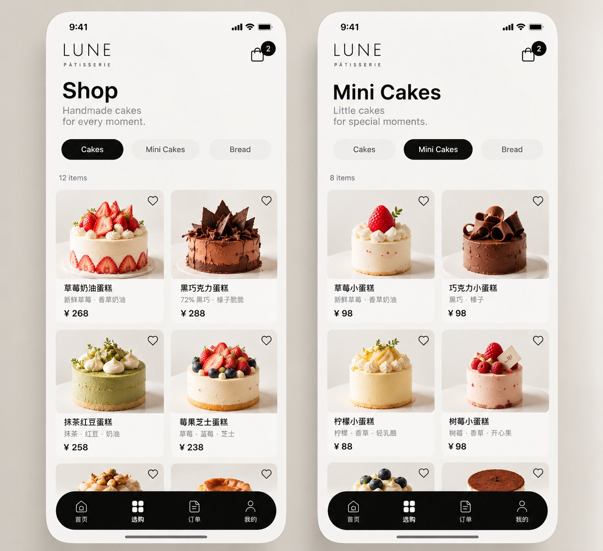
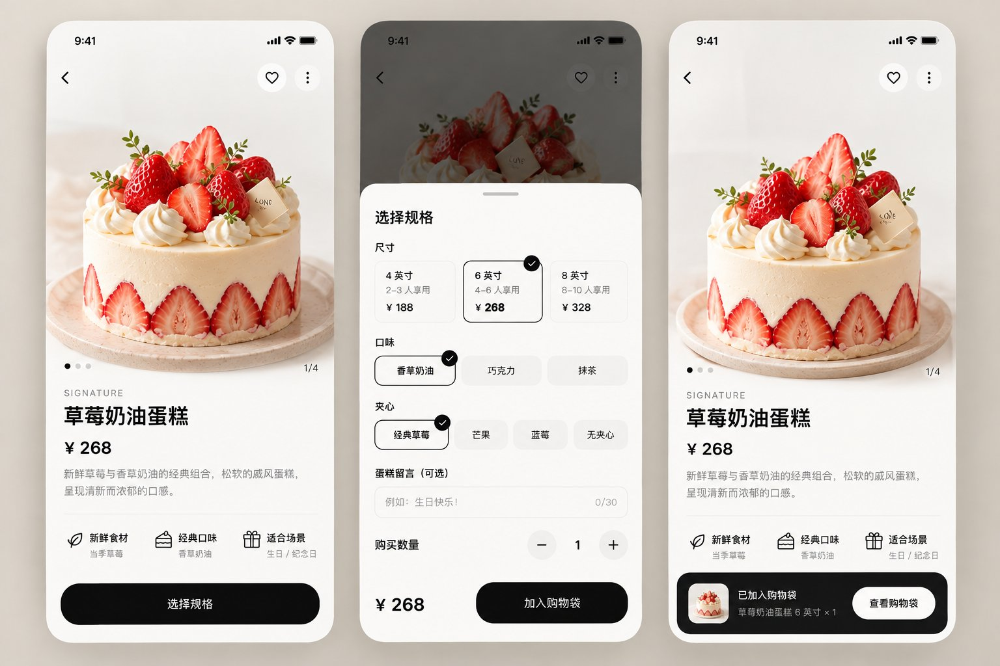
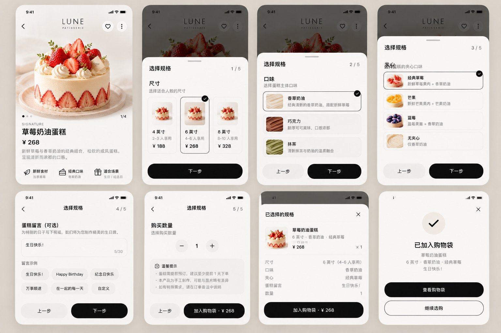
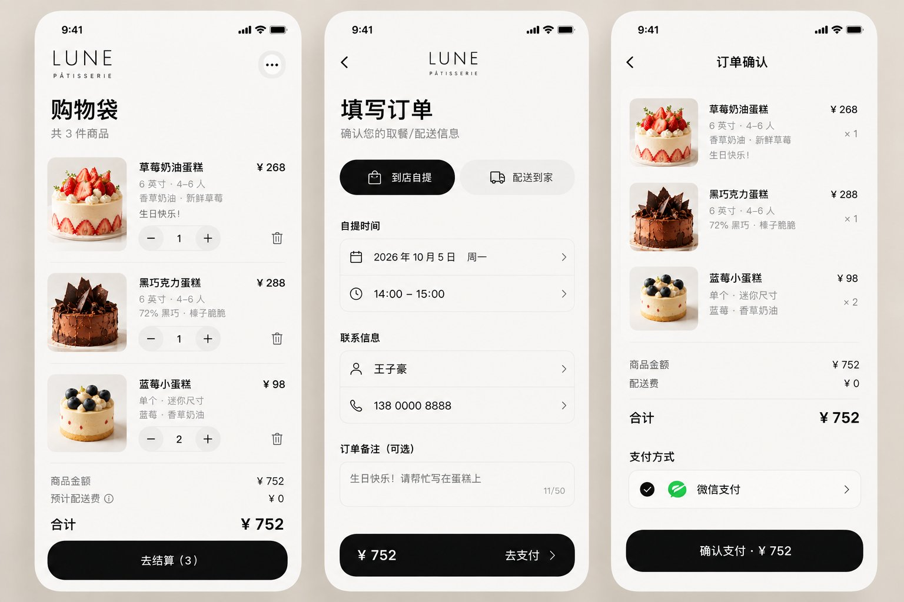
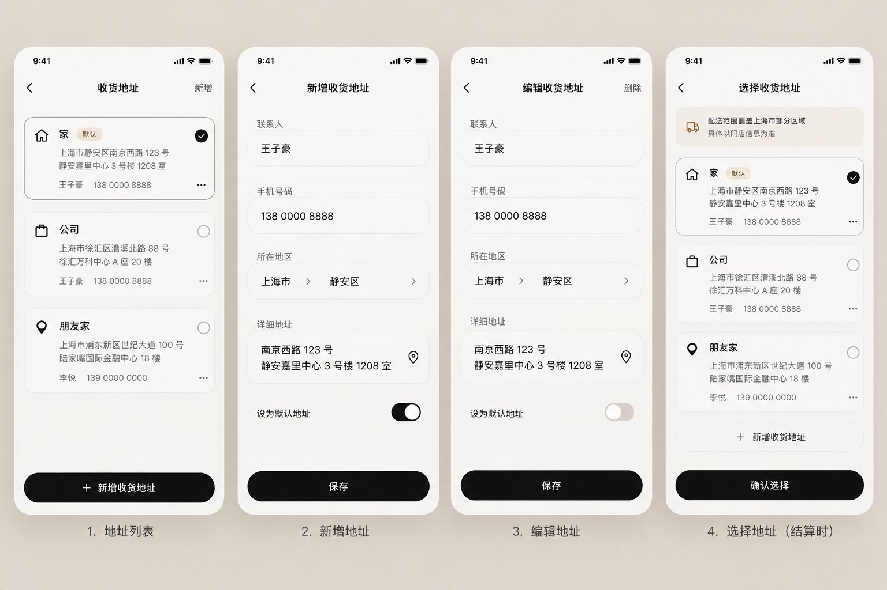
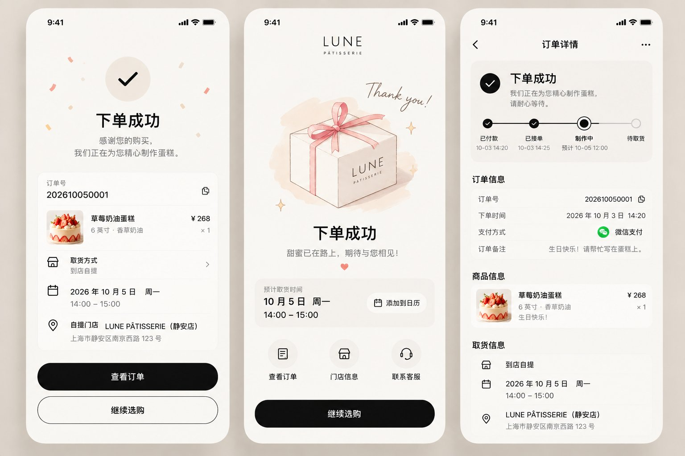
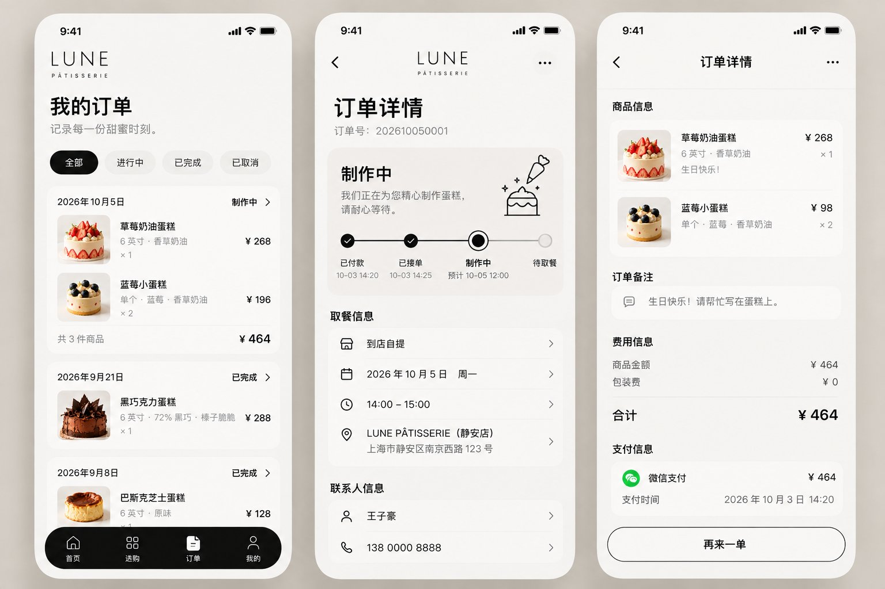
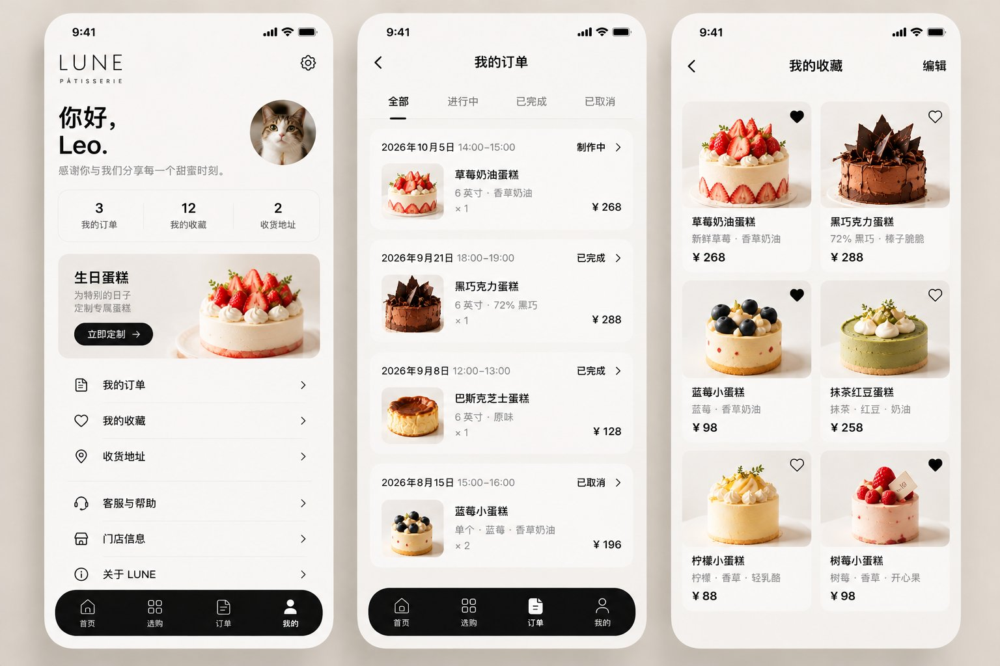

# 家家乐蛋糕店 · 微信小程序项目总纲（V1）

> 状态：V1 规划定稿，UI Exploration → 工程化过渡  
> 最后更新：2026-10-03  
> 配图：`artifacts/design-ref/`（AI 生成界面参考稿，**非真实商品素材**）  
> 正式品牌名：**家家乐蛋糕店**（LUNE PÂTISSERIE 仅为设计稿 / 文案代号，不上线）  
> 本文档由《DESIGN-SPEC（UI 详设）》与《LUNE_CODEX_PROJECT_HANDOFF（工程总纲）》于 2026-10-03 合并而成，**合并后为唯一项目文档**。

## 目录

- [0. 已定稿决策摘要](#0-已定稿决策摘要)
- [1. 项目目标](#1-项目目标)
- [2. 信息架构与一级导航](#2-信息架构与一级导航)
- [3. 主流程、业务闭环与验收链路](#3-主流程业务闭环与验收链路)
- [4. 页面详设](#4-页面详设)
- [5. 公共业务模块](#5-公共业务模块)
- [6. UI 视觉总纲](#6-ui-视觉总纲)
- [7. 技术方案](#7-技术方案)
- [8. 后端 Domain 划分](#8-后端-domain-划分)
- [9. 云数据库模型](#9-云数据库模型)
- [10. 权限与安全原则](#10-权限与安全原则)
- [11. 推荐项目目录](#11-推荐项目目录)
- [12. V1 功能范围](#12-v1-功能范围)
- [13. 开发阶段](#13-开发阶段)
- [14. Codex 工作方式](#14-codex-工作方式)
- [15. 待确认项](#15-待确认项)

---

## 0. 已定稿决策摘要

以下事项已确定，无需重复询问：

| 事项          | 定稿                                                           |
| ----------- | ------------------------------------------------------------ |
| 平台          | 微信小程序（原生）                                                    |
| 后端          | 微信云开发（云数据库 / 云函数 / 云存储 / 微信支付），V1 不搭独立服务器                    |
| 视觉          | 现代黑白极简精品 Bakery                                              |
| 一级导航        | **Home / Shop / Orders / Account** 四 Tab；**Bag 不占一级 Tab**    |
| V1 分类       | **Cake / Mini Cake / Bread** 三分类；Shop Filter **V1 不做**       |
| 规格配置形态      | **独立分步配置页**（详情页不放内联规格）★ 2026-10-03 定稿                        |
| 品牌名         | **家家乐蛋糕店**（正式）；LUNE 仅为设计代号 ★ 2026-10-03 定稿                   |
| 主色          | UI 黑白灰 + 黑色 CTA；`#B5684C` 棕**仅用于收藏 / 售罄态点缀** ★ 2026-10-03 定稿 |
| 履约          | 支持 Pickup（自提）+ Delivery（配送）                                  |
| 支付          | 微信支付                                                         |
| 蛋糕规格        | Size / Flavor / Filling / Message / Quantity                 |
| 预约          | Date + Time Slot                                             |
| 地址          | 新增 / 编辑 / 删除 / 默认 / Checkout 选择                              |
| 订单          | 完整状态跟踪（含异常态）                                                 |
| 商家端         | V1 在同一小程序内按管理员身份提供入口；基础订单 / 商品 / 门店管理                        |
| Custom Cake | V1.5                                                         |
| 复杂营销        | V1 不做（积分 / 会员 / 优惠券 / 储值 / 拼团 / 秒杀 / 评价 / 分销 / AI 推荐）        |

---

## 1. 项目目标

开发一个精品蛋糕 / 烘焙店微信点单小程序。产品目标不是传统「微信商城模板」，而是：

**国外现代极简 Bakery App 的视觉语言 + 微信小程序的本地交易能力。**

一句话产品定义（V1 所有设计与开发决策的主线）：

> **顾客通过 Home / Shop 发现精品蛋糕，配置商品后加入 Bag，选择到店自提或配送并预约时间，通过微信支付下单；商家接单制作并更新状态，顾客通过 Orders 跟踪整个履约过程，并在 Account 管理订单、收藏、地址和账户信息。**

---

## 2. 信息架构与一级导航

### 2.1 项目组成

```
家家乐蛋糕店
│
├── Customer Mini Program
│   └── 顾客浏览、购买、支付、订单、账户
│
├── Cloud Backend
│   └── 商品、购物袋、结算、订单、支付、门店等业务
│
└── Admin
    └── 商家订单、商品、门店基础管理（同一小程序内，管理员身份可见）
```

### 2.2 顾客端信息架构

Bottom Navigation 固定 4 个一级入口：`HOME 首页 / SHOP 选购 / ORDERS 订单 / ACCOUNT 我的`。  
**Bag 不作为一级 Tab**，是购买流程中的独立页面，通过 Header、商品详情等入口进入。

```
家家乐蛋糕店 MINI PROGRAM
│
├── 01 HOME
│   ├── Hero
│   ├── Cakes
│   ├── Mini Cakes
│   ├── Bread
│   ├── Today's Favorite
│   └── Featured Products
│
├── 02 SHOP
│   ├── Cakes
│   ├── Mini Cakes
│   └── Bread
│       │
│       └── Product Detail
│             │
│             └── Specification（独立分步配置页）
│                  ├── Size
│                  ├── Flavor
│                  ├── Filling
│                  ├── Message
│                  └── Quantity
│
├── BAG
│   │
│   └── Checkout
│        ├── Pickup / Delivery
│        ├── Store
│        ├── Address
│        ├── Date
│        ├── Time
│        ├── Contact
│        ├── Note
│        └── WeChat Pay
│              │
│              └── Order Success
│
├── 03 ORDERS
│   ├── All
│   ├── Active
│   ├── Completed
│   └── Cancelled
│        │
│        └── Order Detail
│
└── 04 ACCOUNT
    ├── Orders
    ├── Favorites
    ├── Addresses
    ├── Customer Service
    ├── Store
    ├── About
    └── 商家管理（管理员可见）
```

---

## 3. 主流程、业务闭环与验收链路

### 3.1 用户主流程（Happy Path）

```
Home
  ↓
Product
  ↓
Specification（尺寸 / 口味 / 夹心 / 留言 / 数量）
  ↓
Add to Bag
  ↓
Bag
  ↓
Checkout
  ↓
选择自提 / 配送
  ↓
选择日期时间
  ↓
微信支付
  ↓
Order Confirmed
  ↓
Orders
```

### 3.2 业务闭环（含商家侧）

```
顾客    Home / Shop 发现商品
          ↓
        配置蛋糕（Specification）
          ↓
        加入 Bag → 选择自提 / 配送 → 预约时间
          ↓
        微信支付
          ↓
商家    接单 → 制作
          ↓
顾客    Orders 查看履约
        （制作中 → 待取餐 → 已完成）
          ↓
Account 管理订单、收藏、地址
          ↓
        沉淀 → 复购回到 Home ↺
```

### 3.3 订单状态机

正常流：

```
PENDING_PAYMENT → PAID → ACCEPTED → MAKING → READY / DELIVERING → COMPLETED
```

异常流至少考虑：

```
CANCELLED / REFUNDING / REFUNDED
```

**所有状态变化必须经过后端规则校验（合法状态机），不允许前端任意修改订单状态。**

- 自提履约：`Making → Ready → 显示取餐码 / 二维码 → 商家核销 → Completed`
- 配送履约：`Making → 配送准备完成 → Delivering → 用户收货 → Completed`
- V1 不自行开发复杂骑手调度系统

### 3.4 Golden Path（V1 完成前必须真实跑通）

**A · 自提**

```
Home → Shop → Product Detail → Specification → Bag → Checkout
→ Pickup → Store → Date & Time → Confirm → WeChat Pay
→ Order Success → Order Detail → Making → Ready
→ Pickup Verification（核销）→ Completed
```

**B · 配送**

```
Home → Shop → Product Detail → Specification → Bag → Checkout
→ Delivery → Address → Delivery Range Validation → Date & Time
→ Confirm → WeChat Pay → Order Success → Order Detail
→ Making → Delivering → Completed
```

---

## 4. 页面详设

### 4.1 Home：首页负责「发现」

首页不是把所有商品摆出来，而是负责让用户产生购买欲望。

### 4.1 Home：首页负责「发现」

```
┌────────────────────────────┐
│ ☰        家家乐       BAG 2│
│                            │
│ FRESHLY MADE               │
│ Cakes for                  │
│ every moment.              │
│                            │
│       [大型蛋糕主视觉]       │
│                            │
│ Explore →                  │
├────────────────────────────┤
│ Cake    Mini Cake    Bread │
├────────────────────────────┤
│                            │
│ 今日推荐                    │
│ TODAY'S FAVORITE           │
│                            │
│ [商品]          [商品]      │
│                            │
├────────────────────────────┤
│ 当季精选                    │
│ SEASONAL PICK              │
│                            │
│ ← 横向商品列表 →            │
├────────────────────────────┤
│                            │
│ SIGNATURE COLLECTION       │
│      [品牌系列大图]          │
│                            │
├────────────────────────────┤
│ 人气单品                    │
│ POPULAR ITEMS              │
│                            │
│ [商品]          [商品]      │
│                            │
├────────────────────────────┤
│ Home  Shop  Orders Account │
└────────────────────────────┘
```

结构：`Hero → Category → Today's Favorite → Seasonal Pick → Signature Collection → Popular Items`。

- 可包含：Header / Brand、Hero、Cake / Mini Cake / Bread 分类入口、Today's Favorite、Featured Products、Bottom Navigation
- **不要加入传统商城营销模块**（Banner、优惠券、秒杀等）
- Header 左侧 Menu 图标 V1 仅占位，不做抽屉交互

### 4.2 Shop：负责「明确找商品」

首页负责「逛」，Shop 负责「找」。



```
SHOP

What are you
looking for?

────────────────

All
Cakes
Mini Cakes
Bread

────────────────

[商品]              [商品]

[商品]              [商品]

[商品]              [商品]
```

- 分类固定 **All / Cakes / Mini Cakes / Bread**（V1 不扩充 Pastries / Desserts / Drinks）
- **Sort / Filter：V1 不做**（参考图中的 Filter 暂缓）
- 标准两列 Grid

商品卡原则（全站通用）：

```
Product Image
Product Name
Short Description
Price
Favorite（♡）
```

**不要显示**：销量、评分、满减、折扣、包邮、库存、原价删除线、「立即抢购」。

### 4.3 Product Detail：从「看」进入「买」



**★ 定稿（2026-10-03）：详情页不放内联规格配置。** 详情页只承担「展示 + 收藏 + 引导」，点 ADD TO BAG 进入独立分步配置页（§4.4）。

```
‹                         ⋮

┌──────────────────────────┐
│                          │
│         CAKE             │
│                          │
└──────────────────────────┘

● ○ ○


SIGNATURE COLLECTION

草莓奶油蛋糕

新鲜草莓 · 香草奶油

¥268

收藏 ♡


──────────────────────────────

¥268                    ADD TO BAG
```

- 内容：Large Product Gallery、商品名、价格、一句描述、基础商品信息、Favorite、Add to Bag
- 商品图片占据最大视觉面积

### 4.4 Product Specification：独立分步配置页（V1）

Cake 类商品采用分步配置，进入路径：Product Detail → ADD TO BAG。



```
Step 1  Size（4" / 6" / 8"，含适用人数）
Step 2  Flavor（Vanilla / Chocolate / Earl Grey…）
Step 3  Filling
Step 4  Cake Message（生日牌文字）
Step 5  Quantity
Step 6  Confirm / Add to Bag
```

**规格必须由数据驱动，不要把所有选项硬编码在页面。**

### 4.5 Create Your Cake：高级定制（V1.5）

普通电商没有、蛋糕品类特有的能力，**V1 不因此扩大范围**。

```
Size → Cake Base → Flavor → Filling → Decoration
→ Message → Pickup Date → Preview → Add to Bag
```

### 4.6 Bag：购物袋

保持黑白极简。**不显示 Bottom TabBar** —— 进入购买流程后让用户注意力集中在结算。



```
BAG                                      2


[图片]   草莓奶油蛋糕
         6" / Vanilla · Strawberry
         Cake Message

         −     1     +          删除

                               ¥268

──────────────────────────────

Subtotal                      ¥396

Delivery              Calculated later


        CHECKOUT · ¥396
```

展示内容：Product Image、Product Name、Selected Specification、Cake Message、Quantity、Price、Delete、Subtotal、Checkout。

### 4.7 Checkout：业务最复杂的一页

**视觉是国外 App，底层逻辑完全符合中国用户真实使用习惯。**

```
              Checkout
                  │
         ┌────────┴────────┐
         │                 │
      Pickup            Delivery
      到店自提           配送到家
```

**Pickup 分支**

```
选择门店 → 选择日期 → 选择时间段
→ 联系人 → 手机号 → 订单备注
→ 核对订单 → 支付
```

**Delivery 分支**

```
选择收货地址 → 判断配送范围 → 选择配送日期 → 选择配送时间段
→ 联系人 → 手机号 → 配送费 → 订单备注
→ 核对订单 → 支付
```

两分支最终汇合：`Confirm Order → WeChat Pay → Order Success`。

页面结构（以自提为例）：

```
CHECKOUT

01  获取方式      ● 到店自提  ○ 配送
02  时间          10月5日 周一 14:00–15:00   →
03  联系人        王先生 138****8888         →
04  地址          [仅配送模式显示]
05  蛋糕留言      Happy Birthday            →
06  备注          少一点奶油                 →

──────────────────────────────
商品 ¥268   配送 ¥12   TOTAL ¥280
        微信支付 · ¥280
```

地址管理属于公共模块（§5.1），Checkout 内只做选择。



### 4.8 Order Success：品牌页

支付完成后不要立刻扔到订单列表，做一个品牌化的确认页。



```
             ✓

ORDER CONFIRMED

Thank you.

Your cake is being prepared.

ORDER #20261002001
OCT 05 · 14:00 – 15:00 · 到店自提

       VIEW ORDER
       BACK HOME
```

至少显示：Order Number、Items Summary、Fulfillment Type、Pickup / Delivery Date、Time Slot、Store / Address、View Order、Continue Shopping。

### 4.9 Orders：订单（第三个一级 Tab）

视觉分段用 **CURRENT / PAST**（不做传统「全部|待付款|待发货|待收货」横条），筛选维度支持 All / Active / Completed / Cancelled。



```
ORDERS

CURRENT
────────────────────────
10月5日
[蛋糕]   草莓奶油蛋糕 · 6"
         制作中
         14:00–15:00 自提
         VIEW ORDER →

PAST
────────────────────────
9月21日
[蛋糕]   巴斯克芝士蛋糕
         已完成
```

Order Detail 根据状态提供 Contextual Action：

```
待支付 → 去支付 / 取消
制作中 → 查看状态 / 联系门店
待取餐 → 查看取餐码 / 门店信息
配送中 → 查看配送信息
已完成 → 再来一单
```

### 4.10 Order Detail：订单详情


这一页需要非常实用，视觉与实用性不冲突。界面参考 §4.9 配图的中、右两屏。

```
ORDER #20261002001

制作中
Your cake is being prepared.

━━━━━━●────────
已付款 已接单 制作中 待取餐 已完成

PICKUP
10月5日 14:00–15:00
家家乐蛋糕店（门店地址）

ITEMS
[图片] 草莓奶油蛋糕
6" / Vanilla / Birthday Message
1 × ¥268

TOTAL  ¥268
```

- 进度条对应 §3.3 状态机
- 自提订单：Ready 后显示取餐码 / 二维码，供商家核销
- 配送订单：显示配送状态

### 4.11 Account：我的

视觉比传统个人中心更安静，**不做九宫格功能入口**。



```
ACCOUNT

Hello, Leo.

ORDERS           我的订单        →
FAVORITES        我的收藏        →
ADDRESSES        配送地址        →
────────────────────────────
CUSTOMER SERVICE 联系客服        →
STORE            门店信息        →
ABOUT            关于品牌        →
────────────────────────────
Privacy    Terms
```

- 收藏可重新进入购买链路：`Favorites → Product Detail → Specification → Bag`
- 管理员账号额外显示：**商家管理 →**（进入 §4.12）

### 4.12 商家端 Admin（V1，同小程序内）

**Orders**

状态列表：New Orders / Accepted / Making / Ready for Pickup / Delivering / Completed / Cancelled

商家必须能够：接单、开始制作、标记制作完成、确认取餐 / 核销、更新配送状态、完成订单。

**Products（基础商品管理）**

```
Product List / Create / Edit
Category · SKU · Price
Availability / On / Off Shelf
Basic Stock
```

**Store Settings**

```
门店信息 / 营业时间
Pickup Availability / 可预约时间段
Delivery Range
```

---

## 5. 公共业务模块

这些不是一级业务模块，而是被多条链路调用的公共能力，**不要在多个页面重复实现**。

### 5.1 Address 地址

```
Address List / Add / Edit / Delete / Default Address / Select in Checkout
```

字段建议：

```
receiverName / phone / province / city / district / detail / label / isDefault
```

配送结算时**必须检查地址是否位于可配送范围**。

### 5.2 Date & Time 预约

蛋糕订单需要预约履约时间，模块支持 Available Dates + Available Time Slots。

门店配置至少需要：

```
营业时间
不可预约日期
每日可预约时间段
最短提前预订时间
单时间段最大订单量（可后续增强）
```

### 5.3 其他辅助能力

Search / Store / Customer Service —— 均为公共能力，V1 做基础版。

---

## 6. UI 视觉总纲

### 6.1 核心关键词

```
Modern Minimal Bakery · Monochrome · Product-first · Soft Minimalism
Swiss-inspired · Premium · Clean · International
```

整体应像成熟的国外精品 Cake / Bakery App，而不是传统微信商城、外卖 App 或营销商城。

> Premium ≠ 黑金 / 金色 / Serif / 奢侈品风。要的是年轻、现代、干净、克制、产品导向的高级感。

### 6.2 视觉原则

1. 黑 / 白 / 浅灰 / 暖白为主要 UI 色彩
2. 商品摄影承担页面主要色彩
3. Cake / Bakery Product 是视觉中心
4. 现代 Sans-serif 字体语言；标题可较粗，正文克制
5. 大量留白，降低信息密度
6. Grid 清晰，强对齐
7. 圆角存在，但不可「万物大圆角」
8. 阴影极少使用
9. Primary CTA 以黑底白字为主
10. 图标简洁线性
11. 底部导航采用黑色 Floating Navigation 视觉语言（一期可用官方 tabBar 改配色实现，二期再换自定义）
12. 每个页面尽量只有一个明确 Primary Action
13. 微信交互逻辑本土化，视觉语言国际化

### 6.3 禁止项

- 粉色少女蛋糕风、卡通插画、Emoji 装饰
- 促销红、大促 Banner、优惠券堆叠、秒杀 / 拼团视觉
- 淘宝 / 美团式高密度页面
- 彩色分类 Icon、大量 Badge
- 渐变、Glassmorphism、重阴影、无意义背景纹理
- 每个区域都套 Card
- 黑金奢侈品风、过多 Serif 装饰字体

### 6.4 商品图片

高质量、背景干净、视觉风格统一、产品主体足够大；Cake 是首页和 Shop 的主要视觉主角；**UI 不应与食品颜色竞争**。

### 6.5 Design Token

| Token | 值 |
|---|---|
| 页面底色 | `#FAF7F2`（暖白） |
| 卡片 | `#FFFFFF` |
| 主文字 / CTA | `#111111`（黑底白字按钮） |
| 辅助文字 | `#8A8A8A`（正文灰不低于 `#666666`） |
| 品牌点缀色 | `#B5684C` —— **仅用于收藏 ♥ / 售罄态，不参与大面积** |
| 圆角 | 卡片 24rpx 级、按钮胶囊全圆角 |
| 间距 | 只用 8 的倍数（16 / 24 / 32 / 48） |
| 字号 | 4 档：32 / 28 / 24 / 22（rpx 级） |
| 字体 | 中文系统默认（苹方 / 思源黑），**禁止引入网络字体**（主包 2MB 限制） |

### 6.6 微信小程序适配

所有 UI 必须考虑：微信状态栏、右上角胶囊区域、Safe Area（顶部 + 底部）、不同手机宽度、rpx、触摸目标尺寸、页面滚动、中文文本长度、微信登录 / 支付 / 客服。

**不要因为视觉参考来自国外 App 就忽略微信运行环境。**

### 6.7 UI 验收标准

打开小程序的第一感觉应该是：**「这是一个现代、精品、国外设计语言的 Cake / Bakery App。」** 而不是「这是一个套模板的微信商城」。

- [ ] 商品是否是真正视觉中心？
- [ ] 页面是否有足够留白？
- [ ] 是否出现无必要的彩色 UI？
- [ ] 是否出现传统促销商城元素？
- [ ] CTA 是否明确？
- [ ] 页面信息是否过密？
- [ ] Bottom Navigation 是否统一？
- [ ] Product / Shop / Bag / Checkout / Orders 是否像同一个设计系统？
- [ ] 中文内容是否自然，而不是机械英文 UI 翻译？
- [ ] 微信胶囊与 Safe Area 是否正确？

---

## 7. 技术方案

### 7.1 技术栈

```
微信小程序（原生）
+
微信云开发
├── 云数据库
├── 云函数
├── 云存储
└── 微信支付
```

V1 不额外搭建独立传统服务器。**现有项目中的 `server/`、`web/` 目录为初版 demo 遗留，待迁移后废弃（见 §15）。**

### 7.2 项目组成

见 §2.1。V1 商家端在同一小程序中按管理员身份提供管理入口，不优先开发独立 PC Web 后台。

---

## 8. 后端 Domain 划分

代码与云函数**优先按业务领域组织**，而不是「一页一个云函数」。页面只是这些 Domain 的 UI 表现。

```
01 User      02 Catalog   03 Cart     04 Checkout  05 Order
06 Payment   07 Address   08 Store    09 Admin
```

---

## 9. 云数据库模型

V1 预计 collections：

```
users  categories  products  skus  favorites  carts  addresses
stores  orders  order_items  order_logs  store_config
```

### 9.1 Catalog 关系

```
Category → Product (SPU) → SKU
```

例：草莓奶油蛋糕 → 4寸/Vanilla/Strawberry、6寸/Vanilla/Strawberry、8寸/Vanilla/Strawberry …

### 9.2 Order Snapshot（重要）

订单创建时必须保存商品快照：

```
productName / skuDescription / unitPrice / quantity / productImage / cakeMessage
```

**不要让历史订单依赖当前 Product / SKU 数据**，否则商品改名、改价、下架会破坏历史订单。

---

## 10. 权限与安全原则

1. 商品价格、订单总价**不能信任前端计算结果**
2. 创建订单时由云函数重新读取 SKU 价格并计算
3. 支付结果必须以后端 / 微信支付结果为准
4. 管理员权限在云端校验
5. 普通用户只能读取 / 修改自己的地址、购物袋、订单等私有数据
6. 订单状态变化必须经过合法状态机
7. 敏感业务逻辑不要只写在客户端
8. 不在客户端硬编码管理员权限或支付关键参数

---

## 11. 推荐项目目录

```
/
├── miniprogram/
│   ├── pages/
│   │   ├── home/  shop/  product/  specification/  bag/
│   │   ├── checkout/  order-success/  orders/  order-detail/
│   │   ├── account/  addresses/  admin/
│   ├── components/  services/  utils/  constants/  styles/  assets/
├── cloudfunctions/
│   ├── user/  catalog/  cart/  checkout/  order/
│   ├── payment/  address/  store/  admin/
├── docs/（本文件 / DATA_MODEL.md / API_CONTRACT.md / UI_REFERENCES/）
└── README.md
```

- 不要为了形式机械创建空目录，实际目录随功能逐步落地
- **现有页面与目标结构的映射差异**（Phase 0 统一处理，不逐页顺手改）：
  - 现 `shop`（首页+列表合体）→ 拆分为 `home` + `shop`
  - 现 `order` / `orders` → `order-detail` / `orders`
  - 现 `staff` → `admin`
  - 新增 `specification` / `bag` / `order-success` / `addresses`

---

## 12. V1 功能范围

### 12.1 必须实现

**用户端**

| 模块 | 功能 |
|---|---|
| 浏览 | 商品浏览、Cake / Mini Cake / Bread 三分类 |
| 商品 | 商品详情、规格选择（Size / Flavor / Filling / Message / Quantity）、收藏 |
| 交易 | 购物袋、创建订单、微信支付 |
| 履约 | 自提、配送、地址管理、预约时间 |
| 订单 | 订单状态、订单详情 |
| 我的 | Account（收藏 / 地址 / 客服 / 门店信息入口） |

**商家端**

| 模块 | 功能 |
|---|---|
| 订单 | 商家订单管理（接单 / 制作 / 核销 / 完成） |
| 商品 | 基础商品管理（上下架 / 价格 / 库存简单维护） |
| 门店 | 基础门店设置（营业时间 / 时间段 / 配送范围） |

### 12.2 明确不做（V1）

积分、会员等级、优惠券、储值、拼团、秒杀、评价、分销、复杂营销、AI 推荐、多门店复杂库存、复杂配送调度。

### 12.3 版本表

| 版本 | 范围 |
|---|---|
| V1 | 上述用户端 + 商家端，普通蛋糕购买闭环（Golden Path A / B 跑通） |
| V1.5 | Create Your Cake 定制流程 |
| 后续 | 搜索增强、评价、会员等（视运营需要再评估） |

---

## 13. 开发阶段

**不要一次让 Codex「开发完整小程序」。** 严格按阶段推进，每个 Phase 再拆成可单独验收的 Task。

```
Phase 0  项目初始化与工程规范（git、目录迁移、单行文件格式化）
Phase 1  UI Shell（Home / Shop / Navigation / 基础组件）
Phase 2  Catalog（Category / Product / SKU / Product Detail）
Phase 3  Cart（Specification / Bag）
Phase 4  Checkout（Pickup / Delivery / Address / Date & Time）
Phase 5  Order（Create / List / Detail / State Machine）
Phase 6  Payment（微信支付 / Callback / Order Success）
Phase 7  Admin（订单管理 / 商品管理 / 门店设置）
Phase 8  Integration & QA（完整链路 / 权限 / 异常 / 真机）
```

---

## 14. Codex 工作方式

### 14.1 开始 Task 前

1. 阅读本文件
2. 阅读当前代码结构
3. 判断 Task 属于哪个 Domain
4. 检查是否已有可复用组件 / 服务
5. 明确本次修改范围
6. 不主动扩大 Scope

### 14.2 开发过程中必须

- 优先复用组件，避免页面内复制相同业务逻辑
- 数据驱动 SKU / 分类 / 状态
- UI 与业务逻辑分离
- 云端承担可信业务计算
- 保持命名统一
- 不为了「看起来完成」写大量不可维护 Mock 逻辑
- UI Exploration 阶段允许 Mock Data，但接入业务时必须逐步替换

### 14.3 不允许

- 未经要求重构整个项目
- 擅自增加功能 / 新的商品分类 / 营销系统
- 擅自改变已确定视觉方向
- 将价格计算完全放在前端
- 在多个页面重复实现同一套 Date / Address / SKU 逻辑
- 用大量硬编码解决本应数据驱动的问题

### 14.4 Task 分析格式

收到新 Task 先输出：

```
Task Goal           本次要实现什么
Scope               本次会修改什么，不修改什么
Affected Domain     Catalog / Cart / Checkout / Order / ...
Files               预计新增或修改哪些文件
Data Flow           页面 → Service → Cloud Function → Database
Acceptance Criteria 如何判断本 Task 完成
```

分析完成后再实施。

### 14.5 冲突处理

如果发现当前 Task 会破坏既有数据模型、订单状态机、支付安全或项目视觉一致性，**应先说明冲突，不要静默绕过**。

---

## 15. 待确认项

> 合并后仅剩以下未决事项，均不阻塞 Phase 0–1 开工。

| # | 事项 | 说明 |
|---|---|---|
| 1 | **商品实拍素材** | 全案视觉 80% 依赖大尺寸、统一风格、干净背景的实拍图。`design-ref/` 内配图均为 AI 设计稿渲染，**不是真实素材**。需确认已有多少 SKU 实拍图；Phase 1 可先用占位图 |
| 2 | **遗留代码处置** | 云开发定稿后，现有 `server/`（独立后端）与 `web/` 目录为初版 demo 遗留，需定迁移或废弃计划 |
| 3 | **取餐码形式** | 自提核销显示取餐码 / 二维码，具体形式（纯数字码 vs 二维码）在 Phase 5 定即可 |
