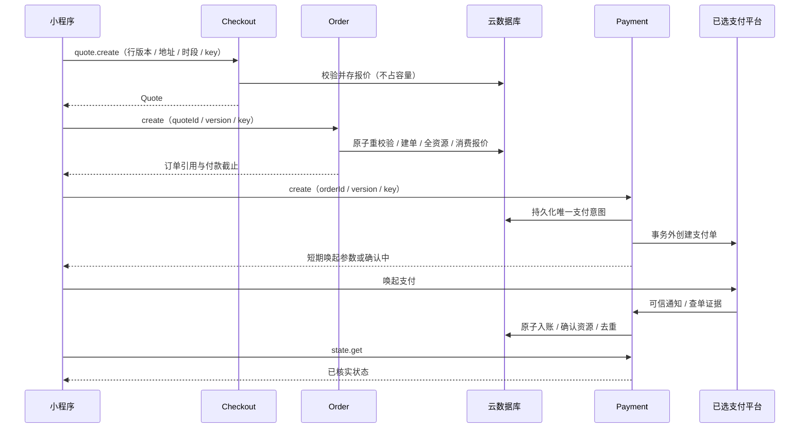

# D07：目标网络 API 与读模型

日期：2026-10-03。契约版本 v1-api-2026-10-03。目标 action 清单与基础请求 schema 已本地验证，**不是已部署 API**。现有函数与客户端 allowlist 仍仅 user.me / store.health。完整目录、地址、报价、订单、资金与管理 handler 在后续领域逐步落地，实际 SDK / 支付方案参数仍待核验。

## 请求与基础类型

逻辑调用为 domain 云函数接收 {action,payload,requestId?}；服务端生成权威 requestId，客户端值只作可选关联，不当身份 / 幂等键。成功响应 {ok:true,requestId,data}，失败 {ok:false,requestId,error:{code,message}}。每个结果 data 增加 apiVersion=v1-api-2026-10-03；现有两个最小接口保持当前形状，接入新协议时做显式版本兼容，不伪报已升级。

[api-contract.js](../cloudfunctions/_shared/api-contract.js) 的 getActionContract / parseApiRequest 只核对已声明 action、字段基础类型及部分条件，深复制 / 冻结输入；没有 dispatch、身份加载、领域验证、DTO 投影或 DB 操作。禁止把 schema 通过当作权限通过。未知 root/payload 字段拒绝，event.openid / role / ownerId / 金额 / nextStatus 不进入顾客命令。管理员 draft 是 JSON 对象，仍须完整领域白名单和业务校验，不直接 spread 落库。

API 本地请求上限 64 KiB（UTF-8），是本项目技术上限，不声称腾讯 SDK 限额。有限列表和事务行数仍取发布经营配置，不能用该字节数补业务上限。无 JSON getter / 循环 / 稀疏数组 / undefined / Symbol / Date 输入。

| 输入类型 | 契约 |
|---|---|
| id / nullableId | 1–256 字符规范文本；nullableId 可 null；ID 自身不证明访问权 |
| counter / positive | 非负 / 正安全整数；金额为 CNY 分，版本为非负整数 |
| text / message | text 为非空首尾无空白文本（技术上限 2048 UTF-16 单元）；message 为可 null 的合法 Unicode 文本；业务长度与留言策略另校验 |
| key | 16–128 字符 A–Z/a–z/0–9/_/-；由客户端随机生成并保留，同次用户意图重试不换键；不是身份凭证 |
| selection | [{groupCode,optionCode}]，允许空数组；禁止客户端 label；D03 核验重复组 / 合法组合 |
| lines | 非空 [{lineId,lineVersion}]，lineId 不重复；数量与留言从袋读取，服务端复核当前版本 |
| contact | {name,phone}；phone 是字符串，格式、长度与真实联系校验由领域落实 |
| address | {receiverName,phone,province,city,district,regionCodes:{province,city,district},detail,mapSelectionToken?}；编码可 null；不接受 Location/source/verifiedAt；选点 token 仍由服务端核验归属 / 来源 / 时效 |
| storePatch | 非空对象，仅 name/address/phone/timeZone/status/mapSelectionToken；禁止 activeConfigId / 客户端已核验坐标；OPEN 必须校验正式资料与完整发布配置 |
| json | 管理草稿对象；完整 Product/SKU/资源/图片/配置 schema 及发布校验沿用 D02–D05，不属于本模块已完成验证 |
| category / fulfillment | CAKE/MINI_CAKE/BREAD；PICKUP/DELIVERY |
| orderView（O06） | ALL / ACTIVE / CURRENT / PAST / COMPLETED / CANCELLED；ACTIVE=CURRENT，按履约轴分组，不按退款轴 |
| date | YYYY-MM-DD 基础格式；真实日历 / 时区 / 窗口由 D05 验证 |
| search | NFC + 首尾 trim，最多 64 Unicode 码点，空串等同不搜索；不改变内部文本 / 大小写；名称文字子串，服务器转义元字符，不接受客户端正则 |
| pageSize / cursor | 20 默认 / 最大 50；cursor 可 null；完整签名及 scope 校验见分页章节 |

商品搜索需在 owner/store/status/category 等服务端固定过滤下执行，基于发布名称。搜索存储 / 大小写 / 索引效率须在 C01/C02 与真实 SDK 核验，不以客户端全表扫描代接口。不为搜索静默新增一级分类。

## 身份、幂等与版本规则

所有面向小程序 action 至少要求可信平台 AppID / environment / OPENID 匹配；公共投影不要求已创建 users，但仍核验平台身份。OWNER 先加载本环境 ACTIVE 用户（缺记录先调用 user.bootstrap）并做父实体所有权校验；系统回调 / 任务不复用这类客户端入口。商家能力按 D06 当前角色及目标实体 storeId 检查。

表中 KEY 表示 idempotencyKey 必填，绑定 environment / 稳定 subjectId / 完整 domain.action / key，指纹来自规范白名单业务输入（剔除幂等键本身与 requestId）。管理员目标门店 / 实体与版本仍在指纹中；同键异参拒绝。quote.create 虽不占资源，也持久化报价，必须去重。读 action 不建立业务幂等记录。

写请求 expectedVersion / expectedLineVersion 等来自用户见到的版本，事务再检查实际版本。发生冲突先查原键结果，再刷新；同一意图未知结果不换键重复下单 / 付款 / 退款。真正改变参数或版本须用户重新确认并形成新意图；同键异参不能覆盖。

幂等重放先做本次当前身份 / 权限 / 所有权校验。D04 CommandResult 仅记录 entityId/version/errorCode，网络 handler 从对应实体重新做受限投影；不能缓存原始支付唤起参数或未经权限检查返回旧 DTO。参数丢失 / 过期时复用同一 payment 意图重新获取合法唤起数据，不能另建一笔。

COND 表示条件能力：admin.order.transition 的 REJECT_ORDER 需同一当前角色 ORDER_OPERATE + REFUND_APPROVE，其余允许履约命令需 ORDER_OPERATE；admin.cancellation.review 的 APPROVE 同样需两项（含 0 元），REJECT 需 ORDER_OPERATE。不得用管理员入口统一赋六项能力。

本人或他人实体存在性在公开层统一 NOT_FOUND（FORBIDDEN 的内部授权失败在父实体读取 handler 处转换）；管理入口能力不足可公开 FORBIDDEN。角色管理除 ROLE_MANAGE 外需 D06 委派范围、自身授权禁止与审计原子性。storeId / subjectId 参数是目标引用，不是操作者身份。

## 目标 action 清单

下表由运行时目标 registry 核对，共 61 项（A06 新增仅 PLANNED 的 admin.exceptions.list）；? 表示可选字段。输入省略重复的 pageSize/cursor 说明，KEY 即含必填 idempotencyKey。所有 action 通用错误为 INVALID_REQUEST、AUTH_REQUIRED、FORBIDDEN、INTERNAL_ERROR；KEY 另有 IDEMPOTENCY_KEY_REUSED / BUSY，PAGE 另有 CURSOR_INVALID / CURSOR_EXPIRED。各行列出额外常见业务错误，实际领域仍可能传播固定公开错误表中的适用代码。

| domain.action | 身份 / 能力 | 输入 payload | 输出 DTO | 幂等 / 分页 | 额外业务错误 |
|---|---|---|---|---|---|
| user.me | PLATFORM | {} | IdentitySummary | 原生元组 create-if-absent；无客户端业务 key | AUTH_REQUIRED / INTERNAL_ERROR |
| store.health | PLATFORM | {} | Health | READ | NOT_FOUND / CONFIGURATION_REQUIRED / APPOINTMENT_UNAVAILABLE |
| user.bootstrap | PLATFORM | idempotencyKey:key | Profile | KEY | VERSION_CONFLICT |
| user.profile.get | OWNER | {} | Profile | READ | NOT_FOUND |
| user.profile.update | OWNER | expectedVersion:counter, displayName:text, avatarAssetId?:nullableId, idempotencyKey:key | Profile | KEY | NOT_FOUND / VERSION_CONFLICT |
| user.consent.accept | OWNER | expectedVersion:counter, policyVersion:id, idempotencyKey:key | Profile | KEY | NOT_FOUND / VERSION_CONFLICT |
| user.favorites.list | OWNER | pageSize?:pageSize, cursor?:cursor | FavoritePage | READ + PAGE CREATED_DESC | NOT_FOUND / VERSION_CONFLICT |
| user.favorite.set | OWNER | productId:id, enabled:boolean, idempotencyKey:key | FavoriteState | KEY | NOT_FOUND / VERSION_CONFLICT |
| catalog.categories.list | PLATFORM | {} | CategoryList | READ | NOT_FOUND / PRODUCT_UNAVAILABLE / INVALID_SELECTION |
| catalog.products.list | PLATFORM | storeId:id, categoryCode?:category, search?:search, pageSize?:pageSize, cursor?:cursor | ProductPage | READ + PAGE CATALOG | NOT_FOUND / PRODUCT_UNAVAILABLE / INVALID_SELECTION |
| catalog.product.get | PLATFORM | productId:id | ProductDetail | READ | NOT_FOUND / PRODUCT_UNAVAILABLE / INVALID_SELECTION |
| cart.get | OWNER | storeId:id | Cart | READ | NOT_FOUND / VERSION_CONFLICT / PRODUCT_UNAVAILABLE / INVALID_SELECTION / INVALID_QUANTITY / INVALID_MESSAGE / CART_LIMIT_EXCEEDED / CONFIGURATION_REQUIRED |
| cart.add | OWNER | storeId:id, expectedVersion:counter, productId:id, skuId:id, selectedOptions:selection, quantity:positive, cakeMessage?:message, idempotencyKey:key | Cart | KEY | NOT_FOUND / VERSION_CONFLICT / PRODUCT_UNAVAILABLE / INVALID_SELECTION / INVALID_QUANTITY / INVALID_MESSAGE / CART_LIMIT_EXCEEDED / CONFIGURATION_REQUIRED |
| cart.update | OWNER | cartId:id, expectedVersion:counter, lineId:id, expectedLineVersion:counter, skuId:id, selectedOptions:selection, quantity:positive, cakeMessage?:message, idempotencyKey:key | Cart | KEY | NOT_FOUND / VERSION_CONFLICT / PRODUCT_UNAVAILABLE / INVALID_SELECTION / INVALID_QUANTITY / INVALID_MESSAGE / CART_LIMIT_EXCEEDED / CONFIGURATION_REQUIRED |
| cart.remove | OWNER | cartId:id, expectedVersion:counter, lineId:id, expectedLineVersion:counter, idempotencyKey:key | Cart | KEY | NOT_FOUND / VERSION_CONFLICT / PRODUCT_UNAVAILABLE / INVALID_SELECTION / INVALID_QUANTITY / INVALID_MESSAGE / CART_LIMIT_EXCEEDED / CONFIGURATION_REQUIRED |
| address.list | OWNER | pageSize?:pageSize, cursor?:cursor | AddressPage | READ + PAGE UPDATED_DESC | NOT_FOUND / VERSION_CONFLICT / LOCATION_REQUIRED |
| address.get | OWNER | addressId:id | Address | READ | NOT_FOUND / VERSION_CONFLICT / LOCATION_REQUIRED |
| address.create | OWNER | address:address, idempotencyKey:key | Address | KEY | NOT_FOUND / VERSION_CONFLICT / LOCATION_REQUIRED |
| address.update | OWNER | addressId:id, expectedVersion:counter, address:address, idempotencyKey:key | Address | KEY | NOT_FOUND / VERSION_CONFLICT / LOCATION_REQUIRED |
| address.remove | OWNER | addressId:id, expectedVersion:counter, expectedUserVersion:counter, idempotencyKey:key | Removal | KEY | NOT_FOUND / VERSION_CONFLICT / LOCATION_REQUIRED |
| address.setDefault | OWNER | addressId:id, expectedVersion:counter, expectedUserVersion:counter, idempotencyKey:key | Profile | KEY | NOT_FOUND / VERSION_CONFLICT / LOCATION_REQUIRED |
| store.get | PLATFORM | storeId:id | Store | READ | NOT_FOUND / CONFIGURATION_REQUIRED / APPOINTMENT_UNAVAILABLE |
| store.slots.list | PLATFORM | storeId:id, fulfillment:fulfillment, serviceDate:date, productIds:ids | SlotList | READ | NOT_FOUND / CONFIGURATION_REQUIRED / APPOINTMENT_UNAVAILABLE |
| checkout.quote.create | OWNER | cartId:id, expectedCartVersion:counter, lines:lines, fulfillment:fulfillment, contact:contact, addressId?:nullableId, slotId:id, orderNote?:message, idempotencyKey:key | Quote | KEY | NOT_FOUND / QUOTE_EXPIRED / QUOTE_CHANGED / PRODUCT_UNAVAILABLE / RESOURCE_UNAVAILABLE / APPOINTMENT_UNAVAILABLE / LOCATION_REQUIRED / DELIVERY_OUT_OF_RANGE / CONFIGURATION_REQUIRED |
| checkout.quote.get | OWNER | quoteId:id | Quote | READ | NOT_FOUND / QUOTE_EXPIRED / QUOTE_CHANGED / PRODUCT_UNAVAILABLE / RESOURCE_UNAVAILABLE / APPOINTMENT_UNAVAILABLE / LOCATION_REQUIRED / DELIVERY_OUT_OF_RANGE / CONFIGURATION_REQUIRED |
| order.create | OWNER | quoteId:id, expectedQuoteVersion:counter, idempotencyKey:key | CommandResult | KEY | NOT_FOUND / VERSION_CONFLICT / QUOTE_EXPIRED / QUOTE_CHANGED / RESOURCE_UNAVAILABLE / APPOINTMENT_UNAVAILABLE / LOCATION_REQUIRED / DELIVERY_OUT_OF_RANGE / PAYMENT_PENDING / REFUND_IN_PROGRESS / INVALID_TRANSITION |
| order.list | OWNER | status?:orderStatus, view?:orderView, pageSize?:pageSize, cursor?:cursor | OrderPage | READ + PAGE CREATED_DESC | NOT_FOUND / VERSION_CONFLICT / QUOTE_EXPIRED / QUOTE_CHANGED / RESOURCE_UNAVAILABLE / APPOINTMENT_UNAVAILABLE / LOCATION_REQUIRED / DELIVERY_OUT_OF_RANGE / PAYMENT_PENDING / REFUND_IN_PROGRESS / INVALID_TRANSITION |
| order.get | OWNER | orderId:id | Order | READ | NOT_FOUND / VERSION_CONFLICT / QUOTE_EXPIRED / QUOTE_CHANGED / RESOURCE_UNAVAILABLE / APPOINTMENT_UNAVAILABLE / LOCATION_REQUIRED / DELIVERY_OUT_OF_RANGE / PAYMENT_PENDING / REFUND_IN_PROGRESS / INVALID_TRANSITION |
| order.cancelUnpaid | OWNER | orderId:id, expectedVersion:counter, reason:text, idempotencyKey:key | CommandResult | KEY | NOT_FOUND / VERSION_CONFLICT / QUOTE_EXPIRED / QUOTE_CHANGED / RESOURCE_UNAVAILABLE / APPOINTMENT_UNAVAILABLE / LOCATION_REQUIRED / DELIVERY_OUT_OF_RANGE / PAYMENT_PENDING / REFUND_IN_PROGRESS / INVALID_TRANSITION |
| order.cancellation.request | OWNER | orderId:id, expectedVersion:counter, reason:text, idempotencyKey:key | CommandResult | KEY | NOT_FOUND / VERSION_CONFLICT / QUOTE_EXPIRED / QUOTE_CHANGED / RESOURCE_UNAVAILABLE / APPOINTMENT_UNAVAILABLE / LOCATION_REQUIRED / DELIVERY_OUT_OF_RANGE / PAYMENT_PENDING / REFUND_IN_PROGRESS / INVALID_TRANSITION |
| order.delivery.confirm | OWNER | orderId:id, expectedVersion:counter, idempotencyKey:key | CommandResult | KEY | NOT_FOUND / VERSION_CONFLICT / QUOTE_EXPIRED / QUOTE_CHANGED / RESOURCE_UNAVAILABLE / APPOINTMENT_UNAVAILABLE / LOCATION_REQUIRED / DELIVERY_OUT_OF_RANGE / PAYMENT_PENDING / REFUND_IN_PROGRESS / INVALID_TRANSITION |
| order.pickupCredential.get | OWNER | orderId:id | PickupCredential | READ | NOT_FOUND / VERSION_CONFLICT / QUOTE_EXPIRED / QUOTE_CHANGED / RESOURCE_UNAVAILABLE / APPOINTMENT_UNAVAILABLE / LOCATION_REQUIRED / DELIVERY_OUT_OF_RANGE / PAYMENT_PENDING / REFUND_IN_PROGRESS / INVALID_TRANSITION |
| payment.create | OWNER | orderId:id, expectedVersion:counter, idempotencyKey:key | PaymentSession | KEY | NOT_FOUND / VERSION_CONFLICT / INVALID_TRANSITION / PAYMENT_PENDING / CONFIGURATION_REQUIRED |
| payment.state.get | OWNER | orderId:id | PaymentState | READ | NOT_FOUND / VERSION_CONFLICT / INVALID_TRANSITION / PAYMENT_PENDING / CONFIGURATION_REQUIRED |
| admin.orders.list | ORDER_OPERATE | storeId:id, status?:orderStatus, pageSize?:pageSize, cursor?:cursor | MerchantOrderPage | READ + PAGE CREATED_DESC | NOT_FOUND / VERSION_CONFLICT / INVALID_TRANSITION / INVALID_REQUEST / REFUND_IN_PROGRESS / PAYMENT_PENDING / CONFIGURATION_REQUIRED |
| admin.order.get | ORDER_OPERATE | orderId:id | MerchantOrder | READ | NOT_FOUND / VERSION_CONFLICT / INVALID_TRANSITION / INVALID_REQUEST / REFUND_IN_PROGRESS / PAYMENT_PENDING / CONFIGURATION_REQUIRED |
| admin.order.transition | COND | orderId:id, expectedVersion:counter, command:storeCommand, pickupCredential?:id, reason?:text, idempotencyKey:key | CommandResult | KEY | NOT_FOUND / VERSION_CONFLICT / INVALID_TRANSITION / INVALID_REQUEST / REFUND_IN_PROGRESS / PAYMENT_PENDING / CONFIGURATION_REQUIRED |
| admin.cancellation.review | COND | orderId:id, expectedVersion:counter, reviewId:id, decision:decision, refundCents?:counter, reason:text, idempotencyKey:key | CommandResult | KEY | NOT_FOUND / VERSION_CONFLICT / INVALID_TRANSITION / INVALID_REQUEST / REFUND_IN_PROGRESS / PAYMENT_PENDING / CONFIGURATION_REQUIRED |
| admin.refund.approve | REFUND_APPROVE | orderId:id, expectedVersion:counter, refundCents:positive, reason:text, idempotencyKey:key | CommandResult | KEY | NOT_FOUND / VERSION_CONFLICT / INVALID_TRANSITION / INVALID_REQUEST / REFUND_IN_PROGRESS / PAYMENT_PENDING / CONFIGURATION_REQUIRED |
| admin.refund.retry | REFUND_APPROVE | refundId:id, expectedVersion:counter, reason:text, idempotencyKey:key | CommandResult | KEY | NOT_FOUND / VERSION_CONFLICT / INVALID_TRANSITION / INVALID_REQUEST / REFUND_IN_PROGRESS / PAYMENT_PENDING / CONFIGURATION_REQUIRED |
| admin.exceptions.list | REFUND_APPROVE | storeId:id, pageSize?:pageSize, cursor?:cursor | MerchantExceptionPage | READ + PAGE CREATED_DESC | NOT_FOUND / VERSION_CONFLICT / INVALID_REQUEST / CONFIGURATION_REQUIRED |
| admin.products.list | CATALOG_WRITE | storeId:id, status?:productStatus, pageSize?:pageSize, cursor?:cursor | MerchantProductPage | READ + PAGE CATALOG | NOT_FOUND / VERSION_CONFLICT / INVALID_TRANSITION / INVALID_REQUEST / REFUND_IN_PROGRESS / PAYMENT_PENDING / CONFIGURATION_REQUIRED |
| admin.product.save | CATALOG_WRITE | storeId:id, productId?:id, expectedVersion?:counter, draft:json, idempotencyKey:key | CommandResult | KEY | NOT_FOUND / VERSION_CONFLICT / INVALID_TRANSITION / INVALID_REQUEST / REFUND_IN_PROGRESS / PAYMENT_PENDING / CONFIGURATION_REQUIRED |
| admin.product.status.set | CATALOG_WRITE | productId:id, expectedVersion:counter, status:productStatus, reason:text, idempotencyKey:key | CommandResult | KEY | NOT_FOUND / VERSION_CONFLICT / INVALID_TRANSITION / INVALID_REQUEST / REFUND_IN_PROGRESS / PAYMENT_PENDING / CONFIGURATION_REQUIRED |
| admin.inventory.setTotal | CATALOG_WRITE | resourceId:id, expectedVersion:counter, totalUnits:counter, reason:text, idempotencyKey:key | CommandResult | KEY | NOT_FOUND / VERSION_CONFLICT / INVALID_TRANSITION / INVALID_REQUEST / REFUND_IN_PROGRESS / PAYMENT_PENDING / CONFIGURATION_REQUIRED |
| admin.store.update | CONFIG_WRITE | storeId:id, expectedVersion:counter, patch:storePatch, reason:text, idempotencyKey:key | CommandResult | KEY | NOT_FOUND / VERSION_CONFLICT / INVALID_TRANSITION / INVALID_REQUEST / REFUND_IN_PROGRESS / PAYMENT_PENDING / CONFIGURATION_REQUIRED |
| admin.config.save | CONFIG_WRITE | storeId:id, configId?:id, expectedVersion?:counter, draft:json, idempotencyKey:key | CommandResult | KEY | NOT_FOUND / VERSION_CONFLICT / INVALID_TRANSITION / INVALID_REQUEST / REFUND_IN_PROGRESS / PAYMENT_PENDING / CONFIGURATION_REQUIRED |
| admin.config.publish | CONFIG_WRITE | storeId:id, configId:id, expectedVersion:counter, expectedStoreVersion:counter, idempotencyKey:key | CommandResult | KEY | NOT_FOUND / VERSION_CONFLICT / INVALID_TRANSITION / INVALID_REQUEST / REFUND_IN_PROGRESS / PAYMENT_PENDING / CONFIGURATION_REQUIRED |
| admin.slot.update | CONFIG_WRITE | slotId:id, expectedVersion:counter, status:resourceStatus, capacityTotal:positive, reason:text, idempotencyKey:key | CommandResult | KEY | NOT_FOUND / VERSION_CONFLICT / INVALID_TRANSITION / INVALID_REQUEST / REFUND_IN_PROGRESS / PAYMENT_PENDING / CONFIGURATION_REQUIRED |
| admin.roles.list | ROLE_MANAGE | storeId:id, pageSize?:pageSize, cursor?:cursor | RolePage | READ + PAGE CREATED_DESC | NOT_FOUND / VERSION_CONFLICT / INVALID_TRANSITION / INVALID_REQUEST / REFUND_IN_PROGRESS / PAYMENT_PENDING / CONFIGURATION_REQUIRED |
| admin.role.grant | ROLE_MANAGE | subjectId:id, storeIds:ids, capabilities:capabilities, reason:text, idempotencyKey:key | CommandResult | KEY | NOT_FOUND / VERSION_CONFLICT / INVALID_TRANSITION / INVALID_REQUEST / REFUND_IN_PROGRESS / PAYMENT_PENDING / CONFIGURATION_REQUIRED |
| admin.role.revoke | ROLE_MANAGE | roleId:id, expectedVersion:counter, reason:text, idempotencyKey:key | CommandResult | KEY | NOT_FOUND / VERSION_CONFLICT / INVALID_TRANSITION / INVALID_REQUEST / REFUND_IN_PROGRESS / PAYMENT_PENDING / CONFIGURATION_REQUIRED |
| admin.audit.list | AUDIT_READ | storeId:id, pageSize?:pageSize, cursor?:cursor | AuditPage | READ + PAGE CREATED_DESC | NOT_FOUND / VERSION_CONFLICT / INVALID_TRANSITION / INVALID_REQUEST / REFUND_IN_PROGRESS / PAYMENT_PENDING / CONFIGURATION_REQUIRED |
| admin.product.get | CATALOG_WRITE | productId:id | ProductDraft | READ | NOT_FOUND / VERSION_CONFLICT / INVALID_TRANSITION / INVALID_REQUEST / REFUND_IN_PROGRESS / PAYMENT_PENDING / CONFIGURATION_REQUIRED |
| admin.store.get | CONFIG_WRITE | storeId:id | StoreDraft | READ | NOT_FOUND / VERSION_CONFLICT / INVALID_TRANSITION / INVALID_REQUEST / REFUND_IN_PROGRESS / PAYMENT_PENDING / CONFIGURATION_REQUIRED |
| admin.config.get | CONFIG_WRITE | storeId:id, configId?:id | ConfigDraft | READ | NOT_FOUND / VERSION_CONFLICT / INVALID_TRANSITION / INVALID_REQUEST / REFUND_IN_PROGRESS / PAYMENT_PENDING / CONFIGURATION_REQUIRED |
| admin.configs.list | CONFIG_WRITE | storeId:id, pageSize?:pageSize, cursor?:cursor | ConfigSummaryPage | READ + PAGE CREATED_DESC | NOT_FOUND / VERSION_CONFLICT / INVALID_TRANSITION / INVALID_REQUEST / REFUND_IN_PROGRESS / PAYMENT_PENDING / CONFIGURATION_REQUIRED |
| admin.inventory.list | CATALOG_WRITE | storeId:id, pageSize?:pageSize, cursor?:cursor | ResourcePage | READ + PAGE CREATED_DESC | NOT_FOUND / VERSION_CONFLICT / INVALID_TRANSITION / INVALID_REQUEST / REFUND_IN_PROGRESS / PAYMENT_PENDING / CONFIGURATION_REQUIRED |
| admin.slots.list | CONFIG_WRITE | storeId:id, fulfillment:fulfillment, serviceDate:date | SlotResourceList | READ | NOT_FOUND / VERSION_CONFLICT / INVALID_TRANSITION / INVALID_REQUEST / REFUND_IN_PROGRESS / PAYMENT_PENDING / CONFIGURATION_REQUIRED |
| admin.refunds.list | REFUND_APPROVE | storeId:id, status?:refundStatus, pageSize?:pageSize, cursor?:cursor | RefundPage | READ + PAGE CREATED_DESC | NOT_FOUND / VERSION_CONFLICT / INVALID_TRANSITION / INVALID_REQUEST / REFUND_IN_PROGRESS / PAYMENT_PENDING / CONFIGURATION_REQUIRED |
| admin.refund.get | REFUND_APPROVE | refundId:id | Refund | READ | NOT_FOUND / VERSION_CONFLICT / INVALID_TRANSITION / INVALID_REQUEST / REFUND_IN_PROGRESS / PAYMENT_PENDING / CONFIGURATION_REQUIRED |

## 输出 DTO 的字段边界

新协议 data 包含 apiVersion；表中均为投影白名单，不直传原文档。version 为非负安全整数、金额为 CNY 安全整数分、时间为 UTC 毫秒。明确 null 保留未配置状态。

| DTO / 别名 | 可返回字段 |
|---|---|
| IdentitySummary / Health | 当前既有 authenticated/subjectHash/role 或 available/stage/environment；不返回 OPENID；subjectHash 不作为 owner |
| Profile | userId/version/displayName/avatar公开引用/defaultAddressId/privacyConsent{policyVersion,acceptedAt}；不返回平台映射或全量角色 |
| CategoryList | items:[{code,nameZh,nameEn,sortOrder}]，仅已发布三分类 |
| ProductCard | productId/version/categoryCode/name/description/cover:PublicMedia/minPriceCents/currency；无合法在售 SKU 时不可买 |
| ProductDetail | ProductCard + images/optionGroups/messagePolicy/minLeadTimeMinutes/skus:[{skuId,version,description,selectedOptions,unitPriceCents,currency,minQuantity,maxQuantity}]；无 stockRequirements |
| ProductPage / FavoritePage | Page<ProductCard>；收藏另含 favoriteId/createdAt/unavailable；下架只输出关系必要引用，不泄露草稿 |
| FavoriteState | productId/enabled，确认关系存在 / 移除 |
| Cart | cartId/version/storeId/lines:[{lineId,lineVersion,productId,skuId,quantity,cakeMessage,normalizationVersion,addedAt,updatedAt,display或null,availability}]；不保存权威价格 / 占用，不输出 ownerId/messageFingerprint |
| Address / AddressPage | addressId/version/receiverName/phone/province/city/district/regionCodes/detail/location:null或{longitude,latitude,coordinateSystem}；Page<Address>，仅本人 |
| Removal | entityId/deleted:true/userVersion；默认地址删除原子清空指针，不影响历史快照 |
| Store | storeId/name/address/phone/timeZone/必要位置/营业窗口/fulfillmentModes/配送说明/政策版本；DRAFT 不作为 OPEN，无完整配置 / 资源计数 |
| SlotList | storeId/fulfillment/serviceDate/timeZone/items:[{slotId,startAt,endAt,available,windowNature}]；满额 available=false 或不返回，不返回占用计数，不锁容量 |
| Quote | quoteId/version/expiresAt/status/consumedOrderId/fulfillment/store:StoreRef/contact/本人地址或null/appointment/items:PurchaseItem[]/orderNote/currency/subtotalCents/deliveryFeeCents/totalCents；无资源版本、袋证据、评估 ID / 指纹 |
| Order / OrderPage | orderId/orderNo/version/三轴/fulfillment/store/contact/本人地址或null/appointment/items/orderNote/currency/subtotalCents/deliveryFeeCents/totalCents/paidCents/refundedCents/createdAt/paymentDeadlineAt/必要履约时间/cancellationSummary/refundSummary；Page<OrderSummary> 只保留卡片名称 / 封面 / 单号 / 金额 / 状态 / 时间 |
| PickupCredential | orderId/expiresAt/format/value；仅本人有效 READY/PICKUP 单；E10/O07 码形 / 期限 / 限速未确认前不开放，不返回 digest |
| PaymentSession | paymentId/orderId/orderVersion/paymentDeadlineAt/state:READY或PENDING_CONFIRMATION/payInvocation:有效短期平台唤起参数或null；provider 参数待 E03/P01，不进日志或幂等结果 |
| PaymentState | orderId/orderVersion/orderStatus/paymentStatus/refundStatus/currency/totalCents/paidCents/refundedCents；只读已核实摘要，不因前端成功改轴 |
| CommandResult | entityId/version/errorCode:null；失败对应错误 envelope；重放重新鉴权，不复用原始私有 DTO |
| MerchantOrder / MerchantOrderPage | 同店 ORDER_OPERATE 的必要履约事实及审批摘要；Page<MerchantOrderSummary>；联系方式按页面业务需要，不含全局 users / 资金原文 |
| MerchantProductPage / ProductDraft | 同店 CATALOG_WRITE：Page<ProductDraftSummary> 或产品可编辑字典、SKU 草稿及版本 / 同店资源引用；不含财务或身份信息 |
| StoreDraft / ConfigDraft / ConfigSummaryPage | 同店 CONFIG_WRITE：门店可编辑字段与版本，或该店完整草稿 / 发布配置；列表仅 configId/configVersion/version/status/createdAt；config.get 省略 configId 则读当前发布指针，缺配置明确失败 |
| ResourcePage / SlotResourceList | 同店库存或指定日期 / 模式时段：resourceId或slotId/version/status/单位/总量/三类占用/必要起止，仅管理，不进公开结果 |
| Refund / RefundPage | 同店 REFUND_APPROVE：refundId/version/orderId/currency/amountCents/status/createdAt/settledAt/脱敏异常/审批依据摘要；Page<Refund>，不含平台号 / 原文 / 密钥 |
| RolePage | 同店 ROLE_MANAGE：roleId/version/subjectId/storeIds/capabilities/status/revokedAt；多店角色须有整份可管理范围，不借一店命中暴露其余范围；无 OpenID |
| AuditPage | 同店 AUDIT_READ：auditId/action/脱敏 actor与target与change摘要/createdAt；无原始联系方式、地址、留言、平台身份或资金报文 |

O06 补充：order.list 可选 view 与精确 status 取交集，查询 / 游标均绑定规范化 view 与 status。CURRENT 是待付至配送中，PAST 是完成 / 取消；退款摘要独立显示累计成功 / 未决金额和部分 / 全额完成程度。Order 增加 group / statusLabel / paymentLabel / availableActions 和公开 timeline；卡片仅产品名称 / 封面 / 数量、状态 / 金额 / 生命周期、预约和取消 / 退款摘要，不含本人联系方式 / 地址 / 留言。内部动作 enabled=false，不能作为命令鉴权。历史图片只能读原版本，未获准或缺失为空；公开日志不回传原文理由 / 内部身份与事件。当前仅 OFFLINE_ORDER_PAGE / DETAIL，尚无 handler / 页面实接，见 [O06-ORDER-READ.md](O06-ORDER-READ.md)。

PublicMedia={assetId,storageRef,sourceKind,revision}，只输出合法公开引用，不用短期签名 URL 作永久快照。头像引用仍按本人授权校验；真实媒体上传、来源和生命周期在 C01/A04 落实，当前无新上传接口。
StoreRef={storeId,name,address,phone,timeZone}；Appointment={serviceDate,timeZone,startAt,endAt,fulfillment,windowNature}，配送固定 ESTIMATED。
PurchaseItem={lineId,productId,skuId,categoryCode,productName,skuDescription,selectedOptions,productImage或null,quantity,cakeMessage,unitPriceCents,lineTotalCents}。

CommandResult 主实体：下单 / 取消未付 / 本人收货 / 商家履约 / 取消审批为订单；取消申请为申请；退款审批 / 重试为退款意图；商品保存 / 状态为商品；库存 / 时段为资源；配置保存为配置、发布为门店；门店修改为门店；角色授权 / 撤销为角色。按命令决定实体类型，不允许客户端自报 collection。

## 分页、索引与游标

Page<T>={items,nextCursor:null或签名文本,hasMore:boolean}。默认 20 / 最大 50，每次取 pageSize+1 判断 hasMore，仅返回前 pageSize 项；nextCursor 取最后一个返回项，不能取额外项。空页 cursor=null / hasMore=false，无全局 total。

[pagination-model.js](../cloudfunctions/_shared/pagination-model.js)：pageRequest / issueCursor / readCursor / seekConditions。服务端 context={environment,actorScope,action,sortId,query}，key={id,secret:至少32字节Buffer}，now 为服务端时间。actorScope 从身份 / 门店授权构造，query 为规范白名单过滤；每页重查权限，不从 token 缓存角色。页大小可在范围内变化，不参与 scope。技术游标 15 分钟不是经营预约 / 报价 / 付款时长。

HMAC-SHA256 绑定环境 / 用户域 / 完整 action / 查询 / 排序 / 时效；严格 base64url 与常量时间 MAC 比较。换用户、门店、状态、分类或搜索不能沿用旧游标，now>=expiresAt 拒绝。轮换 keyId 后重载首屏；密钥按环境受控保存，不进入代码、seed、主包或日志。HMAC 提供完整性，不加密；正文只有查询摘要和固定排序 anchor，无原始搜索、电话或地址。

| sortId / 列表 | 排序与 seek | 索引候选 / 注意 |
|---|---|---|
| CATALOG：公开 / 管理商品 | sortOrder ASC,_id ASC；a>A OR (a=A AND id>ID) | products(storeId,status,categoryCode,sortOrder,_id)；缺分类须匹配独立索引；搜索子串效率待实际 SDK |
| CREATED_DESC：收藏 / 订单 / 退款 / 角色 / 配置 / 库存 / 审计 | createdAt DESC,_id DESC；t<T OR (t=T AND id<ID) | ownerId或可信门店过滤、可选状态，再 createdAt,_id；门店关联查询按字典落实，不能编造 refunds.storeId |
| UPDATED_DESC：地址 | updatedAt DESC,_id DESC，同值用 _id | addresses(ownerId,deletedAt,updatedAt,_id)；null / 方向语义待 SDK 验证 |

seekConditions 返回 OR 分支，每分支为前缀 EQ 与最后 LT/GT；真实 adapter 必须将该 OR 整体 AND 到 owner/store/published 过滤，不能只限制一个 OR 分支。退款通过父订单归属限权，角色 storeIds 数组筛选须受控查询设计；不能无条件全表读取后前端筛选。方向、OR/AND、join 查询与实际索引未上云验证。

稳定 seek 处理同值边界，不是跨页数据库快照。createdAt 固定时新较新记录在刷新后读取；sortOrder/updatedAt/状态变化可能移位，页面按 ID 去重并提供刷新。不可宣称可变目录在任何并发修改下绝对无遗漏；快照目录需显式扩展字典与版本化服务。

## 公开错误与恢复

api-contract.js 的 publicError 只返回固定 code/message；不复制 message/stack/input/平台凭证。未知或内部状态损坏统一 INTERNAL_ERROR 并后台脱敏告警。

| 公开 code | 客户端处理 |
|---|---|
| INVALID_REQUEST / INVALID_SELECTION / INVALID_QUANTITY / INVALID_MESSAGE / CART_LIMIT_EXCEEDED | 修正输入，不盲目重发 |
| AUTH_REQUIRED / FORBIDDEN / NOT_FOUND | 重新验证身份或回列表，不能枚举他人记录 |
| VERSION_CONFLICT | 先查原幂等结果，再刷新并确认新意图 |
| CONFIGURATION_REQUIRED / PRODUCT_UNAVAILABLE | 停止购买，不补演示值 |
| QUOTE_EXPIRED / QUOTE_CHANGED | 重报价并由用户确认新金额 / 信息，不自动接受变化 |
| RESOURCE_UNAVAILABLE / APPOINTMENT_UNAVAILABLE | 重选商品 / 时间段并重报价 |
| LOCATION_REQUIRED / DELIVERY_OUT_OF_RANGE | 核实地址或改选自取，客户端判断仅辅助 |
| PAYMENT_PENDING / REFUND_IN_PROGRESS / BUSY | 查询原意图，不换键重复资金动作 |
| IDEMPOTENCY_KEY_REUSED | 不覆盖原记录，明确新意图才换键 |
| INVALID_TRANSITION | 刷新订单当前阶段与可操作项 |
| CURSOR_INVALID / CURSOR_EXPIRED | 清空游标重载首屏 |
| INTERNAL_ERROR | 保留 requestId，先确认是否已落结果再恢复，不把网络失败当付款失败 |

内部 USER_DISABLED/USER_NOT_PROVISIONED/APP_MISMATCH/ENV_MISMATCH→AUTH_REQUIRED；SKU_UNAVAILABLE→PRODUCT_UNAVAILABLE；SKU_SELECTION_MISMATCH→INVALID_SELECTION；MESSAGE_NOT_SUPPORTED→INVALID_MESSAGE；LINE_NOT_FOUND→NOT_FOUND；RESOURCE_VERSION_CONFLICT→QUOTE_CHANGED；PAYMENT_UNRESOLVED→PAYMENT_PENDING；窗口 / 满额→APPOINTMENT_UNAVAILABLE；未统一坐标→LOCATION_REQUIRED；退款金额非法 / 超额→INVALID_REQUEST。未列出的领域错误保守 INTERNAL_ERROR，新增错误须同步公开表 / 回归。

## quote → order → payment 时序

1. quote.create 提交袋选中行 / 版本、履约、联系人、本人地址、slotId、报价 key。服务端读取真实袋 / 目录 / 发布配置 / 地址 / 时段；D03 验规格 / 数量 / 留言 / 整数分，D05 验范围 / 日期 / 提前量 / 名额，D02 捕获事实并存 ACTIVE 报价，不占资源。
2. 用户确认 Quote 后 order.create 提交 quoteId/expectedQuoteVersion/下单 key。云端复核归属 / 时效 / 未消费、现行事实 / 商品 / 地址版本 / 发布配置 / 范围 / 时段 / 库存；同一真实事务写订单头 / 行 / 日志 / reservations、更新全资源、消费报价、记录幂等。失败不留半单或局部占用。
3. 一报价最多一个 consumedOrderId。同键返回原结果；不同键也不能再次消费；同本人已有 consumedOrderId 可受限返回原单引用。事实变化 QUOTE_CHANGED 须重新确认，不能自动涨价。
4. 返回 PENDING_PAYMENT 与统一付款截止。payment.create 读取本人订单状态和金额，先持久化唯一未决意图 / 商户号，再事务外调选定适配器；无真实接入配置明确失败，不生成模拟唤起参数。

5. 前端唤起支付后无论成功 / 取消 / 失败，只查询 payment.state.get；不写付款轴。可信通知 / 查单核对商户 / AppID / 意图 / 币种 / 全额分金额，按事件与交易号去重入账。未知展示确认中，重复请求沿用原意图。
6. 可信付款才 PAID、资源 CONFIRMED。取消 / 过期先查单 / 关单，未知不释放；取消后迟到实付记账并计划全额退款，保持取消。退款持久化审批意图后事务外发起，重试同退款号，失败仍占预算。

2026-10-05 P02 已在离线注入事务服务验证唯一意图、独立商户号、受控预算与跨 key 复用；claimDispatch 的一次发送占权 / token 是内部要求，不是公开 action。仅返回不可调用计划、payInvocation=null；发送后未知 / 响应丢失只要求查单，尚未执行外部调用、签发 READY 参数或实现 state.get handler / 关闭后重付。现有 PaymentSession 仍是目标协议，不将内部发送数据直接投影；真实传输格式继续待 E03/P01。见 [P02](P02-PAYMENT-INTENTS.md)。

2026-10-05 P03 注入来源边界后的业务核验、通知 / 交易双去重、原子入账 / 资源确认及异常资金隔离离线通过；没有真实 callback 传输格式、原始字节验签 / 解密、平台转发认证或 HTTP 应答。处理结果不投影成 PaymentSession，也不开放客户端 SYSTEM action。未来应答必须晚于资金处理或可信恢复证据持久提交；无云时不能拿内部 sourceAccepted 冒充成功应答。下一项 P04 查单 / 关单与迟到款协调，见 [P03](P03-PAYMENT-NOTIFICATIONS.md)。

P04 本地恢复请求先提交再输出内部查询 / 关闭要求，实际网络执行器尚未实现。经注入验证的结果按原请求绑定：查询 SUCCESS 共用资金去重；关闭空 ACK / 未知只要求查询，可信 CLOSED 才写摘要并允许 O05 重新取消。迟到款补偿意图与告警需求持久保存，退款 / 告警传输待接入；不新增用户 SYSTEM action 或真实网络协议字段。见 [P04](P04-PAYMENT-RECOVERY.md)。

## 系统 / 运维与未定边界

不属于 registry 用户 action：可信支付 / 退款通知、查单 / 关单 / 补偿、订单过期协调、时段初始化 / 政策版本管理、初始角色授权、开发 seed 受控落库。只由受控入口执行，客户端不能选 SYSTEM。provider 签名 / 加密格式与真实唤起字段留 E03/P01；任务内部认证和事件幂等，不复用用户身份入口。

提货凭证 E10、隐私 / 售后 E13、真实电话 / 商品价格 / 素材 / 业务时间参数仍待确认；受阻接口不能返回占位成功。API 扩展须显式版本兼容。当前未实现 DTO 投影 handler、上传媒体、地图转换、支付回调、种子落库或真实查询。

开发 seed 见 [DEVELOPMENT-SEED.md](DEVELOPMENT-SEED.md)，模型阶段评审见 [PHASE-2-REVIEW.md](PHASE-2-REVIEW.md)。新工具不扩展客户端 allowedActions，不改现有函数或自动部署。

user.bootstrap 是唯一首次登录初始化用户 action：先校验平台元组，以 D06 完整确定性用户 ID 作初始 actorScope 与自然唯一键，在事务内 create-if-absent 创建用户（不包含任何角色），同时记录幂等。不同 key 并发也不得重复用户或覆盖已有 profile / status / version；已存在 DISABLED 不重新启用。user.profile.get 只读取；其余 OWNER 动作缺账户不隐式建账户。当前该流程仅有契约，没有写库实现。

管理资源 DTO 明确映射：库存为 resourceId/storeId/version/unit/totalUnits/heldUnits/confirmedUnits/consumedUnits/status；时段为 slotId/storeId/version/fulfillment/serviceDate/timeZone/startAt/endAt/capacityUnit/capacityTotal/heldUnits/confirmedUnits/consumedUnits/status。总量调整不得低于三类占用之和；当前 V1 时段容量须保留自取3/配送1，关闭用 status=CLOSED，不借改容量或新 ID 重开名额；改政策须显式升级并保留既有占用。

## C02 本地目录读取补充

公开目录纯模型、字段投影和示例Shop见 [CATALOG-READ.md](CATALOG-READ.md)。ProductCard必须有合法ON_SALE SKU和精确登记PUBLISHED/REAL_PHOTO云封面，minPriceCents仅取有效在售SKU；图网络加载失败为前端兜底。C01草稿不参与公开读。

CATALOG排序仍sortOrder ASC / _id ASC；模型将当前公开分类/商品排序内容摘要加入可信query绑定，公开内容改变后旧cursor拒绝，客户端刷新第一页。相同实例持隔离快照，不是DB快照保证。未来adapter须维护可信修订/快照一致性与索引seek，验证SDK ASCII ID排序、动态变化及查询预算，不能直接不受控全表加载。

开发示例仅本机development/shell使用，未发布、不可买，development-preview.*不是HMAC服务端token。没有新catalog handler或平台认证/SDK执行，所有目标目录action仍PLANNED，不能因投影纯模型已写就开放客户端调用。

## C03 本地商品详情 / 规格补充

createCatalogReadModel 新增 productGet({productId})，沿用 C02 公开条件；返回卡片字段及 images / optionGroups / messagePolicy / minLeadTimeMinutes / skus。SKU 仅含 skuId/version/description/selectedOptions/unitPriceCents/currency/minQuantity/maxQuantity，不公开库存需求。图集按精确已发布实拍版本去重，现行配置提供选项标签；不可公开商品统一 PRODUCT_UNAVAILABLE。

规格纯模型 / 输入输出详见 [SPECIFICATION-RULES.md](SPECIFICATION-RULES.md)。组合匹配、失效清除和版本重确认仅为客户端显示能力；正式价格 / 数量 / 留言 / 库存 / 履约仍须服务端最终验证。开发 Service 只在 development/shell 提供9商品/15规格，未知经营配置仍null、canPurchase=false。不增加 handler、SDK、allowlist 或 action 部署状态。

## C04 本地详情展示 Service

product-detail.js仅在development/shell组合C02卡片与C03配置展示详情，同ID/名称/分类/来源/起价需一致；没有正式API适配，不把展示字段canConfigure当购买授权。当前与旧Home设计预览分来源隔离，旧面包预览价同步用户确认的12元。客户端固定错误新增PRODUCT_UNAVAILABLE，未知错误仍固定脱敏。详见 [PRODUCT-DETAIL.md](PRODUCT-DETAIL.md)；现有cloud allowlist/action部署状态不变。

## 用户指定的商品详情弹层与本机购物袋（2026-10-04）

用户最新指示覆盖原独立规格页交互，详情现在打开当前页底部弹层。新增本机LOCAL_DRAFT袋Service仅development/shell使用，wx Storage写入并读回后才显示成功；重核现行示例SKU/版本/价格/已知数量和留言规则。同SKU/规范留言合并、无云库存占用/身份/订单/结算。checkoutAllowed=false/requiresCloudValidation=true，不属于正式Cart DTO，不发往云端。未确认留言长度仅保本机草稿，无正式有效留言证明。详见 [PRODUCT-DETAIL-REDESIGN.md](PRODUCT-DETAIL-REDESIGN.md)。cloud allowlist、action部署状态及正式D03/D04领域实现不变。
