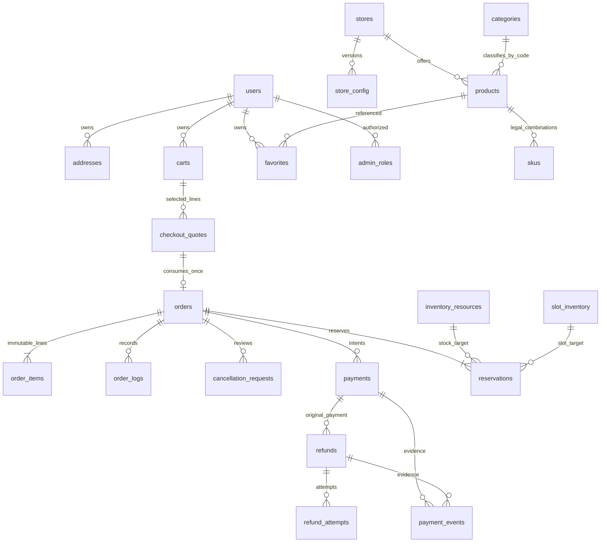

# V1 数据模型

日期：2026-10-03。当前版本覆盖 **D01 交易约束及 D02 完整字段字典、关系与快照设计**；目标模型尚未创建集合或接入云端。经营政策与状态矩阵见 [TRANSACTION-RULES.md](TRANSACTION-RULES.md)。

## D01 交易快照字段

供云端模型校验的内部快照；字段须由云端显式构造，纯函数不会自动填默认值。正式数据库实体与客户端读模型在下文分别定义，不能把内部快照直接全部返回给客户端。

| 字段 | 类型 / 必填 | 新订单值 | 单位 / 约束 | 可变性与隐私 |
|---|---|---|---|---|
| id | string / 是 | 服务端生成 | 非空唯一订单 ID | 不可变；本人 / 授权商家 |
| ownerId | string / 是 | 可信身份解析结果 | 非空；不取客户端 ownerId 或角色 | 不可变；私有关联键 |
| storeId | string / 是 | 服务端认可的门店 | 非空；一单一家门店 | 不可变；授权范围 |
| tradePolicyVersion | string / 是 | v1-2026-10-03 | 记录创建时政策；不支持的版本拒绝自动操作 | 不可变；审计依据 |
| fulfillment | enum / 是 | PICKUP 或 DELIVERY | 与已确认报价一致 | 创建后不可静默改变；订单私有 |
| orderStatus | enum / 是 | PENDING_PAYMENT | 仅领域命令合法迁移 | 服务端可变；本人 / 授权商家读 |
| paymentStatus | enum / 是 | UNPAID | 支付意图持久化后先变 PENDING，再调用外部 API | 仅资金领域修改；用户只读摘要 |
| refundStatus | enum / 是 | NONE | 最新退款意图的状态摘要；历史留在 refunds | 仅资金领域修改；用户只读摘要 |
| currency | literal / 是 | CNY | 币种 | 不可变 |
| totalCents | safe integer / 是 | 云端报价总额 | 分；正值，不接受浮点、NaN、Infinity | 不可变；商品小计 / 运费见下文 D02 |
| paidCents | safe integer / 是 | 0 | 分；V1 只能为 0 或 totalCents | 可信全额实收后增加；退款不抹掉实收 |
| refundedCents | safe integer / 是 | 0 | 分；累计成功退款 | 仅可信退款结果增加；事务去重 |
| refundReservedCents | safe integer / 是 | 0 | 分；未决退款意图的占用，包括失败待处理 | 原意图确认 / 处置前不自动释放 |
| version | safe integer / 是 | 0 | 无单位；非负；实际写入递增 | 数据库事务条件；客户端不能指定新版本 |

安全约束：`refundedCents + refundReservedCents <= paidCents <= totalCents`。活动已付阶段必须 paymentStatus=PAID 且实收足额。DELIVERING 仅用于 DELIVERY。未核实的支付不能与 CANCELLED 合并成“已关闭可释放资源”的事实。


D01 状态字段的完整枚举（与 trade-model.js 相同）：

| 字段 | 合法值 / 约束 |
|---|---|
| orderStatus | PENDING_PAYMENT / PAID / ACCEPTED / MAKING / READY / DELIVERING / COMPLETED / CANCELLED |
| paymentStatus | UNPAID / PENDING / PAID / CLOSED / EXCEPTION；PAID 要求 paidCents=totalCents，其他要求 paidCents=0 |
| refundStatus | NONE / PENDING / SUCCEEDED / FAILED；NONE 要求累计退款与占用均为 0，PENDING/FAILED 要求正占用，SUCCEEDED 要求零占用且累计成功退款为正 |
| fulfillment | PICKUP / DELIVERY；DELIVERING 仅配送 |

PAID/ACCEPTED/MAKING/READY/DELIVERING/COMPLETED 履约态均要求 paymentStatus=PAID。PENDING_PAYMENT 要求 paidCents=0；CANCELLED 不允许未核实的 PENDING/EXCEPTION 支付轴。详细合法迁移与角色操作见 TRANSACTION-RULES.md，不能只按枚举成员检查放行任意跳转。

## 取消申请与退款的关系

取消申请单独存储，最小校验对象为 `id / orderId / ownerId / status`，status 为 PENDING / APPROVED / REJECTED。审批必须匹配当前订单和本人；审批记录保存商家、理由、本次退款金额与时间。完整字段、不可变性及隐私见下文；索引 / 事务留 D04。

```text
取消申请 PENDING → 商家 APPROVED / REJECTED
审批通过：订单变 CANCELLED；正金额建立 refunds 意图
审批拒绝：保留当前订单状态
退款意图 PENDING → SUCCEEDED / FAILED
退款失败：订单不复活；意图继续占用原预算
```

退款与付款保留独立实体，关联原始真实付款；多个已完成的部分退款累计不能超实付，最多一个未决意图。单独售后退款保持实际履约状态，例如 COMPLETED + PAID + SUCCEEDED，而不是把历史已交付订单改为 CANCELLED。

## 集合基线与验收边界

D02 下文定义 users / categories / products / skus / favorites / carts / addresses / stores / store_config / checkout_quotes / orders / order_items / order_logs / cancellation_requests / payments / refunds / payment_events / reservations / slot_inventory / idempotency_records / admin_roles / audit_logs 的字段与关系，并明确金额、商品、地址、门店、预约和费率快照。当前没有创建这些集合。

文档示例中的订单 / 身份 ID 和价格仅用于离线测试，不是正式门店资料或商品价格。完整索引、事务预算、权限规则和云种子属于 D03–D07，尚未通过云验收。

## D02 通用持久化契约

本节为 D02 设计基线，未创建数据库集合。除另有说明，表中每个字段都遵循以下类型、默认、可变性与隐私规则；共用字段不再逐集合重复列出。

| 通用字段 / 类型 | 必填 / 默认 | 单位与约束 | 可变性 | 隐私 |
|---|---|---|---|---|
| _id: ID | 是 / 服务端生成 | 非空不透明唯一字符串；引用使用同一值 | 固定 | 继承实体级别；ID 本身不构成权限 |
| schemaVersion: N | 是 / 1 | 结构版本；升级须显式迁移 | 迁移时变更 | 继承实体 |
| version: N | 是 / 0 | 每次实际写入递增；追加记录通常维持 0 | 服务端条件更新 | 继承实体 |
| createdAt: T | 是 / 服务端当前时间 | UTC Unix 毫秒，正安全整数 | 固定 | 继承实体 |
| updatedAt: T | 是 / createdAt | 不早于 createdAt；真实写入时更新 | 服务端修改 | 继承实体 |

类型缩写：`S` 字符串（非空除非允许空串）；`ID` 外键 / 标识字符串；`N` 非负安全整数；`P` 正安全整数；`C` 非负安全整数分，正价使用 `C+`；`T` UTC 毫秒正安全整数；`B` boolean；`E` 枚举；`[]` 有序数组；`?` 表示允许 null。未特别标注的字段 **必填、无隐式默认、无单位、服务端赋值**；显式写 null 不等于允许省略。所有数组去除重复引用，空数组只有表中允许时可用。JSON 不接受 undefined、NaN、Infinity、BigInt、函数、Date 实例或循环结构；日期先转换成约定字符串 / 毫秒。数量、容量、序号、版本均非金额。

表中可变性：`固定` 指创建后不可静默覆盖；`可改` 指授权服务端按版本写入；`一次` 指从 null 填入后固定；`追加` 指不可覆盖历史。隐私：`公开` 仅发布后的必要目录资料；`本人` 经服务端只对所有者；`履约` 仅本人和有当前门店权限且履约所需的人员；`内部` 仅对应服务 / 受控管理员。所有字段禁止普通客户端直接写数据库；用户输入须经接口验证。字段级投影详见读模型章节。

纯模型 `order.id = orders._id`、`review.id = cancellation_requests._id`，适配层映射；数据库不再保存可独立修改的 `id` 副本。`ownerId / subjectId / reviewerId` 均指 `users._id`。将经过校验的 `(environment, appId, openId)` 映射为稳定用户 ID；并发首次登录必须唯一，具体索引 / 确定性映射由 D04 验证。现有 user.me 的 16 位 `subjectHash` 仅用于追踪，不能作为用户主键、角色键或订单所有者。trace 哈希也不能代替鉴权。

所有外键的环境、门店、所有者须服务端检查；不存在跨环境关系。业务引用不能依赖数据库自动外键。目录、地址可停用 / 删除，历史订单快照不得级联删除。配置缺失保持 DRAFT / null，不能用旧 Demo、展示价格或机器时区补正式经营值。业务发布须在 D03 / D05 冻结真实值。

## D02 集合字段字典

每个集合均含上述五个通用字段。以下 22 个集合是计划基线；末尾另定义三个支撑集合的设计取舍。所有名称是目标模型，不表示已创建或已部署。

### users

| 字段 / 类型 | 必填 / 默认 | 约束 / 单位 | 可变性 | 隐私 |
|---|---|---|---|---|
| environment: S | 是 / 无 | 当前隔离环境 | 固定 | 内部 |
| appId: S | 是 / 无 | 可信平台上下文 | 固定 | 内部 |
| openId: S | 是 / 无 | 同 appId、environment 唯一身份映射 | 固定 | 内部 |
| displayName: S | 是 / 空串 | 非鉴权依据 | 可改 | 本人 |
| avatar: MediaRef? | 是 / null | 不包含访问 token | 可改 | 本人 |
| defaultAddressId: ID? | 是 / null | 必须为本人未删除地址；单一指针 | 可改 | 本人 |
| status: E | 是 / ACTIVE | ACTIVE / DISABLED；禁用不删除历史关系 | 可改 | 内部 |
| privacyConsent: Consent? | 是 / null | 版本化同意记录；缺少时不能假装已同意 | 可改并留审计 | 本人 |

### categories

| 字段 / 类型 | 必填 / 默认 | 约束 / 单位 | 可变性 | 隐私 |
|---|---|---|---|---|
| code: E | 是 / 无 | 仅 CAKE / MINI_CAKE / BREAD；全局唯一 | 固定 | 公开 |
| nameZh: S | 是 / 无 | 对应 蛋糕 / 小蛋糕 / 面包 | 固定 | 公开 |
| nameEn: S | 是 / 无 | 对应 Cake / Mini Cake / Bread | 固定 | 公开 |
| sortOrder: N | 是 / 无 | 顺序；不派生新分类 | 可改 | 公开 |
| published: B | 是 / false | 仅发布记录公开 | 可改 | 公开 |

### products

| 字段 / 类型 | 必填 / 默认 | 约束 / 单位 | 可变性 | 隐私 |
|---|---|---|---|---|
| storeId: ID | 是 / 无 | stores | 固定 | 公开 |
| categoryCode: E | 是 / 无 | categories.code 三分类之一 | 固定 | 公开 |
| name: S | 是 / 无 | 正式名称 | 可改 | 公开 |
| description: S | 是 / 空串 | 展示文本，无执行内容 | 可改 | 公开 |
| images: MediaRef[] | 是 / [] | 发布要求有效素材；空值只供草稿 | 可改 | 公开 |
| optionGroups: OptionGroup[] | 是 / [] | 允许空规格；不能推导不存在 SKU | 可改 | 公开 |
| messagePolicy: MessagePolicy? | 是 / null | 发布时 null 表示不支持留言；DRAFT 待配置须保留阻塞，不得自动发布；不能从分类猜上限 | 可改 | 公开 |
| minLeadTimeMinutes: N? | 是 / null | 分钟；发布前明确，包括允许 0 的决定 | 可改 | 公开 |
| status: E | 是 / DRAFT | DRAFT / ON_SALE / OFF_SALE / ARCHIVED | 可改 | 公开仅 ON_SALE |
| sortOrder: N | 是 / 0 | 展示顺序 | 可改 | 公开 |

### skus

| 字段 / 类型 | 必填 / 默认 | 约束 / 单位 | 可变性 | 隐私 |
|---|---|---|---|---|
| storeId: ID | 是 / 无 | 与 product 相同 | 固定 | 公开 |
| productId: ID | 是 / 无 | products | 固定 | 公开 |
| description: S | 是 / 无 | 规格显示文本 | 可改 | 公开 |
| selectedOptions: SelectedOption[] | 是 / [] | groupCode 每组唯一；合法组合只来自明确 SKU | 固定；换组合建新 SKU | 公开 |
| currency: E | 是 / CNY | 仅 CNY | 固定 | 公开 |
| unitPriceCents: C+? | 是 / null | 分；null 草稿不可买；正式价 > 0 | 可改 | 公开 |
| minQuantity: P? | 是 / null | 件 / 份等销售数量；待商家确认 | 可改 | 公开 |
| maxQuantity: P? | 是 / null | 不小于 minQuantity；不替代库存 | 可改 | 公开 |
| stockRequirements: ResourceRequirement[] | 是 / [] | 非空且资源单位明确后才允许销售 | 可改 | 内部 |
| status: E | 是 / DRAFT | DRAFT / ON_SALE / OFF_SALE / ARCHIVED；产品亦须可售 | 可改 | 公开仅可售 |

### favorites

| 字段 / 类型 | 必填 / 默认 | 约束 / 单位 | 可变性 | 隐私 |
|---|---|---|---|---|
| ownerId: ID | 是 / 无 | users；同 owner/product 唯一 | 固定 | 本人 |
| productId: ID | 是 / 无 | products；下架仍可取消收藏 | 固定 | 本人 |

重复收藏使用同一关系；取消可删关系，不能删除商品。

### carts

| 字段 / 类型 | 必填 / 默认 | 约束 / 单位 | 可变性 | 隐私 |
|---|---|---|---|---|
| ownerId: ID | 是 / 无 | users；每 owner/store 一个当前袋 | 固定 | 本人 |
| storeId: ID | 是 / 无 | stores；不混门店 | 固定 | 本人 |
| lines: CartLine[] | 是 / [] | lineId 唯一；行数限制来自发布配置 | 可改 | 本人 |

袋无权威总额、已预留库存或支付状态。相同 SKU 不同 cakeMessage 可以分行，留言不是 SKU。最终合并及规范化技术规则见下文 D03；经营值仍待确认。

### addresses

| 字段 / 类型 | 必填 / 默认 | 约束 / 单位 | 可变性 | 隐私 |
|---|---|---|---|---|
| ownerId: ID | 是 / 无 | users | 固定 | 本人 |
| receiverName: S | 是 / 无 | 服务端验证联系人 | 可改 | 本人 |
| phone: S | 是 / 无 | 电话字符串；不能转数值 | 可改 | 本人 |
| province: S | 是 / 无 | 行政区文字 | 可改 | 本人 |
| city: S | 是 / 无 | 行政区文字 | 可改 | 本人 |
| district: S | 是 / 无 | 行政区文字 | 可改 | 本人 |
| regionCodes: RegionCodes | 是 / 无 | 文字与编码核对；缺编码可显式 null | 可改 | 本人 |
| detail: S | 是 / 无 | 完整地址；不进入公开日志 | 可改 | 本人 |
| location: Location? | 是 / null | 未定位时不得用虚构坐标 | 可改 | 本人 |
| deletedAt: T? | 是 / null | 软删除；不得改订单地址快照 | 一次 | 本人 |

默认地址仅 users.defaultAddressId，不保存竞争的 isDefault。删除默认地址与清空指针须原子；不隐式选另一个地址。设置默认时验证本人 / 未删除 / version。

### stores

| 字段 / 类型 | 必填 / 默认 | 约束 / 单位 | 可变性 | 隐私 |
|---|---|---|---|---|
| name: S | 是 / 无 | 正式门店名 | 可改 | 公开 |
| address: S? | 是 / null | 正式实体店地址，缺失不发布 | 可改 | 公开 |
| phone: S? | 是 / null | 正式联系号码，缺失不发布 | 可改 | 公开 |
| timeZone: S? | 是 / null | IANA 时区；不继承客户端 / 执行机时区 | 可改 | 公开 |
| location: Location? | 是 / null | 配送定位依赖的可信门店位置 | 可改 | 公开仅必要位置 |
| status: E | 是 / DRAFT | DRAFT / OPEN / CLOSED / ARCHIVED | 可改 | 公开仅发布资料 |
| activeConfigId: ID? | 是 / null | 本店 PUBLISHED store_config | 可改 | 内部 |

### store_config

配置采用发布版本：发布后固定；修改生成新记录并切换 stores.activeConfigId，不能改历史版本。

| 字段 / 类型 | 必填 / 默认 | 约束 / 单位 | 可变性 | 隐私 |
|---|---|---|---|---|
| storeId: ID | 是 / 无 | stores | 固定 | 内部 |
| configVersion: N | 是 / 无 | 本店单调唯一发布序号，与记录 version 区别 | 固定 | 内部 |
| status: E | 是 / DRAFT | DRAFT / PUBLISHED / RETIRED | 可改并审计 | 内部 |
| fulfillmentModes: E[] | 是 / [] | PICKUP / DELIVERY；发布非空 | 草稿可改；发布固定 | 公开投影 |
| timePolicy: TimePolicy? | 是 / null | 缺失不得报价 | 草稿可改；发布固定 | 公开投影 |
| deliveryRules: DeliveryRule[] | 是 / [] | 启用配送须有完整可判定规则 | 草稿可改；发布固定 | 公开投影 |
| cartLimits: CartLimits? | 是 / null | 缺限制不开放正式袋写入 | 草稿可改；发布固定 | 公开投影 |
| quoteTtlMinutes: P? | 是 / null | 分钟，待确认 | 草稿可改；发布固定 | 内部 |
| paymentHoldMinutes: P? | 是 / null | 分钟；须符合预约边界 | 草稿可改；发布固定 | 内部 |
| slotPolicy: SlotPolicy? | 是 / null | 容量 / 单位 / 回补语义待确认 | 草稿可改；发布固定 | 内部 |
| tradePolicyVersion: S | 是 / v1-2026-10-03 | 已冻结政策 | 草稿可改；发布固定 | 公开 |
| fulfillmentPolicyVersion: S | 是 / v1-fulfillment-2026-10-03 | 已确认履约政策，随配置版本保存 | 草稿可改；发布固定 | 公开 |
| publishedAt: T? | 是 / null | 发布校验通过后填 | 一次 | 内部 |

### checkout_quotes

| 字段 / 类型 | 必填 / 默认 | 约束 / 单位 | 可变性 | 隐私 |
|---|---|---|---|---|
| ownerId: ID | 是 / 无 | users；客户端只能取本人报价 | 固定 | 本人 |
| storeId: ID | 是 / 无 | 与 facts.storeSnapshot.storeId 一致 | 固定 | 本人 |
| facts: OrderFacts | 是 / 无 | captureOrderFacts 返回结构；facts.quoteId = _id | 固定 | 履约 |
| resourceVersions: ResourceVersion[] | 是 / 无 | 当前资源版本 / 需求证明；非预留 | 固定 | 内部 |
| addressVersion: N? | 是 / 无 | DELIVERY 是来源地址版本；PICKUP null | 固定 | 内部 |
| expiresAt: T | 是 / 无 | > createdAt；TTL 来自发布配置 | 固定 | 本人 |
| status: E | 是 / ACTIVE | ACTIVE / CONSUMED / INVALIDATED；过期按时间判定 | 可改 | 本人 |
| consumedOrderId: ID? | 是 / null | 一份报价最多创建一个订单 | 一次 | 本人 |

### orders

含 D01 的全部交易字段，持久化时 id 由 _id 映射、version 已由通用字段定义；其余 ownerId/storeId/tradePolicyVersion/fulfillment/三轴/currency/totalCents/三个资金摘要沿用前表的类型、初值、约束与隐私。以下补齐事实 / 状态字段。

| 字段 / 类型 | 必填 / 默认 | 约束 / 单位 | 可变性 | 隐私 |
|---|---|---|---|---|
| orderNo: S | 是 / 服务端生成 | 唯一展示编号，不是核销凭证 / 鉴权键 | 固定 | 履约 |
| quoteId: ID | 是 / 无 | checkout_quotes，反向 consumedOrderId 对应 | 固定 | 内部 |
| orderNote: S | 是 / 空串 | 订单备注，与逐行留言独立；长度待配置 | 固定 | 履约 |
| cartSelectionSnapshot: CartSelectionSnapshot | 是 / 无 | 创建时选中行证据 | 固定 | 内部 |
| storeSnapshot: StoreSnapshot | 是 / 无 | 订单创建事实 | 固定 | 履约 |
| contactSnapshot: ContactSnapshot | 是 / 无 | 自提 / 配送联系人 | 固定 | 履约 |
| addressSnapshot: AddressSnapshot? | 是 / 无 | DELIVERY 对象；PICKUP null | 固定 | 履约 |
| appointmentSnapshot: AppointmentSnapshot | 是 / 无 | 时区与 UTC 区间 | 固定 | 履约 |
| deliverySnapshot: DeliverySnapshot | 是 / 无 | 服务端运费与范围证据 | 固定 | 履约投影 |
| subtotalCents: C+ | 是 / 无 | 分，订单行之和 | 固定 | 履约 |
| deliveryFeeCents: C | 是 / 无 | 分，与 deliverySnapshot.feeCents 一致 | 固定 | 履约 |
| paymentDeadlineAt: T | 是 / 无 | 资源占用截止；不晚于预约允许边界 | 固定 | 履约 |
| paidAt: T? | 是 / null | 可信平台成功时间 | 一次 | 履约 |
| cancelledAt: T? | 是 / null | 合法取消提交时间 | 一次 | 履约 |
| completedAt: T? | 是 / null | 合法履约完成时间 | 一次 | 履约 |
| cancellationReason: S? | 是 / null | 取消时填，不混审批 / 退款原因 | 一次 | 履约 |
| pickupCredential: PickupCredential? | 是 / null | 仅自提；策略 E10 待确认 | 可改按核销契约 | 内部 |

### order_items

| 字段 / 类型 | 必填 / 默认 | 约束 / 单位 | 可变性 | 隐私 |
|---|---|---|---|---|
| orderId: ID | 是 / 无 | orders；与订单头同事务创建 | 固定 | 履约 |
| position: N | 是 / 无 | 原快照 items 数组顺序，从 0 起，连续且唯一 | 固定 | 履约 |
| ItemSnapshot 各字段 | 是 / 无 | 下文逐字段展开；直接存行字段，不再嵌套 item | 固定 | 履约 |

数据库订单头 **不另存 items 数组**。captureOrderFacts 的 items 仅为原子创建载荷，落到 order_items 后是唯一历史明细。读模型按 position 聚合；不得通过两个入口独立改明细。外键 productId/skuId 仅溯源，读历史必须用快照。

### order_logs

| 字段 / 类型 | 必填 / 默认 | 约束 / 单位 | 可变性 | 隐私 |
|---|---|---|---|---|
| orderId: ID | 是 / 无 | orders | 固定 | 履约 |
| command: S | 是 / 无 | D01 命令或显式资金 / 资源领域动作 | 固定 | 内部 |
| actor: ActorRef | 是 / 无 | 可信执行者，不接受前端 role | 固定 | 内部 |
| before: TradeAxes | 是 / 无 | 提交前状态 / 金额 / version | 固定 | 内部 |
| after: TradeAxes | 是 / 无 | 提交后状态 / 金额 / version | 固定 | 内部 |
| requestId: S | 是 / 无 | 脱敏关联追踪，不是幂等键 | 固定 | 内部 |
| eventId: ID? | 是 / null | 资金动作关联 payment_events | 固定 | 内部 |
| reason: S | 是 / 空串 | 脱敏理由；不存电话 / 凭证 | 固定 | 履约投影 |
| publicMessage: S | 是 / 空串 | 审核过的订单进度文案 | 固定 | 履约 |

### cancellation_requests

| 字段 / 类型 | 必填 / 默认 | 约束 / 单位 | 可变性 | 隐私 |
|---|---|---|---|---|
| orderId: ID | 是 / 无 | orders；同订单最多一个 PENDING 申请 | 固定 | 履约 |
| ownerId: ID | 是 / 无 | 与订单 ownerId 一致 | 固定 | 本人 |
| status: E | 是 / PENDING | PENDING / APPROVED / REJECTED | 一次审批 | 履约 |
| reason: S | 是 / 无 | 本人申请原因 | 固定 | 履约 |
| reviewerId: ID? | 是 / null | 审批时有当前本店权限的 users | 一次 | 内部 |
| reviewedAt: T? | 是 / null | 决定时间 | 一次 | 履约 |
| reviewReason: S? | 是 / null | 审批 / 拒绝理由 | 一次 | 履约 |
| approvedRefundCents: C? | 是 / null | 分；APPROVED 必填可为 0；其他 null | 一次 | 履约 |
| refundId: ID? | 是 / null | 正金额审批关联 refunds；零金额保持 null | 一次 | 内部 |

申请不改变 orderStatus，商家审批须读当前订单；履约竞争可能使申请无法批准，显式拒绝并留记录，不静默撤销。

### payments

| 字段 / 类型 | 必填 / 默认 | 约束 / 单位 | 可变性 | 隐私 |
|---|---|---|---|---|
| orderId: ID | 是 / 无 | orders；一个订单可有关闭后的重试意图 | 固定 | 内部 |
| ownerId: ID | 是 / 无 | 订单本人；来源身份映射 | 固定 | 内部 |
| provider: S | 是 / 无 | 选定真实接入方案，不预设平台参数 | 固定 | 内部 |
| merchantId: S | 是 / 无 | 真实商户绑定 | 固定 | 内部 |
| appId: S | 是 / 无 | 与平台结果核对 | 固定 | 内部 |
| outTradeNo: S | 是 / 服务端生成 | 商户侧唯一；重试不变更同一意图单号 | 固定 | 内部 |
| transactionId: S? | 是 / null | 可信平台交易号；全局去重 | 一次 | 内部 |
| currency: E | 是 / CNY | 对应订单 | 固定 | 履约投影 |
| amountCents: C+ | 是 / 无 | 分，必须等于订单 totalCents | 固定 | 履约投影 |
| status: E | 是 / PENDING | PENDING / PAID / CLOSED / EXCEPTION；非订单 UNPAID | 可改按资金证据 | 履约投影 |
| accountingState: E | 是 / UNAPPLIED | UNAPPLIED / APPLIED / QUARANTINED；APPLIED 须可信成功且只入账一次 | 可改受控 | 内部 |
| expiresAt: T | 是 / 无 | <= 订单付款截止 | 固定 | 内部 |
| confirmedAt: T? | 是 / null | 可信成功时间 | 一次 | 履约投影 |
| closedAt: T? | 是 / null | 可信关闭时间，不是客户端退出 | 一次 | 内部 |
| lastEventId: ID? | 是 / null | payment_events | 可改 | 内部 |

### refunds

| 字段 / 类型 | 必填 / 默认 | 约束 / 单位 | 可变性 | 隐私 |
|---|---|---|---|---|
| orderId: ID | 是 / 无 | orders | 固定 | 内部 |
| paymentId: ID | 是 / 无 | 已成功付款，原交易号可定位 | 固定 | 内部 |
| cancellationRequestId: ID? | 是 / null | 取消审批退款才有值 | 固定 | 内部 |
| approvalLogId: ID | 是 / 无 | order_logs；拒单 / 补偿也记录依据 | 固定 | 内部 |
| approvedBy: ActorRef | 是 / 无 | 商家审批或可信迟到款补偿处理器 | 固定 | 内部 |
| reason: S | 是 / 无 | 本次意图依据 | 固定 | 履约投影 |
| currency: E | 是 / CNY | 原付款币种 | 固定 | 履约投影 |
| amountCents: C+ | 是 / 无 | 分；不保存零金额意图 | 固定 | 履约投影 |
| outRefundNo: S | 是 / 服务端生成 | 唯一意图号；查询 / 重试复用 | 固定 | 内部 |
| providerRefundId: S? | 是 / null | 可信退款平台号 | 一次 | 内部 |
| status: E | 是 / PENDING | PENDING / FAILED / SUCCEEDED；成功不可倒退 | 可改按资金证据 | 履约投影 |
| budgetState: E | 是 / RESERVED | RESERVED / SETTLED / RELEASED；失败仍 RESERVED | 可改受控 | 内部 |
| settledAt: T? | 是 / null | 可信成功时间 | 一次 | 履约投影 |
| lastEventId: ID? | 是 / null | payment_events | 可改 | 内部 |
| lastErrorCode: S? | 是 / null | 脱敏错误，无原始凭证 | 可改 | 内部 |

budgetState=RELEASED 仅供未来核实后受控处置，须审计与订单摘要同事务调整，D01 不提供该命令；当前不能调用方自行释放。退款意图终结后的订单 refundStatus 重算规则及处置流程须在 P06 完成，未经实现保持预算占用。

### payment_events

| 字段 / 类型 | 必填 / 默认 | 约束 / 单位 | 可变性 | 隐私 |
|---|---|---|---|---|
| provider: S | 是 / 无 | 与对应资金意图核对 | 固定 | 内部 |
| providerEventId: S? | 是 / null | 平台提供则保存；不同事件仍按交易号去重 | 固定 | 内部 |
| source: E | 是 / 无 | NOTIFICATION / QUERY / RECONCILIATION | 固定 | 内部 |
| kind: E | 是 / 无 | PAYMENT / REFUND / CLOSE | 固定 | 内部 |
| paymentId: ID? | 是 / null | 未匹配证据允许 null，进入隔离 | 一次关联 | 内部 |
| refundId: ID? | 是 / null | 退款事件匹配后填 | 一次关联 | 内部 |
| receivedAt: T | 是 / 服务端当前时间 | UTC 毫秒 | 固定 | 内部 |
| evidence: MoneyEvidence | 是 / 无 | 只保存白名单核验事实；不保存私钥 / token | 固定 | 内部 |
| verificationStatus: E | 是 / UNVERIFIED | UNVERIFIED / VERIFIED / REJECTED；未验不入账 | 一次核验 | 内部 |
| processingStatus: E | 是 / RECEIVED | RECEIVED / APPLIED / DUPLICATE / QUARANTINED / RETRY | 可改 | 内部 |
| processedAt: T? | 是 / null | 处理结束时间 | 一次 | 内部 |
| errorCode: S? | 是 / null | 脱敏异常；核验失败不丢证据 | 可改 | 内部 |

### reservations

| 字段 / 类型 | 必填 / 默认 | 约束 / 单位 | 可变性 | 隐私 |
|---|---|---|---|---|
| orderId: ID | 是 / 无 | orders；与订单头 / 行同事务 | 固定 | 内部 |
| storeId: ID | 是 / 无 | 一致门店 | 固定 | 内部 |
| resourceKind: E | 是 / 无 | STOCK / SLOT | 固定 | 内部 |
| resourceId: ID | 是 / 无 | STOCK→inventory_resources；SLOT→slot_inventory | 固定 | 内部 |
| quantity: P | 是 / 无 | resource 单位，按整单聚合，不等同售价数量 | 固定 | 内部 |
| status: E | 是 / HELD | HELD / CONFIRMED / CONSUMED / RELEASED | 可改受控且不能重复释放 | 内部 |
| expiresAt: T | 是 / 无 | 初始支付占用截止；到期不代表可直接释放 | 固定 | 内部 |
| resolvedAt: T? | 是 / null | 消耗 / 释放提交时间 | 一次 | 内部 |
| resolutionLogId: ID? | 是 / null | order_logs | 一次 | 内部 |

### slot_inventory

| 字段 / 类型 | 必填 / 默认 | 约束 / 单位 | 可变性 | 隐私 |
|---|---|---|---|---|
| storeId: ID | 是 / 无 | stores | 固定 | 内部 |
| fulfillment: E | 是 / 无 | PICKUP / DELIVERY 分开 | 固定 | 公开投影 |
| serviceDate: S | 是 / 无 | 门店当地 YYYY-MM-DD | 固定 | 公开投影 |
| timeZone: S | 是 / 无 | 对应发布配置 | 固定 | 公开投影 |
| startAt: T | 是 / 无 | UTC 毫秒 | 固定 | 公开投影 |
| endAt: T | 是 / 无 | > startAt；半开区间 [startAt,endAt) | 固定 | 公开投影 |
| policyVersion: S | 是 / 无 | TimePolicy.policyVersion | 固定 | 内部 |
| capacityUnit: S | 是 / 无 | SlotPolicy.unit，经确认后才能发布 | 固定 | 内部 |
| capacityTotal: N | 是 / 无 | 容量，允许 0 表示无可售名额 | 可改按资源事务 | 内部 |
| heldUnits: N | 是 / 0 | HELD 预留之和 | 可改按资源事务 | 内部 |
| confirmedUnits: N | 是 / 0 | CONFIRMED 之和 | 可改按资源事务 | 内部 |
| consumedUnits: N | 是 / 0 | CONSUMED 之和 | 可改按资源事务 | 内部 |
| status: E | 是 / CLOSED | OPEN / CLOSED；配置核验后开放 | 可改 | 公开投影 |

### idempotency_records

| 字段 / 类型 | 必填 / 默认 | 约束 / 单位 | 可变性 | 隐私 |
|---|---|---|---|---|
| actorScope: S | 是 / 无 | 可信 owner / 系统处理器身份隔离范围 | 固定 | 内部 |
| command: S | 是 / 无 | 命令隔离范围 | 固定 | 内部 |
| key: S | 是 / 无 | 调用方幂等键；同 scope/command/key 唯一 | 固定 | 内部 |
| requestFingerprint: S | 是 / 无 | 规范化命令摘要；同键不同输入拒绝 | 固定 | 内部 |
| status: E | 是 / IN_PROGRESS | IN_PROGRESS / SUCCEEDED / FAILED；锁租约 D04 定义 | 可改 | 内部 |
| result: CommandResult? | 是 / null | 可重放安全结果，不存电话 / 支付 token | 一次终结 | 内部 |
| leaseUntil: T? | 是 / null | 后台任务租约；不等于资金终结 | 可改受控 | 内部 |
| retentionUntil: T? | 是 / null | 保留策略待定；不能仅 TTL 删除资金唯一性证据 | 可改受控 | 内部 |

### admin_roles

| 字段 / 类型 | 必填 / 默认 | 约束 / 单位 | 可变性 | 隐私 |
|---|---|---|---|---|
| subjectId: ID | 是 / 无 | users；初始身份 E12 待确认 | 固定 | 内部 |
| storeIds: ID[] | 是 / 无 | 非空门店范围，不接受请求自报 | 可改并审计 | 内部 |
| capabilities: S[] | 是 / [] | ORDER_OPERATE / REFUND_APPROVE / CATALOG_WRITE / CONFIG_WRITE / ROLE_MANAGE / AUDIT_READ；具体授权 D06 | 可改并审计 | 内部 |
| status: E | 是 / ACTIVE | ACTIVE / REVOKED | 可改并审计 | 内部 |
| grantedBy: ActorRef | 是 / 无 | 受控初始化或有角色管理权限者 | 固定 | 内部 |
| revokedAt: T? | 是 / null | 撤销生效；每次敏感操作重查 | 一次 | 内部 |

### audit_logs

| 字段 / 类型 | 必填 / 默认 | 约束 / 单位 | 可变性 | 隐私 |
|---|---|---|---|---|
| actor: ActorRef | 是 / 无 | 真实服务端身份 | 固定 | 内部 |
| action: S | 是 / 无 | 角色 / 配置 / 目录 / 财务处置等动作 | 固定 | 内部 |
| storeId: ID? | 是 / null | 全局初始化可 null | 固定 | 内部 |
| target: AuditTarget | 是 / 无 | 目标实体与版本 | 固定 | 内部 |
| changes: AuditChange[] | 是 / [] | 只保存允许审计的脱敏标量差异 | 固定 | 内部 |
| reason: S | 是 / 无 | 操作依据 | 固定 | 内部 |
| requestId: S | 是 / 无 | 追踪 | 固定 | 内部 |
| outcome: E | 是 / 无 | SUCCEEDED / REJECTED / FAILED | 固定 | 内部 |

资金与订单日志均追加，修正以新记录关联旧记录；不得擦除历史事实。

## 支撑集合取舍

采用以下三个支撑集合作为 D02 的目标设计扩展（22 个计划集合 + 3 个支撑集合），均未建库。它们分别解决共享资源、历史图版本、退款重试留痕；不会引入新的经营政策。D03–D05 / P06 仍须验证具体事务与外部接入。

- inventory_resources：同一资源可供多个 SKU 使用，避免在每个 SKU 中复制余额；也支持一 SKU 一资源。实际采用独立 / 共享及单位仍待 E06。
- media_assets：稳定 assetId + revision 定位不可覆盖的图文件。仅在订单保存 URL 无法保证历史文件存活，必须由素材服务落实引用检查 / 保留。
- refund_attempts：退款意图与一次外部调用分开；失败调用不会生成新退款额度或新意图号。

### inventory_resources

含五个通用字段；同一个资源的单位和归属不可更改。

| 字段 / 类型 | 必填 / 默认 | 约束 / 单位 | 可变性 | 隐私 |
|---|---|---|---|---|
| storeId: ID | 是 / 无 | stores | 固定 | 内部 |
| name: S | 是 / 无 | 资源名，非 SKU 名 | 可改 | 内部 |
| unit: S | 是 / 无 | 经确认的整数计量单位 | 固定 | 内部 |
| totalUnits: N | 是 / 无 | 总配额；单位见 unit | 可改按资源事务 | 内部 |
| heldUnits: N | 是 / 0 | HELD 之和 | 可改按资源事务 | 内部 |
| confirmedUnits: N | 是 / 0 | CONFIRMED 之和 | 可改按资源事务 | 内部 |
| consumedUnits: N | 是 / 0 | CONSUMED 之和；退款不恢复 | 可改按资源事务 | 内部 |
| status: E | 是 / CLOSED | OPEN / CLOSED；未确认单位不能开放 | 可改 | 内部 |

`heldUnits + confirmedUnits + consumedUnits <= totalUnits`，时段用同式对应 capacityTotal。所有中间求和须安全整数。可用量为总量减这三项，不能修改总量至已占用量以下。补货 / 周期重置必须有受控资源记录，不能抹去仍存活的预留；具体周期、slot 回补与消耗时机留 D04 / D05。

### media_assets

含五个通用字段；一记录对应一个不可覆盖版本。同 assetId/revision 唯一，订单引用此二元键而非此记录 _id。

| 字段 / 类型 | 必填 / 默认 | 约束 / 单位 | 可变性 | 隐私 |
|---|---|---|---|---|
| assetId: ID | 是 / 服务端生成 | 稳定逻辑素材 ID | 固定 | 公开仅发布引用 |
| revision: S | 是 / 无 | 不透明版本，不能重新指向另一文件 | 固定 | 公开仅发布引用 |
| storageRef: S | 是 / 无 | 稳定存储引用；不用会过期的签名 URL | 固定 | 公开仅发布引用 |
| sourceKind: E | 是 / 无 | REAL_PHOTO / DESIGN_PREVIEW；不得伪称实拍 | 固定 | 公开 |
| contentHash: S | 是 / 无 | 文件内容校验摘要 | 固定 | 内部 |
| mimeType: S | 是 / 无 | 验证后的图片类型 | 固定 | 内部 |
| byteLength: P | 是 / 无 | bytes；实际文件大小 | 固定 | 内部 |
| status: E | 是 / DRAFT | DRAFT / PUBLISHED / RETIRED；退役不等于物理删除 | 可改 | 内部 |
| retainedUntil: T? | 是 / null | null 表示尚未批准删除时间；不是立即可删 | 可改受控 | 内部 |

删除前检查所有历史订单、有效报价和现行目录引用，并符合确定的保留策略；不能仅凭版本退役删除。快照深复制只保存引用，不保存图片 bytes，也没有实现物理保留服务。

### refund_attempts

含五个通用字段；开始记录与完成结果由同一后台任务更新，不允许覆盖已完成尝试。

| 字段 / 类型 | 必填 / 默认 | 约束 / 单位 | 可变性 | 隐私 |
|---|---|---|---|---|
| refundId: ID | 是 / 无 | refunds，同一意图的多个尝试 | 固定 | 内部 |
| sequence: P | 是 / 无 | 同意图从 1 起唯一调用序号 | 固定 | 内部 |
| operation: E | 是 / 无 | SUBMIT / QUERY | 固定 | 内部 |
| outRefundNo: S | 是 / 无 | 与 refunds 原号一致 | 固定 | 内部 |
| requestId: S | 是 / 无 | 追踪，不能代替退款号 | 固定 | 内部 |
| startedAt: T | 是 / 服务端当前时间 | UTC 毫秒 | 固定 | 内部 |
| finishedAt: T? | 是 / null | 请求返回或确定超时时间 | 一次 | 内部 |
| outcome: E | 是 / STARTED | STARTED / ACCEPTED / UNKNOWN / FAILED / CONFIRMED；CONFIRMED 仍须证据入账 | 一次终结 | 内部 |
| eventId: ID? | 是 / null | 可信查询结果关联 payment_events | 一次 | 内部 |
| errorCode: S? | 是 / null | 脱敏错误 | 一次 | 内部 |

## 不可变 OrderFacts 与嵌套对象

以下字段名逐一对应 order-facts.js 的白名单。快照字段的统一规则是 **必填、无隐式默认、创建后固定、继承订单履约隐私**，除表中说明外无单位。nullable 值必须显式 null。表中的更强业务约束是未来服务前置条件，不宣称 captureOrderFacts 已全部验证。

### OrderFacts 根结构

| 字段 / 类型 | 默认 / 约束 | 单位 / 隐私补充 |
|---|---|---|
| schemaVersion: N | 工具固定生成 1 | 结构版本，与 orders.schemaVersion 对齐 |
| quoteId: ID | 报价 ID | 内部 |
| tradePolicyVersion: S | 已确认 v1-2026-10-03；工具仅检查非空 | 版本 |
| fulfillment: E | PICKUP / DELIVERY | 无 |
| orderNote: S | 唯一可省略输入字段，工具默认空串 | 长度待配置；履约 |
| cartSelectionSnapshot: CartSelectionSnapshot | 必填 | 内部 |
| storeSnapshot: StoreSnapshot | 必填 | 履约 |
| contactSnapshot: ContactSnapshot | 必填 | 履约个人信息 |
| addressSnapshot: AddressSnapshot? | 配送必填；自提固定 null 并忽略输入地址 | 履约个人信息 |
| appointmentSnapshot: AppointmentSnapshot | 必填 | 履约 |
| deliverySnapshot: DeliverySnapshot | 自提亦须对象含 feeCents=0，其余输出 null | 内部证明；仅金额可给用户 |
| items: ItemSnapshot[] | 非空；lineId 唯一；与选中行集合、数量完全一致 | 唯一创建载荷，落库拆 order_items |
| currency: E | 工具固定生成 CNY | 币种 |
| subtotalCents: C+ | 工具由 items 计算 | 分 |
| deliveryFeeCents: C | 工具取 deliverySnapshot.feeCents | 分 |
| totalCents: C+ | 工具计算 subtotalCents+deliveryFeeCents | 分 |

### CartSelectionSnapshot / SelectedLine

| 字段 / 类型 | 默认 / 约束 | 单位 / 隐私补充 |
|---|---|---|
| cartId: ID | carts，必须本人同店 | 内部 |
| cartVersion: N | 整袋版本 | 无 |
| selectedLines: SelectedLine[] | 非空，lineId 无重复 | 内部 |
| SelectedLine.lineId: ID | CartLine.lineId | 内部 |
| SelectedLine.lineVersion: N | 当前行版本 | 无 |
| SelectedLine.quantity: P | 与对应 items 行数量相等 | 销售单位 |
| SelectedLine.messageFingerprint: S | 服务端规范化留言摘要，包括 null / 空串区别；不能信客户端摘要 | 内部；摘要也不是匿名信息 |

### StoreSnapshot / ContactSnapshot

| 字段 / 类型 | 默认 / 约束 | 单位 / 隐私补充 |
|---|---|---|
| StoreSnapshot.storeId: ID | stores | 无 |
| StoreSnapshot.name: S | 创建时正式门店名 | 无 |
| StoreSnapshot.address: S | 创建时正式地址 | 无 |
| StoreSnapshot.phone: S | 创建时正式电话 | 无 |
| StoreSnapshot.timeZone: S | 有效 IANA 时区 | 无 |
| StoreSnapshot.configVersion: N | store_config.configVersion | 版本 |
| ContactSnapshot.name: S | 服务端验证联系人 | 个人信息 |
| ContactSnapshot.phone: S | 验证后的电话字符串 | 个人信息 |

### AddressSnapshot / RegionCodes / Location

| 字段 / 类型 | 默认 / 约束 | 单位 / 隐私补充 |
|---|---|---|
| AddressSnapshot.addressId: ID | 本人地址来源 ID | 内部 |
| AddressSnapshot.receiverName: S | 收件人 | 个人信息 |
| AddressSnapshot.phone: S | 电话字符串 | 个人信息 |
| AddressSnapshot.province: S | 行政区文字 | 个人信息 |
| AddressSnapshot.city: S | 行政区文字 | 个人信息 |
| AddressSnapshot.district: S | 行政区文字 | 个人信息 |
| AddressSnapshot.regionCodes: RegionCodes | 必填对象 | 个人信息 |
| AddressSnapshot.detail: S | 详细地址 | 个人信息 |
| AddressSnapshot.location: Location? | 缺可信位置 null；不自动当成配送通过 | 个人信息 |
| RegionCodes.province: S? | 可 null，否则可信行政编码字符串 | 无 |
| RegionCodes.city: S? | 可 null，否则可信行政编码字符串 | 无 |
| RegionCodes.district: S? | 可 null，否则可信行政编码字符串 | 无 |
| Location.longitude: number | 有限值，[-180,180] | 经度，度 |
| Location.latitude: number | 有限值，[-90,90] | 纬度，度 |
| Location.coordinateSystem: S | 来源坐标系统；服务必须验证或显式转换后比较 | 无 |
| Location.source: S | 来源标识；合法来源与可信链在 D05 冻结 | 内部 |
| Location.verifiedAt: T | 服务端核验时间，不能客户端自证 | UTC 毫秒；内部 |

Location 不是任意 JSON：对象存在时五字段必填。工具目前只筛白名单和 JSON 类型，不验证经纬度范围、编码一致性或坐标转换。区域规则能在无坐标时判定的条件留 D05；需要距离 / 多边形的规则在 null 时必须拒绝报价。

### AppointmentSnapshot / DeliverySnapshot

| 字段 / 类型 | 默认 / 约束 | 单位 / 隐私补充 |
|---|---|---|
| AppointmentSnapshot.storeId: ID | = StoreSnapshot.storeId | 无 |
| AppointmentSnapshot.slotId: ID | slot_inventory._id；履约方式一致 | 内部 |
| AppointmentSnapshot.serviceDate: S | 合法当地 YYYY-MM-DD，非 UTC 日期截取 | 日期 |
| AppointmentSnapshot.timeZone: S | = StoreSnapshot.timeZone | 无 |
| AppointmentSnapshot.startAt: T | 与时段记录一致 | UTC 毫秒 |
| AppointmentSnapshot.endAt: T | > startAt；半开区间 | UTC 毫秒 |
| AppointmentSnapshot.policyVersion: S | 时间规则版本 | 无 |
| AppointmentSnapshot.minLeadTimeMinutes: N | 门店与各商品要求的最大提前量 | 分钟 |
| DeliverySnapshot.ruleId: ID? | 配送 ruleId，自提 null | 内部 |
| DeliverySnapshot.ruleVersion: N? | 配送规则 version，自提 null | 内部 |
| DeliverySnapshot.feeCents: C | 自提 0；配送为服务端评估金额 | 分 |
| DeliverySnapshot.evaluationId: ID? | 配送评估追踪 ID，自提 null；不是已建评估集合 | 内部 |
| DeliverySnapshot.addressFingerprint: S? | 服务端规范化地址 / 定位摘要，自提 null | 内部 |

配送评估由未来 quote 服务执行，evaluationId 关联同份报价中的地址、规则版本与计算结果，不引入可由客户端伪造的“验证通过”字段。

### ItemSnapshot / SelectedOption / MediaRef

| 字段 / 类型 | 默认 / 约束 | 单位 / 隐私补充 |
|---|---|---|
| lineId: ID | 来源购物袋行，与 selectedLines 完全匹配 | 内部来源引用 |
| productId: ID | 创建时合法产品 | 溯源 |
| skuId: ID | 合法已发布 SKU，不能仅凭规格文本造 SKU | 溯源 |
| productVersion: N | products.version | 版本 |
| skuVersion: N | skus.version | 版本 |
| categoryCode: E | CAKE / MINI_CAKE / BREAD | 无 |
| productName: S | 创建时名称 | 无 |
| skuDescription: S | 创建时规格文案 | 无 |
| selectedOptions: SelectedOption[] | 可空数组；只保存已匹配 SKU 的选项 | 无 |
| productImage: MediaRef? | 无图可显式 null；发布所需素材条件 C01 冻结 | 无 |
| unitPriceCents: C+ | 正安全整数 | 分 |
| quantity: P | 正安全整数；业务上限另外检查 | 销售单位 |
| lineTotalCents: C+ | 工具生成 unitPriceCents×quantity；输入行值不作权威 | 分 |
| cakeMessage: S? | 必填，null 为不适用；空串为适用但未填写；长度 / 字符规则待 D03 | 履约个人输入 |
| SelectedOption.groupCode: S | 稳定规格组编码 | 无 |
| SelectedOption.optionCode: S | 组内稳定选项编码 | 无 |
| SelectedOption.label: S | 创建时显示文案 | 无 |
| MediaRef.assetId: ID | 逻辑素材 ID | 无 |
| MediaRef.storageRef: S | 稳定存储引用，无短效 token | 无 |
| MediaRef.sourceKind: E | REAL_PHOTO / DESIGN_PREVIEW | 无 |
| MediaRef.revision: S | 不可覆盖的素材版本 | 无 |

MediaRef 也用于商品 / 用户头像；用户头像继承本人隐私，不因共用类型而公开。工具允许 ItemSnapshot.productImage=null；素材历史保留服务尚未实现。

## 其余嵌套字段字典

下表按类型逐字段定义；继承包含实体的可变性与隐私，除字段说明外均必填、无默认、无单位。草稿中可缺的业务配置用外层 null 表示；不得发布半个规则。配置发布后固定，袋行按版本可改，证据和审计对象追加。

| 类型.字段 / 类型 | 默认 / 约束 / 单位 |
|---|---|
| Consent.policyVersion: S | 用户同意的隐私文本版本，正式文本待提供 |
| Consent.acceptedAt: T | 服务端记录时间，UTC 毫秒 |
| OptionGroup.groupCode: S | 产品内唯一稳定编码 |
| OptionGroup.label: S | 展示名 |
| OptionGroup.required: B | 是否必须选；无默认 |
| OptionGroup.options: OptionDefinition[] | 非空；组内 optionCode 唯一 |
| OptionDefinition.optionCode: S | 稳定编码 |
| OptionDefinition.label: S | 展示文案 |
| MessagePolicy.maxLength: P | 留言上限，计数算法见 D03：NFC / trim 后 Unicode 码点 |
| MessagePolicy.normalizationVersion: S | 规范化规则版本，当前 unicode-nfc-trim-codepoints-v1；不能静默改已保存文本 |
| ResourceRequirement.resourceId: ID | inventory_resources；同店、当前可用 |
| ResourceRequirement.unitsPerItem: P | 每销售数量占用资源整数单位 |
| CartLine.lineId: ID | 服务端稳定行 ID；袋内唯一 |
| CartLine.lineVersion: N | 初值 0；行实际写入递增 |
| CartLine.productId: ID | products，必须同店 |
| CartLine.skuId: ID | skus；组合权威来源 |
| CartLine.quantity: P | 销售数量；发布配置与 SKU 双重上限 |
| CartLine.cakeMessage: S? | null 不适用、空串未填写；不同文本可分行 |
| CartLine.messageFingerprint: S | 服务端按规范版本生成；不能代替保留原留言 |
| CartLine.normalizationVersion: S | 留言 / 合并规则版本 |
| CartLine.addedAt: T | UTC 毫秒，固定 |
| CartLine.updatedAt: T | UTC 毫秒，行写入更新 |
| CartLimits.maxLines: P | 每袋最大行数；需结合 D04 事务预算 |
| CartLimits.maxQuantityPerLine: P | 数量上限，不覆盖 SKU 更低上限 |
| CartLimits.maxOrderNoteLength: P | 订单备注上限；计数规则待 D03 |
| TimePolicy.policyVersion: S | 不可覆盖版本 |
| TimePolicy.timeZone: S | = 门店有效 IANA 时区 |
| TimePolicy.weeklyWindows: WeeklyWindow[] | 可空；一周营业 / 履约窗口 |
| TimePolicy.dateOverrides: DateOverride[] | 默认 []；覆盖 / 禁约日期 |
| TimePolicy.minLeadTimeMinutes: N | 分钟，正式值待定 |
| TimePolicy.maxAdvanceDays: P | 按门店当地日期的最大预约天数 |
| TimePolicy.crossDayStrategy: E | V1 REJECT；08:00–21:00 无跨午夜窗口，其他策略需显式升级 |
| WeeklyWindow.weekday: N | 1–7，周一为 1 |
| WeeklyWindow.fulfillment: E | PICKUP / DELIVERY |
| WeeklyWindow.startMinute: N | 当地分钟偏移，0–1439 |
| WeeklyWindow.endMinute: P | 当地分钟偏移，1–1440；同日 > startMinute |
| DateOverride.serviceDate: S | 合法当地 YYYY-MM-DD |
| DateOverride.fulfillment: E | PICKUP / DELIVERY；同日同模式唯一 |
| DateOverride.closed: B | true 时 windows=[]；显式覆盖 weeklyWindows |
| DateOverride.windows: LocalWindow[] | closed=false 时非空；不混时区 |
| LocalWindow.startMinute: N | 0–1439，当地分钟 |
| LocalWindow.endMinute: P | 1–1440，> startMinute |
| SlotPolicy.unit: S | V1 固定 ORDER，已由用户确认 |
| SlotPolicy.unitsPerOrder: P | V1 固定 1，每订单而非商品件数 |
| SlotPolicy.capacityPerSlot: FulfillmentCapacities | V1 固定各模式独立上限 |
| SlotPolicy.slotMinutes: P | V1 固定 30，分钟 |
| FulfillmentCapacities.PICKUP: P | 固定 3，ORDER / 时段 |
| FulfillmentCapacities.DELIVERY: P | 固定 1，ORDER / 时段 |
| SlotPolicy.releasePolicyVersion: S | 取消 / 制作 / 过期后能否回补的已确认规则版本 |
| DeliveryRule.ruleId: ID | 配置内稳定规则 ID |
| DeliveryRule.ruleVersion: N | 规则版本 |
| DeliveryRule.priority: N | 多规则匹配顺序；相同优先级重叠须拒绝发布 |
| DeliveryRule.status: E | DRAFT / ACTIVE / RETIRED |
| DeliveryRule.area: DeliveryArea | 完整范围定义 |
| DeliveryRule.operator: E | V1 固定 STORE_SELF |
| DeliveryRule.windowNature: E | V1 固定 ESTIMATED，不承诺分钟送达 |
| DeliveryRule.distanceAlgorithmVersion: S | 当前 haversine-r6371000-v1，随规则版本固定 |
| DeliveryRule.feePolicy: FeePolicy | 服务端费用计算 |
| DeliveryArea.kind: E | V1 固定 RADIUS；旧 REGION / POLYGON 候选非 V1 启用配置 |
| DeliveryArea.regionPaths: RegionCodes[]? | REGION 非空编码路径数组，其余 null；null 层级是否通配须 D05 冻结 |
| DeliveryArea.center: Location? | RADIUS 完整可信中心，其余 null |
| DeliveryArea.radiusMeters: P? | V1 固定 20000 米，已确认 |
| DeliveryArea.vertices: GeoPoint[]? | POLYGON 至少三个不同点并闭合校验，其余 null |
| DeliveryArea.coordinateSystem: S? | RADIUS / POLYGON 坐标系统；REGION null |
| DeliveryArea.boundaryIncluded: B | V1 固定 true，已确认 |
| GeoPoint.longitude: number | 有限 [-180,180]，度 |
| GeoPoint.latitude: number | 有限 [-90,90]，度；坐标系统继承范围 |
| FeePolicy.kind: E | V1 固定 FLAT；DISTANCE 仅旧候选，未启用 |
| FeePolicy.baseFeeCents: C | V1 固定 0 分，用户已确认免费 |
| FeePolicy.includedMeters: N? | DISTANCE 整数米；FLAT null |
| FeePolicy.stepMeters: P? | DISTANCE 每阶整数米；FLAT null |
| FeePolicy.stepFeeCents: C? | DISTANCE 每阶分；FLAT null |
| FeePolicy.rounding: E? | DISTANCE 固定 CEIL_STEPS；FLAT null；实际收费方案待确认 |
| ResourceVersion.resourceKind: E | STOCK / SLOT |
| ResourceVersion.resourceId: ID | 对应资源 ID |
| ResourceVersion.version: N | 报价观察版本；创建订单重读 |
| ResourceVersion.requiredUnits: P | 按整个选中袋聚合后的资源需求 |
| ActorRef.type: E | CUSTOMER / STORE / SYSTEM |
| ActorRef.subjectId: ID? | CUSTOMER / STORE 必填 users ID；SYSTEM null |
| ActorRef.service: S? | SYSTEM 必填内部处理器标识，其余 null |
| TradeAxes.orderStatus: E | D01 订单枚举 |
| TradeAxes.paymentStatus: E | D01 支付枚举 |
| TradeAxes.refundStatus: E | D01 退款枚举 |
| TradeAxes.paidCents: C | 分 |
| TradeAxes.refundedCents: C | 分 |
| TradeAxes.refundReservedCents: C | 分 |
| TradeAxes.version: N | 对应订单状态版本 |
| PickupCredential.digest: S | 不可推算凭证摘要；不保存可公开猜测的订单号替代 |
| PickupCredential.expiresAt: T | 核销有效期，UTC 毫秒；真实策略待 E10 |
| PickupCredential.usedAt: T? | 初值 null，核销一次填 |
| PickupCredential.usedBy: ID? | 初值 null，核销商家身份 |
| CommandResult.entityId: ID? | 无实体结果显式 null |
| CommandResult.version: N? | 无版本结果显式 null |
| CommandResult.errorCode: S? | 成功 null；失败固定公开错误码 |
| AuditTarget.collection: S | 字典内白名单集合，不能客户端任意选 |
| AuditTarget.entityId: ID | 目标 _id |
| AuditTarget.beforeVersion: N? | 创建时 null |
| AuditTarget.afterVersion: N? | 删除 / 拒绝无写入时 null；其他为提交版本 |
| AuditChange.field: S | 被允许审计的字段路径 |
| AuditChange.before: scalar? | string / finite number / boolean / null；不存原始敏感对象 |
| AuditChange.after: scalar? | 同上；脱敏后仍受内部权限 |
| MoneyEvidence.appId: S? | 解析结果；缺失 null 并隔离，可信入账前必须核对 |
| MoneyEvidence.merchantId: S? | 同上 |
| MoneyEvidence.outTradeNo: S? | 付款匹配号；退款也要定位原付款 |
| MoneyEvidence.transactionId: S? | 真实收款号，缺失不能声称已确认收款 |
| MoneyEvidence.outRefundNo: S? | 退款事件必需，其余可 null |
| MoneyEvidence.providerRefundId: S? | 平台提供时保存 |
| MoneyEvidence.currency: S? | 解析币种；可信入账仅 CNY |
| MoneyEvidence.amountCents: C? | 解析金额，分；异常格式保存 errorCode 而非伪造 0 |
| MoneyEvidence.resultCode: S? | 平台结果码，不直接作为订单状态 |
| MoneyEvidence.occurredAt: T? | 可信平台业务时间；未知 null |
| MoneyEvidence.payloadDigest: S | 原始消息摘要，只用于去重 / 审计，不代替验签 |

MoneyEvidence 的 nullable 字段允许记录隔离证据；只有 VERIFIED 且全部必要归属 / 金额 / 平台结果通过时可入账。原始资金报文如需留存，必须由选定支付方案另定受限存储与保留规则，普通日志不输出报文。

FeePolicy 距离方案的候选计算为 `baseFeeCents + ceil(max(0,distanceMeters-includedMeters)/stepMeters)*stepFeeCents`，全程检查溢出。距离来源、测距算法、边界与实际采用哪种方案由 D05 冻结；该字段设计不是批准默认收费。

## 关系与创建边界



图中的 stock_target / slot_target 是按 resourceKind 二选一；未匹配资金事件暂可无关联。categories 通过 code 关联；CartLine、SelectedOption 等是嵌套值而非集合。MediaRef 按 assetId+revision 引用 media_assets；ResourceRequirement 将 SKU 需求关联库存；AuditTarget 可关联字典内任一实体；默认地址反向指针在 users；这些逻辑关系不等于数据库自动外键。

从当前可信目录 / 袋 / 地址 / 门店 / 发布配置解析并验证事实 → 生成 quote → 服务端读取本人未过期 ACTIVE quote → 事务内重校验与预留 → 原子写订单头、order_items、reservations、资源计数、首条日志、报价消费和幂等结果。资源库存不足、任意行变化或写入失败均拒绝整单，不能留下半条订单或局部预留。捕获事实工具没有执行以上流程。

创建时必须核对：

1. 本人同店购物袋及选中行 ID / version / quantity / 服务端留言摘要；选中行集合与 items 一一对应，不能只比较总价。对已提交袋的后续处理采用原始行版本，防止删掉用户后加数量 / 改留言；细则 B03 / D04。
2. products/skus 的版本、上架、完整合法规格、正式整数分价格、数量与留言政策。相同总额但 SKU 或文案变化也不能悄悄接受旧事实。
3. 地址归属、未删除、addressVersion 与快照及指纹一致；自提清除配送隐私，不读不适用配送证明。
4. 当前 stores 的经营资料与快照相等、OPEN 状态、activeConfigId 对应 configVersion、履约模式、政策版本、时区和发布时间。quote 未另存 storeVersion，服务通过比较对应快照事实与当前发布版本复核；如以后需要统一版本令牌须同步结构迁移。
5. 当地日期、UTC 区间、真实时段、禁约 / 提前量 / 窗口、配送范围 / 权威坐标 / 运费重新成立。时间推进也能使未到 expiresAt 的报价失效。
6. 资源按整单聚合安全整数需求，同一资源多 SKU 累加；重读资源版本与余额。版本变化不复用旧证明，重新评估；可售量变化但事实价格 / 履约未变化时是否允许新资源版本由 D04 明确，绝不能绕过事务余额条件。

报价过期、配置变更或价格 / 行 / 地址变化时返回明确冲突，让用户重新报价确认；客户端金额、摘要、角色、配送评估 ID 均不作权威来源。expiresAt 到期即无效，不依赖后台 TTL 删除。报价不锁资源；实际订单才预留。quote 只能消费一次；同幂等键同请求重放原结果，不同键也不能为已消费 quote 再建订单。D04 决定索引、事务文档预算与冲突重试，当前没有 SDK / 云并发验收。

创建后固定：商品 / SKU / 选项 / 价格 / 图片版本 / 数量 / 留言、订单备注、联系人 / 地址、门店、预约 / 费率、政策与购物袋证据。后续仅受控改变三轴、资金摘要、履约 / 取消时间、凭证、日志 / 审批 / 资金 / 资源实体；换地址 / 时间 / 数量必须另定业务流程并重新定价，不能偷偷改原订单。

## 金额、流水与资源不变量

全部金额为 CNY 安全整数分（0 到 Number.MAX_SAFE_INTEGER），单价 / 行额 / 小计 / 总额 / 正金额退款均 > 0；每一步乘、加及聚合都检查安全整数。V1 无定金、尾款、折扣和税额分摊，不能从旧演示复制资金字段。

```text
lineTotalCents = unitPriceCents × quantity
subtotalCents = sum(order_items.lineTotalCents)
deliveryFeeCents = deliverySnapshot.feeCents
totalCents = subtotalCents + deliveryFeeCents
PICKUP: addressSnapshot=null, deliveryFeeCents=0, 配送证明各字段=null
paidCents ∈ {0,totalCents}
paidCents = sum(payments.amountCents where status=PAID and accountingState=APPLIED)
refundedCents = sum(refunds.amountCents where status=SUCCEEDED and budgetState=SETTLED)
refundReservedCents = sum(refunds.amountCents where budgetState=RESERVED)
refundedCents + refundReservedCents <= paidCents <= totalCents
新增可退款额度 = paidCents - refundedCents - refundReservedCents
```

同订单最多一笔 APPLIED 全额付款、最多一个 RESERVED 意图。PENDING / FAILED 退款保持 RESERVED，不因重试、进程退出或超时释放；可信退款成功把该意图变 SUCCEEDED+SETTLED，同事务减少占用并增加累计成功金额。回调受理和外部请求返回成功均不是资金成功。成功的部分退款可累计；最新意图摘要为 refundStatus，历史留在 refunds，不由 UI 的“已退款”标签覆盖履约轴。零金额取消审批保存 0，无 refunds 意图。

payments.accountingState 将资金事实与订单入账区分：可信外部成功即保存事实，只有 status=PAID 且订单归属 / 商户 / 应用 / 金额 / 单号 / 幂等全通过才能 APPLIED。若另一笔真实付款、错金额或错归属不能纳入 V1 摘要，保留 QUARANTINED 证据并受控补偿，不能丢弃或把 paidCents 改成超总额。此类资金异常处置须在 P03 / P08 验证，纯模型只拒绝不合法快照。

业务付款号、平台 transactionId、退款意图号、providerRefundId 和事件 ID 都必须参与去重；同一个交易号的不同通知不可重复入账，同一个退款号的重复成功不可再加 refundedCents。失败通知不能倒退已成功意图。异常事件隔离而不伪装资金未发生。

商家拒单补足 `paidCents-refundedCents`，前提无 RESERVED 意图；迟到款保存 CANCELLED 并建立全额补偿，不重新确认已释放资源。付款未知时不先 CANCELLED / 释放。资源 HELD→CONFIRMED 表示已付占用，库存制作时消耗；CONSUMED 不因退款恢复。释放 / 消耗按资源归属、版本和日志只执行一次。slot 的完成 / 取消回补规则尚待 D05。

订单状态、对应资金摘要、审批 / 资金意图、资源计数、业务日志及幂等结果必须在适用事务边界保持一致。资金外部 API 调用位于事务外，先持久化意图及预算，再调用并记录 refund_attempts / 查询证据。D04 / P03 选择实际原子方案及可重试补偿；这里定义应满足的不变量，不表示已执行。

## 客户端读模型与隐私边界

| 读模型 | 可返回 | 必须剔除 / 权限 |
|---|---|---|
| 公共目录 | 三分类、可售产品 / SKU 文案与选项、价格、公开素材引用与 sourceKind | 草稿、内部资源 ID / 余额、角色、成本；只读发布数据 |
| 公开门店 / 可约列表 | 正式名称地址电话、有效时区、营业 / 可用履约与当前可约结果 | 完整配置、资源计数、发布指针；“可约”不承诺锁定 |
| 本人账户 / 地址 / 袋 / 收藏 | 必需的 profile、defaultAddressId、本人地址及编辑 version、本人袋行 | openId/appId 映射、他人记录、trace 当身份键；无公开电话地址 |
| 本人报价摘要 | quoteId/expiresAt、明细文案、留言、联系人地址、日期时段、金额与版本化确认内容 | 完整 resourceVersions、评估 ID / 指纹、购物袋证据、内部配置 |
| 本人订单 | orderNo / _id、三轴及展示状态、金额、创建 / 履约时间、历史行、本人地址 / 联系人、预约、公开日志与审批 / 退款摘要 | openId、内部 actor、资金平台号 / 原始事件、资源、role、审计与凭证 digest；不直接返回整个实体 |
| 商家订单 | 当前门店且 capabilities 允许的订单履约信息、必要联系人 / 地址、审批摘要 | 无门店权限或撤销立即拒绝；全局用户映射、财务原始报文、无关门店 |
| 资金 / 审计后台 | 受控资金查询、退款审批或审计所需字段 | 普通顾客 / 普通目录管理权限不可读；不输出密钥与 token |
| 自提凭证接口 | 仅本人 READY / PICKUP 有效单的受控展示凭证 | 不公开订单号推导值，不返回 digest；凭证形式、存储与限速在 E10/O07 冻结 |

纯模型 actor 的 type 不等于直接存客户端 role；STORE 必须同时满足能力与当前门店范围，SYSTEM 能力固定在内部处理器。user.me 当前 customer 标签不证明数据库 users / roles 已存在。D06 仍需两个真实账号、管理员撤销和直写拒绝的云验收。

联系人、电话、详细地址、位置、留言、默认地址、摘要指纹均按个人 / 订单隐私处理。程序日志仅 code/requestId/stage 等白名单，不打印完整输入、身份平台键、购物袋、资金凭证。保留 / 删除期限待正式隐私与财务策略，不编造天数；删除地址 / 停用商品不能删除交易历史，保留历史也不能授权公开读取。

## 实现范围与一致性验收

- 已实现：trade-model.js 的 14 字段内部交易约束、命令计划；order-facts.js 的白名单快照、JSON 复制 / 深冻结、基本结构、行 ID / 数量匹配、金额安全整数计算及组合校验。
- 本文定义而未实现：集合持久化、稳定身份、业务字段完整验证、真实日期 / 电话 / 合法 SKU / 规则、媒体保留、报价有效期、资源并发与事务、资金流水 / 幂等、网络接口与数据库权限。更强约束属于服务端前置条件，不能认为文档自动成为运行时校验。
- 内部工具与错误码见 [API_CONTRACT.md](API_CONTRACT.md) 的 D02 节。完整网络 action / DTO 留 D07；SKU 实例与合并留 D03；索引 / 并发留 D04；正式经营规则留 D05；云权限留 D06。
- D02 本地验收要求：25 个目标集合（含 3 支撑扩展）、全部引用 / 嵌套字段、金额 / 快照 / 隐私及关系可查；代码白名单与文档一致，已有相关回归通过。具体检查结果见 [PHASE-2-EXECUTION.md](PHASE-2-EXECUTION.md)。示例 ID / 测试价只用于离线验证。

## D03 已冻结的技术细则与经营待定

依据 [CATALOG-CART-RULES.md](CATALOG-CART-RULES.md)，模型字段沿用 D02，无新增正式经营默认：

- OptionGroup.required / options 与非 ARCHIVED SKU 的 selectedOptions 定义合法组合；可选组缺省亦须有真实 SKU，未配置组合不可选。同产品非归档组合唯一，SKU 所有者、门店和版本须一致。
- BREAD.messagePolicy=null；CAKE / MINI_CAKE 是否支持逐行留言从配置读取。MessagePolicy.normalizationVersion 当前只支持 unicode-nfc-trim-codepoints-v1，maxLength 按 NFC / trim 后 Unicode 码点。购物袋 cakeMessage=null 与空串分别代表不适用与未填写，不作为 SKU。
- CartLine.normalizationVersion / messageFingerprint 与规范文本一起构成合并证据；完整 SHA-256(JSON.stringify([normalizationVersion,cakeMessage]))，同时比较文本以避免单凭摘要合并。ADD 合并同 productId/skuId/规范版本/文本行并保留 lineId；UPDATE 不能静默改 SKU 或吞并另一已有行。
- CartLine.lineVersion 初值 0；ADD 合并或 UPDATE 实际改行后 +1，袋 version 实际变更 +1。原值 UPDATE 不写新版本；REMOVE 校验袋 / 行版本，下架仍可删除。version 溢出拒绝。
- ResourceRequirement.resourceId 支持独立 / 共享引用，unitsPerItem 与销售数量整单乘加聚合；此为需求，不是预留。E06 的单位与分配尚待商家确认。

正式 SKU、价格、图片、数量 / 行数 / 留言上限仍待 E05；商家没有确认这些测试参数。新增模块仅校验已实现输入子集，图片发布、完整身份、配置发布、真实 SKU / 资源查询、数据库权限与事务由后续服务落实。三分类可运行例仅在 tests/fixtures/catalog.js，禁止用于正式 seed 或小程序经营目录。

## D04 离线持久化准备说明

字段不变；[TRANSACTIONS.md](TRANSACTIONS.md) 定义候选逻辑唯一键、索引与事务预算。idempotency_records 的 _id 用 environment/actorScope/command/key 的版本化完整 JSON 哈希，requestFingerprint 对规范命令输入计算；状态和 CommandResult 与本字典一致。终态失败只能保存已核实业务拒绝，未知资金 / 超时保持 IN_PROGRESS / 后台核实，不盲目新建。

reservations 的 _id 用 environment/orderId/resourceKind/resourceId 确定生成；planResourceHolds 返回 schemaVersion=1/version=0/createdAt/updatedAt 及全部业务字段，HELD/截止一致。resourceChanges 是内部写计划，不是新增集合或客户端 DTO。资源库存 / 时段计数仅更新原记录，仍需实际 SDK 事务条件，不能通过纯函数声明并发已完成。

原子创建基础写预算 `4+n+2k`，其它袋 / 审计 / 媒体变更另计；正式 maxLines 等上限须结合真实 SDK 验证。候选索引未创建，无 unique 复合索引或云权限能力已验收的声明。

## D05 用户确认的履约规则与剩余资料

2026-10-03 用户明确确认：自取 / 商家配送均 30 分钟；自取每段最多 3 单、配送 1 单，独立计数；门店自行配送，无骑手系统；门店中心半径 20000 米含边界、0 分；配送为预计时间段，云端最终核对范围 / 时段 / 占用。政策版本 v1-fulfillment-2026-10-03。地址：安徽省合肥市庐江县X085沙溪派出所南侧约50米；每天营业 08:00–21:00，按中国时区 Asia/Shanghai；原始高德点经度 117.2886、纬度 31.1498（GCJ-02）。

SlotPolicy.capacityPerSlot 从此前单一数量候选明确为 FulfillmentCapacities{PICKUP:3,DELIVERY:1}；slotMinutes=30、unit=ORDER、unitsPerOrder=1。slot_inventory.fulfillment / ID 区分模式，容量 3 / 1；已占用计数不能因改 policyVersion 重建清零。slot ID 不包含政策版本，以环境 / 门店 / 模式 / 当地日期 / 起止时间确定。

DeliveryRule 为 RADIUS / FLAT 0 分，regionPaths / vertices / 距离计费各字段 null；center 与 stores.location 必须一致、可信统一 WGS84，原始高德点尚未可信转换 / 核验为 WGS84 时保持 null 且不得发布配送报价。store_config.fulfillmentPolicyVersion 固定引用履约政策，StoreSnapshot.configVersion 可追溯完整不可变发布配置；D02 的事实白名单没有变更，预约 / 配送 policy / rule 版本按原字段记录。

2026-10-03 最新补充：用户确认地址“安徽省合肥市庐江县X085沙溪派出所南侧约50米”，纬度 31.1498、经度 117.2886，来源高德地图；常规营业日每天，营业时间延续 08:00–21:00（Asia/Shanghai）。覆盖此前邮电局地址与营业日待确认状态。原始高德点按 GCJ-02 登记；当前距离模型只接收可信 WGS84，地图服务转换 / 核验仍待接入，stores.location / center 暂保持 null，不编造 verifiedAt。正式电话、临时停业覆盖、提前量、最大预约天数、支付保留与已付取消回补策略仍待配置。日历和定位不补示例值；现有模型只通过本地算法 / 衔接回归，云事务、容量并发与位置核验仍待真实服务。完整规则与技术计算见 [FULFILLMENT-RULES.md](FULFILLMENT-RULES.md)。

## D06 本地身份 / 权限方案补充

稳定 users._id 现明确为 scopedDocumentId('user',[environment,appId,openId]) 的完整分帧哈希，沿用既有 environment/appId/openId 字段，不加 trace 主键。authorization-model.js 已实现元组与 ACTIVE 用户记录匹配、内部 principal、本人记录和当前门店能力检查；真实用户创建 / 持久化尚未实现，不自动转换未知旧主键。

admin_roles 能力限定既有六项；要求非重复门店 / 能力 / 角色 _id，ACTIVE 时 revokedAt=null，REVOKED 时撤销时间有效且拒绝访问。一个复合操作必须由同一 ACTIVE 授权覆盖全部要求能力与目标门店，不组合拆分授权。批准已付取消（即使零退款）和商家拒单需 ORDER_OPERATE + REFUND_APPROVE；独立退款审批需 REFUND_APPROVE。

principal / actor.grant 为内部运行时证据，不是新增集合类型或订单事实快照字段。持久化 ActorRef 沿用 type/subjectId/service 白名单，不落全量角色、能力和平台身份。敏感业务事务需重新检查用户 / 授权及版本，不能用纯函数结果代替实际并发裁决。

25 集合安全规则本地草案全部关闭普通客户端直接 CRUD，公共读取经发布投影接口；规则尚未部署。本人子记录先检查父实体，管理员按目标门店与能力，资金回调 / 任务使用独立受控认证。具体接口、初始角色授权、审计原子写入与真实越权证据仍待后续工作。完整方案见 [AUTHORIZATION-RULES.md](AUTHORIZATION-RULES.md)。

## D07 契约与开发规划补充

目标DTO/60个action/分页/错误与交易时序见 [API_NETWORK.md](API_NETWORK.md)，只新增的本地开发种子见 [DEVELOPMENT-SEED.md](DEVELOPMENT-SEED.md)。不新增集合/快照字段，内部cursor/context与seed.referenceFacts不是实体字段。草稿timePolicy/slotPolicy保持null，不发布半个规则；原始GCJ02点不成为可信WGS84 Location。用户bootstrap目标使用既有users字段及D06稳定ID，首次create-if-absent不覆盖已有账户或建立角色，实际持久化尚未实现。阶段评审见 [PHASE-2-REVIEW.md](PHASE-2-REVIEW.md)。

## C01 本地草稿与素材生命周期补充

实现与本地契约见 [CATALOG-DRAFTS.md](CATALOG-DRAFTS.md)、[阶段三记录](PHASE-3-EXECUTION.md)。不新增集合或订单快照字段。开发目录计划的 reference / review / sourceKey / nameSource / messageDecision / blockers / priceSource 均为包外本地审核元数据，不是 products/skus/media_assets 实体字段，不向正式公开读或订单快照复制。

草稿 messagePolicy=null 可能是待配置：本批蛋糕 review 明确 ENABLED 且 MESSAGE_MAX_LENGTH 未定；商品始终 DRAFT，不解释为关闭留言。正式发布必须由商家明确提交完整 MessagePolicy 或明确禁用，不能只看 null 自动发布。未知 quantity/leadTime/stockUnits 同样阻塞。临时价格不替代正式目录批准。

用户整张参考海报只存在 catalog-assets/development，不进入 product.images / MediaRef / 小程序包；面包统一 1200 分来自用户补充，名称 / 单份规格为开发描述。素材注册只生成 DRAFT；其 mimeType 是签名初步识别，不是完整解码验收。PUBLISHED 必须另走受控来源 / 解码 / 权限 / 文件存在检验。

同 assetId/revision 的 storageRef/sourceKind/contentHash/mimeType/byteLength 锁定；新图建新 revision。引用投影只有既有四字段。退役图片仍按原引用可读，不跳最新版本；引用未消失或保留期未批准均保持。纯保留工具即使零引用也只输出 RECHECK_BEFORE_DELETE，不执行物理删除或解决并发。
