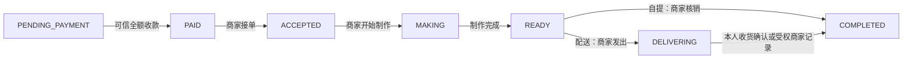

# D01：V1 交易与状态规则

日期：2026-10-03。规则版本：`v1-2026-10-03`。范围：离线模型与后续云端实现契约；未创建订单 / 支付接口，未接入真实收退款。

## 决策来源

| 决策 | 来源 / 状态 |
|---|---|
| 全额微信支付，不迁入定金 / 尾款 | 产品执行书的 V1 基线；旧 server / web / legacy 保持独立 |
| 付款后取消一律由商家审批 | 用户于 2026-10-03 明确确认，已冻结 |
| 商家拒单全额退款 | 同一用户回复，已冻结 |
| 其他退款金额由商家审批 | 同一用户回复，已冻结；技术约束为不超过剩余实付预算 |
| 自提由商家核销；配送可由本人确认收货或受权商家记录完成 | 执行书 §3.3 / §4.12 与开发计划 O08 / Q02；具体配送责任和异常处理仍列 E11 |

“已申请取消”“取消已批准”“退款已批准”“资金已退回”是不同事实。审批金额是本次新增退款金额，不覆盖以前已经成功退回的金额。批准取消允许本次退款为零、部分或剩余全额，但必须保留审批金额与原因；零金额不调用退款接口。单独退款审批不逆转已完成的履约。

## 三条状态轴

| 轴 | 持久化枚举 | 含义 |
|---|---|---|
| `orderStatus` | PENDING_PAYMENT / PAID / ACCEPTED / MAKING / READY / DELIVERING / COMPLETED / CANCELLED | 交易与履约阶段；CANCELLED / COMPLETED 不恢复为活动订单 |
| `paymentStatus` | UNPAID / PENDING / PAID / CLOSED / EXCEPTION | 无支付意图、支付处理中、可信全额收款、可信关闭、结果待核实；PAID 保留实际收款事实，退款不把它改为 UNPAID |
| `refundStatus` | NONE / PENDING / SUCCEEDED / FAILED | 退款意图 / 结果摘要；FAILED 不等于已退款，也不恢复已取消订单 |

`REFUNDING` / `REFUNDED` 属于用户展示态，不能替代真实履约状态。部分退款需显示“部分退款”；退款失败显示“退款待处理”。取消申请另存审批记录，不新增一个会覆盖 MAKING / READY 的订单状态。

正常路径：



付款成功仅表示 PAID / 待接单，不表示 ACCEPTED 或 MAKING。PENDING_PAYMENT 不能直接接单、制作或完成；自提不能进入 DELIVERING，配送不能绕过配送中直接使用自提核销完成。

## 命令与角色矩阵

CUSTOMER 指可信身份解析出的本人；STORE 指当前有该门店权限的商家；SYSTEM 指内部支付证据处理器 / 到期任务。不能使用请求中的 role、ownerId、storeIds 或 capabilities 作为这些权限的依据。

| 内部模型命令 | 前态 | 角色 / 限制 | 后态与必需动作 |
|---|---|---|---|
| PAYMENT_CONFIRMED | PENDING_PAYMENT | SYSTEM / PAYMENT_EVIDENCE；可信平台结果；币种、金额、支付单归属全部一致 | PAID；记实收并确认资源 |
| ACCEPT | PAID | STORE / 同门店 | ACCEPTED |
| START_MAKING | ACCEPTED | STORE / 同门店 | MAKING；按 D04 的方案消耗预留库存 |
| MARK_READY | MAKING | STORE / 同门店 | READY |
| START_DELIVERY | READY | STORE；仅 DELIVERY | DELIVERING |
| COMPLETE_PICKUP | READY | STORE；仅 PICKUP；必须验证核销凭证 | COMPLETED |
| COMPLETE_DELIVERY | DELIVERING | 本人 CUSTOMER 或同门店 STORE；仅 DELIVERY；记录确认来源 | COMPLETED |
| CANCEL_UNPAID | PENDING_PAYMENT | 本人 CUSTOMER 或 SYSTEM / ORDER_EXPIRY；paymentStatus 只能 UNPAID / CLOSED | CANCELLED；处理未消耗资源；不退款 |
| REQUEST_CANCELLATION | PAID / ACCEPTED / MAKING / READY / DELIVERING | 本人 CUSTOMER | 履约状态不变；新增待审批取消申请；不发起退款 |
| APPROVE_CANCELLATION | 上述可取消已付阶段 | STORE；读取匹配订单 / 本人的待审记录；审批金额有效 | CANCELLED；申请变 APPROVED；处理资源；正金额建立退款意图 |
| REJECT_CANCELLATION | 已付活动阶段或 COMPLETED | STORE；读取匹配待审记录 | 履约状态不变；申请变 REJECTED；记录原因 |
| REJECT_ORDER | PAID，尚未接单 | STORE | CANCELLED；累计退足全部实付；已退部分只补差额，不重复退款 |
| APPROVE_REFUND | 已付阶段 / COMPLETED / 已付 CANCELLED | STORE；正整数分且额度有效；不能覆盖未决退款 | 履约状态不变；记录审批，建立退款意图；售后与取消分别记录 |
| PAYMENT_CONFIRMED（迟到款） | 已取消且尚未入账 | SYSTEM / PAYMENT_EVIDENCE；可信且金额 / 币种一致 | 保持 CANCELLED；记真实实收并自动登记全额退款补偿，不恢复资源或制作 |

模型输出 `requiredEffects` 是调用方必须实现的动作清单，不代表这些动作已经完成。`VERIFY_PICKUP_CREDENTIAL` / `RECORD_DELIVERY_CONFIRMATION` 必须在提交状态前完成校验或记录。未实现这些条件时禁止把模型计划直接写成完成订单。

## 异常与竞争

| 情形 | 行为 |
|---|---|
| 待付订单从未建立外部支付意图 | 允许取消；释放未消耗资源一次 |
| 已有支付意图，顾客退出支付或请求超时 | 保持待核实；前端退出不是关单证据；查单 / 关单确认后才能取消释放 |
| 付款与取消同时发生 | O05 / P04 必须在同一订单版本和资源事务中裁决：先入账则按已付审批；先取消则迟到款补偿退款 |
| 已付款商家拒单 | 取消履约，退足全部实付；失败或未知结果继续补偿，不显示已退款 |
| 顾客付款后申请取消 | 仅新增申请；订单保留当前履约状态。商家审批读取当前订单和有效请求，不能使用旧快照绕过版本校验 |
| 制作后商家批准取消 | 停止后续履约；金额来自审批；消耗的原料不因退款自动恢复。时段名额回补规则在 D05 冻结 |
| 订单已完成 | 不能改回活动态或取消；仍可由商家审批售后退款，履约保持 COMPLETED |
| 退款失败 / 超时 | 保存待处理事实；失败退款的额度仍归原意图占用；核实、重试或受控处置，不能另开独立退款绕过额度 |
| 退款结果重复、失败通知晚于成功通知 | 按支付事件 / 退款意图去重；已成功金额只增加一次，不能把 SUCCEEDED 回退 FAILED |
| 回调金额 / 币种 / 支付单归属异常 | 不直接置 PAID；在 payment_events / payments 隔离记录并查单、告警；不能因模型拒绝而丢弃实际异常资金证据 |
| 相同状态的重复证据 | 状态轴检查返回“不需要迁移”；仍需核对同一付款 / 退款意图、金额和事件，不视为完整幂等实现 |

迟到款自动退款属于技术补偿，不是顾客主动取消审批；不让已经取消并释放资源的订单重新进入制作。

## 金额与退款预算

全部使用人民币安全整数分，币种 CNY。无折扣 / 定金 / 尾款。订单总额由云端报价计算，D02 继续定义商品小计和运费快照。

```text
实收 paidCents ∈ {0, totalCents}
成功退款 refundedCents >= 0
退款意图占用 refundReservedCents >= 0
refundedCents + refundReservedCents <= paidCents <= totalCents
可审批新退款额度 = paidCents - refundedCents - refundReservedCents
```

PENDING / FAILED 意图保留预算；确认成功时在同一事务中减少对应占用、增加成功退款。已经成功退款不能再次加钱。退款 API 请求成功仅表示受理，不能据此增加 `refundedCents`。

一个订单当前最多一个未决退款意图。先处理该意图再批准后续退款。退款 SUCCESS / FAILED 的具体平台映射及外部单号重试方式在 P06 按选定接入方案验证，本模型不冒充已接通平台 API。

## 权限、版本与资源边界

模型代码是云端纯函数，不提供网络接口。未来调用方必须先解析可信身份、检查实时门店角色、读取本人订单 / 取消申请、验证支付通知或查单结果，并在事务内使用这些数据。前端隐藏按钮与纯模型中的 actor 对象均不能替代真实鉴权。

`expectedVersion` 可在模型入口检查；D04 / O01 必须在数据库事务中落实原子版本条件、日志、审批、退款预算、资源与幂等，不能通过一次离线比较宣称解决并发。

订单记录政策版本；当前不支持的历史政策版本拒绝自动操作，后续变更需显式兼容，不默默套新规则。资源定位、库存共享、时段回补和 SDK 事务能力分别等待 D03–D05；`RESOLVE_CANCELLED_RESERVATIONS` 不是无条件退库存指令。

## 代码、验证与参考

代码：[trade-model.js](../cloudfunctions/_shared/trade-model.js)。回归：[trade-model.test.js](../tests/trade-model.test.js)。字段：[DATA_MODEL.md](DATA_MODEL.md)。调用边界：[API_CONTRACT.md](API_CONTRACT.md)。

两个现有云函数继续只同步 runtime.js。本模块尚未接入 user / store，不影响小程序主包；后续 Order / Payment 函数真正使用时，必须按 I07 随独立函数部署包携带，禁止引用包外 `_shared`。

平台核查（2026-10-03）：客户端返回之后应由商户查单确认，后端结合可信异步通知、主动查单和对账恢复实际结果；模型据此区分可信付款与客户端返回。[微信支付官方：支付回调和查单实现指引](https://pay.wechatpay.cn/doc/v3/merchant/4012075249)

D01 离线测试不替代真实支付、退款、库存并发、云权限或跨账户验收。执行结果见 [阶段二记录](PHASE-2-EXECUTION.md)。
