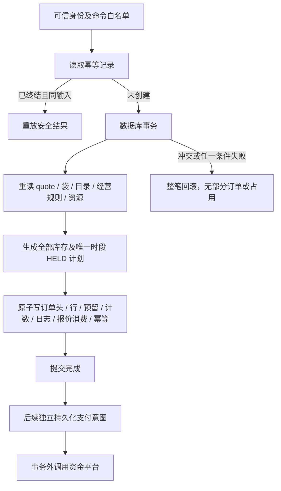

# D04：幂等、资源预留与原子事务设计

日期：2026-10-03。状态：**离线设计 / 纯工具已实现，实际 SDK 事务、索引、并发验收待云条件**。小程序审核期间先推进本地，未选择或连接真实云环境、未建集合、未部署。本文不是可执行云配置；所有 SDK 特有限制须实际验证后冻结。

## 内部工具与身份范围

- idempotency-model.js：canonicalJSON / requestFingerprint / scopedDocumentId / idempotencyId / decideIdempotency。只计算与裁决，不获取锁、不落库。
- resource-model.js：validateResource / planResourceHolds。只验证资源计数并生成整单预留计划，不应用版本、不保证并发 / 回滚、不验证完整门店时间或配送规则。
- 所有输入由未来服务端构造；platform identity→稳定 users ID→owner / 门店授权，不能用客户端 actorScope / role / environment。D06 的实际身份与权限仍未验收。

scopedDocumentId(namespace, parts) 用完整 SHA-256(canonicalJSON(['document-id-v1',namespace,...parts])) 返回 64 位小写十六进制 ID。JSON 数组分帧防止 ':' 等分隔符拼接冲突，namespace 分离领域，parts 显式含可信 environment。ID 是逻辑唯一键，不是鉴权秘密；实际 SDK 是否支持此长度 / 文档写法须验证。

| 实体 / 建议 namespace | 可信组成 parts | 唯一意图 |
|---|---|---|
| idempotency | environment / actorScope / command / key | 同人同命令同键一结果 |
| order | environment / ownerId / ORDER_CREATE / key | 同键创建同订单；跨键仍靠报价消费限制 |
| reservation（已实现） | environment / orderId / resourceKind / resourceId | 同单同资源一个预留 |
| favorite | environment / ownerId / productId | 收藏关系唯一 |
| cart | environment / ownerId / storeId | 一人一店一个活动袋 |
| order-item | environment / orderId / lineId | 历史明细唯一 |
| order-log | environment / orderId / committedOrderVersion / effectKind | 每次提交事件追加一次 |
| quote-consume | 不另建实体；事务写 checkout_quotes.status/consumedOrderId | 两个不同键不能重复消费报价 |

除 idempotency 与 reservation 外，表中 namespace 尚为接入设计，未用于创建实体。requestFingerprint 为 SHA-256('request-json-v1:'+canonicalJSON(payload))；对象键排序，数组顺序保留，不做金额 / 字符串业务纠正。payload 须先按冻结命令语义白名单规范化，包含所有影响结果的输入；不包含 now/requestId、客户端价格 / 身份或随机重试值。同语义对象键顺序不影响摘要；留言规范化由 D03 先做。

canonicalJSON 只接受 JSON 可用字符串 / 有限数字 / boolean / null / 密集数组 / 普通对象；拒绝 undefined、循环、函数、Date、BigInt、非完整 UTF-16、稀疏或带额外枚举属性数组、Symbol 自有键与枚举 getter，避免执行 getter。它不是领域 schema、资金安全整数或长度校验器。非枚举属性按 JSON 语义不进入摘要。摘要含隐私关联信息，不输出到普通客户端 / 日志。

## 幂等裁决与重试

record 为数据库读取的 idempotency_records（null 表示未找到），request 为可信 environment/actorScope/command/key/requestFingerprint。decideIdempotency 返回 CREATE / BUSY / REPLAY 或领域错误，终态 result 仅 entityId/version/errorCode 白名单。

| 已存记录 | 同键同输入 | 同键不同输入 |
|---|---|---|
| 不存在 | CREATE；仍须在事务中原子创建确定性记录 | 首个成功提交决定该键对应输入 |
| IN_PROGRESS | BUSY；过期 lease 也先核实，不盲目接管 | IDEMPOTENCY_KEY_REUSED |
| SUCCEEDED | 重放安全结果；再按当前所有权读实体 | IDEMPOTENCY_KEY_REUSED |
| FAILED（已核实终态） | 重放错误，不另发新资金调用 | IDEMPOTENCY_KEY_REUSED |

先检查可信身份 / 当前权限并读取幂等记录。已成功命令可重放原结果，不因商品后来下架或 quote 后来过期而再创建；不把过往权限当当前授权。未完成的调用要查询实体 / 平台结果再裁决。网络超时、支付未知不能记录成可重开的 FAILED。只有经过核实的业务拒绝才可缓存终态失败；用户修改请求须用新键并重新确认。

付款 / 退款业务单号与平台 transactionId/refundId 是另一层持久唯一性证据；幂等记录保留期限不能短于需要重放的窗口，删除缓存不代表允许重复收退款。保留策略待业务 / 财务资料，不编造 TTL。

## quote → order 的原子边界

事务前解析身份、规范命令、定位确定性 IDs / 引用并预检。真实创建事务里重新读取所有会决定结果的可变记录与版本，校验报价本人同店 / 未消费 / 未过期、袋选中行 / 留言、商品 / SKU、门店 / 发布配置 / 地址、预约与配送规则、资源余额。事务前查询不能取代事务内检查。

planResourceHolds(order, requests, resources, context)：

- order 只用 _id/storeId/paymentDeadlineAt；context.environment/now；requests 每项 resourceKind/resourceId/quantity/expectedVersion；resources 每项 {resourceKind,resource}。STOCK 读 totalUnits，SLOT 读 capacityTotal。
- 所有请求已按 D03 整单聚合、每资源一项；至少一个 STOCK、恰好一个 SLOT，读取资源与请求集合精确对应。同店、OPEN、当前版本、有效截止与安全整数计数必须满足。
- 返回冻结 resourceChanges（resourceKind/resourceId/expectedVersion/nextVersion/三种计数）及完整 reservations 创建记录；预留 schemaVersion=1/version=0、status=HELD、expiresAt=paymentDeadlineAt、resolvedAt/resolutionLogId=null。
- 检查 held+confirmed+consumed<=total，quantity<=可用量，held 增加与 version+1 无溢出。任意资源不足整单抛错，不修改输入，不生成可返回的部分成功。
- 不核对 appointmentSnapshot.slotId、serviceDate、fulfillment、时间 / 配送范围、真实单位、SKU 归属或 paymentDeadline 是否过预约边界；这些须 quote/order 服务按 D02/D05 前置验证，再构造唯一时段请求。

数据库写入必须以 resourceChanges.expectedVersion 检查当前版本并同时修改计数，不能把 plan 输出当锁。两个基于库存 1 / version 0 的纯计划都可以产生 held=1；实际事务只应允许一个提交，另一个重读后缺货。旧版模型测试只能证明计算 / 冲突检测，不能证明云事务语义。

初次 order 写入：orders 头、唯一 order_items、reservations、所有资源计数、order_logs 首事件、checkout_quotes 消费、idempotency_records 同一原子边界。任何写失败应全回滚。若所选 SDK 无法满足，先调整受控事务预算 / 数据结构，不能采用无补偿保证的分步扣库存。是否同事务删除选中袋行在 B03 定义；删除要条件匹配原 lineVersion，不能抹去用户后来修改。

## 付款、取消、消耗与资金意图

| 事务 / 触发 | 同步提交的领域事实 | 事务外 / 不可省略条件 |
|---|---|---|
| 可信付款确认 | 成功 payments 入账、payment_events 去重、订单 paidCents/三轴、HELD→CONFIRMED、日志 / 幂等 | 商户 / 应用 / 单号 / 金额 / 币种核实；前端返回不作证据 |
| 制作 | 订单 MAKING、库存 CONFIRMED→CONSUMED、资源计数 / 日志 | 消耗不因退款恢复；时段策略 D05 冻结 |
| 未付取消 / 到期 | 当前 D01 允许的 CANCELLED、未消耗资源 RELEASED、计数 / 日志 / 幂等 | 支付 UNPAID 或可信 CLOSED 才可释放；未知先查单 / 关单 |
| 已付商家批准取消 / 拒单 | 审批、取消履约、按政策处置资源、正金额 refunds 意图及订单退款预算、日志 / 幂等 | 零金额不建退款意图；制作后不恢复已消耗库存 |
| 退款提交 | 先保存意图 / 预算及调用尝试开始记录 | 外部退款 API 不在事务内，复用原 outRefundNo；未知先查询 |
| 可信退款成功 | refunds=SUCCEEDED/SETTLED、事件去重、占用减少 / 累计成功增加、日志 | 不把接口受理当实际退款；失败保留 RESERVED |
| 已取消迟到款 | 记录真实实收、保持 CANCELLED、全额补偿退款意图 / 预算 | 不重新确认已释放资源；异常款留隔离证据 |

这些是事务方案，resource-model 尚未实现状态转换 / 资金操作。必须逐项落实 D01 requiredEffects 后才能写最终状态；追加业务日志与审计记录使用提交事实，不把“计划创建”写成“资金成功”。跨数据库与外部平台不能用数据库回滚撤销真实付款，使用持久意图、可信事件、查单和可重试补偿。处理器必须可重启恢复。

## 候选索引与逻辑唯一性

下面是访问模式 / 约束候选，**不是已创建索引，也不假定 SDK 支持 unique 复合索引**。优先使用确定性文档 ID 实现可定位的唯一关系；真实索引字段顺序、排序、分页、稀疏 / null 语义在 D04 / D07 按实际 SDK 验证。

| 集合 | 查询 / 排序候选 | 逻辑唯一性 / 注意 |
|---|---|---|
| users | environment/appId/openId；status | 平台身份稳定映射唯一，不能 trace 截断 |
| categories | code；sortOrder | 仅三个 code |
| products | storeId/status/categoryCode/sortOrder | 不公开草稿 |
| skus | productId/status | 产品内有效 optionKey 唯一，前置定位全部组合 |
| favorites | ownerId/createdAt/_id；productId | ownerId/productId 关系唯一 |
| carts | ownerId/storeId | 一个活动袋；lineId 袋内唯一 |
| addresses | ownerId/deletedAt/updatedAt/_id | 默认指针仅 users，一次事务切换 |
| stores | status | activeConfigId 外键同店 |
| store_config | storeId/configVersion | 同店发布版唯一，发布后固定 |
| checkout_quotes | ownerId/expiresAt；consumedOrderId | 一报价最多一消费 |
| orders | ownerId/createdAt/_id；storeId/orderStatus/createdAt/_id | orderNo 唯一，_id 由命令键定位 |
| order_items | orderId/position | orderId/lineId 与 position 各唯一 |
| order_logs | orderId/createdAt/_id | 提交版本 / 事件去重追加 |
| cancellation_requests | orderId/status；ownerId/createdAt/_id | 同订单最多一待审，事务裁决 |
| payments | orderId/status；outTradeNo；transactionId | 业务号 / 平台交易号去重；同订单最多一 APPLIED |
| refunds | orderId/budgetState；paymentId；outRefundNo；providerRefundId | 同订单最多一 RESERVED，退款号不因重试改变 |
| payment_events | provider/providerEventId；processingStatus/receivedAt/_id | 事件去重还须资金交易号去重 |
| reservations | orderId/status；resourceKind/resourceId；status/expiresAt/_id | 同单同资源一个预留，超时不等于可释放 |
| slot_inventory | storeId/fulfillment/serviceDate/startAt | 同店同模式真实时间段唯一，不按政策版本重开容量 |
| idempotency_records | 确定性 _id；status/leaseUntil | 同 actorScope/command/key；回收须核实 |
| admin_roles | subjectId/status | 每次敏感操作重查范围与 capabilities |
| audit_logs | storeId/createdAt/_id；target.collection/target.entityId | 受控查询，不公开 |
| inventory_resources | storeId/status | 单位与共享归属固定 |
| media_assets | assetId/revision；status/retainedUntil | 文件不可覆盖；保留 / 引用检查后才能删除 |
| refund_attempts | refundId/sequence；outRefundNo | 同意图尝试序号唯一，不另占预算 |

列表分页使用明确的稳定排序与游标（含 _id 打破相同时间），不依赖随数据增长的 skip 全表扫描。具体 DTO / 页面大小在 D07 冻结。安全规则不是索引，索引也不授予跨 owner / store 读取权限。

## 事务预算与真实云验收清单

设 n=选中行数，p=不同 product 数，s=不同 SKU 数，k=聚合后的 STOCK 资源数+1 个 SLOT。

- 初次创建基础写文档数为 `4+n+2k`：订单头 1、行 n、预留 k、资源 k、报价消费 1、日志 1、幂等 1。若同事务袋写入，再 +1；媒体 pin / 审计 / 其它业务额外写入必须计入，不能套固定公式漏算。
- 基础读取候选为 quote/cart/store/config/idempotency 五类，加 p 个产品、s 个 SKU、k 个资源、配送地址及身份 / 角色等必要记录。索引查询、重复读、字节数与重试成本由真实 SDK 计量。
- maxLines、每 SKU 资源数、配置字节、时段方案与真实事务操作 / 时长 / 大小限制共同决定可发布的购物袋上限。测试 3 行不是这个预算结论；没有实际 SDK 数值前不编造正式上限。

云条件具备后依次验证：独立函数打包依赖；实际服务端 SDK 多文档读写和事务冲突 / 重试；候选索引支持查询；库存 1 两人同时下单仅一成功；时段 1 同样；同键 / 不同事件重复不多单多扣；第 n 次写失败无半条订单或资源；取消 / 查单 / 回调竞态不多释放；管理员并发状态只迁移一次；真实权限及脱敏日志。记录环境、版本、请求与结果；离线测试结果不能替代这些证据。

## 回归与边界

当前离线回归验证：规范 JSON、隔离域确定性 ID、同键同 / 异输入、终态重放 / 租约未决、白名单结果、非法输入、整单计数安全 / 不足 / 版本 / 归属 / 关闭 / 重复需求 / 过期、共享聚合衔接。明确测试两个旧快照都可计划，避免误认为纯模型已解决云并发。

没有 SDK adapter、持久化锁或业务网络 action；D04 整体状态仍待云验收。后续可以继续 D05 离线时间 / 配送模型，但 E04 / E07 / E08 的正式经营值仍待确认。记录见 [PHASE-2-EXECUTION.md](PHASE-2-EXECUTION.md)。

D05 已确认补充（2026-10-03）：SLOT 为 ORDER 单位，每单 quantity=1；自取 3、配送 1，模式独立，30 分钟。slot ID 不含 policyVersion，配置升级不得另开同时间容量。D05 resolveAppointment 对真实定义 / 余额预检后产生带版本的请求；实际提交仍须本事务最终校验，包括可信地址在 20km 含边界内、时段当前有效和库存 / slot 不超额。免费配送不意味着免除范围或资源校验。详见 [FULFILLMENT-RULES.md](FULFILLMENT-RULES.md)。

## D06 敏感操作权限与事务衔接

authorization-model.js 用本环境 SDK 元组映射 users._id；在每请求重新加载 ACTIVE 用户与当前 admin_roles。门店权限同时核对 subjectId、storeId、能力、ACTIVE / revokedAt，返回内部 grant{roleId,roleVersion,userVersion}，不合并拆分角色。顾客 ownerId 以父实体为准；系统付款 / 过期命令不能经用户包装器进入。

敏感事务需要重新读取用户 / 角色并将权限有效性和业务写入原子裁决；前置校验不保证与撤销竞争安全。角色 / 用户版本或栅栏所需读写应列入 D04 实际 SDK 验证及写预算附加项；当前没有实际实现、不能假定读集冲突语义或具体增加次数。退款 / 资源原子性仍遵循原设计，未知资金状态不因权限通过继续副作用。

角色初始化 / 授权 / 撤销与审计须受控原子操作；普通客户端全表 CRUD 关闭不能代替云函数鉴权。权限方案与待云验收用例见 [AUTHORIZATION-RULES.md](AUTHORIZATION-RULES.md)。

## D07 分页与开发seed衔接

分页明确固定排序与_id打破相同值，seek OR须整体AND到可信过滤；候选索引方向及退款父订单/角色门店数组查询留真实SDK核验，不能编造实体storeId字段。详见 [API_NETWORK.md](API_NETWORK.md)。seed真实apply未实现，只规划五个DRAFT create-if-absent，分类code/配置storeId+configVersion需实际逻辑唯一键与事务重查；已有记录不覆盖，运行/审计成本额外计预算。普通客户端不存在apply入口，见 [DEVELOPMENT-SEED.md](DEVELOPMENT-SEED.md)。
