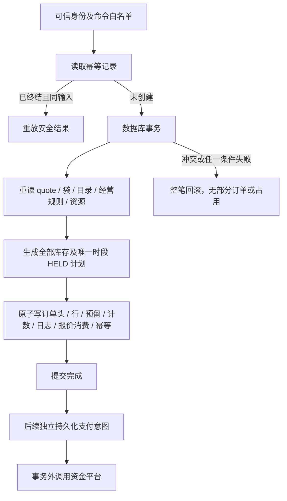

# D04：幂等、资源预留与原子事务设计

日期：2026-10-03。状态：**离线设计 / 纯工具已实现，实际 SDK 事务、索引、并发验收待云条件**。小程序审核期间先推进本地，未选择或连接真实云环境、未建集合、未部署。本文不是可执行云配置；所有 SDK 特有限制须实际验证后冻结。

## 内部工具与身份范围

- idempotency-model.js：canonicalJSON / requestFingerprint / scopedDocumentId / idempotencyId / decideIdempotency。只计算与裁决，不获取锁、不落库。
- resource-model.js：validateResource / planResourceHolds。只验证资源计数并生成整单预留计划，不应用版本、不保证并发 / 回滚、不验证完整门店时间或配送规则。
- 所有输入由未来服务端构造；platform identity→稳定 users ID→owner / 门店授权，不能用客户端 actorScope / role / environment。D06 的实际身份与权限仍未验收。

scopedDocumentId(namespace, parts) 用完整 SHA-256(canonicalJSON(['document-id-v1',namespace,...parts])) 返回 64 位小写十六进制 ID。JSON 数组分帧防止 ':' 等分隔符拼接冲突，namespace 分离领域，parts 显式含可信 environment。ID 是逻辑唯一键，不是鉴权秘密；实际 SDK 是否支持此长度 / 文档写法须验证。

| 实体 / 建议 namespace | 可信组成 parts | 唯一意图 |
|---|---|---|
| idempotency | environment / actorScope / command / key | 同人同命令同键一结果 |
| order | environment / ownerId / ORDER_CREATE / key | 同键创建同订单；跨键仍靠报价消费限制 |
| reservation（已实现） | environment / orderId / resourceKind / resourceId | 同单同资源一个预留 |
| favorite | environment / ownerId / productId | 收藏关系唯一 |
| cart | environment / ownerId / storeId | 一人一店一个活动袋 |
| order-item | environment / orderId / lineId | 历史明细唯一 |
| order-log | environment / orderId / committedOrderVersion / effectKind | 每次提交事件追加一次 |
| quote-consume | 不另建实体；事务写 checkout_quotes.status/consumedOrderId | 两个不同键不能重复消费报价 |

除 idempotency 与 reservation 外，表中 namespace 尚为接入设计，未用于创建实体。requestFingerprint 为 SHA-256('request-json-v1:'+canonicalJSON(payload))；对象键排序，数组顺序保留，不做金额 / 字符串业务纠正。payload 须先按冻结命令语义白名单规范化，包含所有影响结果的输入；不包含 now/requestId、客户端价格 / 身份或随机重试值。同语义对象键顺序不影响摘要；留言规范化由 D03 先做。

2026-10-05 O02 补充：order / order-item namespace 已用于离线创建计划，未实际创建集合或实体；orderNo 使用 V1- 加完整订单摘要。逻辑编号仍要求真实 create-if-absent 与 orderNo 唯一索引，不能把哈希测试当 SDK 唯一约束验收。订单 / 明细 / 全部预留 / 首日志 / ACTIVE 报价消费 / 幂等回执仍须同一事务；付款保留读取发布配置，不沿用报价 TTL。下一项 O03 整单预留编排，详见 [O02-ORDER-CREATION.md](O02-ORDER-CREATION.md)。

2026-10-05 O03 补充：新增内部 order-transaction-service，通过注入事务会话执行当前用户 / 创建数据重读、整单预留及全部组合写入。各写必须返回 1，读依赖须保护到提交；首 ORDER_CREATED 日志 before=null 表示此前无订单。当前只有 tests/fixtures/order-transaction 的串行内存适配器，9 个写位置失败 / 零行均回滚、最后库存 / 独立名额竞争与时效通过；没有 SDK adapter、真实索引或云并发证据。runTransaction 必须提交后才返回，普通分步写不满足契约。下一项 O04 袋同步 / 恢复，详见 [O03-ATOMIC-ORDER-TRANSACTION.md](O03-ATOMIC-ORDER-TRANSACTION.md)。

canonicalJSON 只接受 JSON 可用字符串 / 有限数字 / boolean / null / 密集数组 / 普通对象；拒绝 undefined、循环、函数、Date、BigInt、非完整 UTF-16、稀疏或带额外枚举属性数组、Symbol 自有键与枚举 getter，避免执行 getter。它不是领域 schema、资金安全整数或长度校验器。非枚举属性按 JSON 语义不进入摘要。摘要含隐私关联信息，不输出到普通客户端 / 日志。

## 幂等裁决与重试

record 为数据库读取的 idempotency_records（null 表示未找到），request 为可信 environment/actorScope/command/key/requestFingerprint。decideIdempotency 返回 CREATE / BUSY / REPLAY 或领域错误，终态 result 仅 entityId/version/errorCode 白名单。

| 已存记录 | 同键同输入 | 同键不同输入 |
|---|---|---|
| 不存在 | CREATE；仍须在事务中原子创建确定性记录 | 首个成功提交决定该键对应输入 |
| IN_PROGRESS | BUSY；过期 lease 也先核实，不盲目接管 | IDEMPOTENCY_KEY_REUSED |
| SUCCEEDED | 重放安全结果；再按当前所有权读实体 | IDEMPOTENCY_KEY_REUSED |
| FAILED（已核实终态） | 重放错误，不另发新资金调用 | IDEMPOTENCY_KEY_REUSED |

先检查可信身份 / 当前权限并读取幂等记录。已成功命令可重放原结果，不因商品后来下架或 quote 后来过期而再创建；不把过往权限当当前授权。未完成的调用要查询实体 / 平台结果再裁决。网络超时、支付未知不能记录成可重开的 FAILED。只有经过核实的业务拒绝才可缓存终态失败；用户修改请求须用新键并重新确认。

付款 / 退款业务单号与平台 transactionId/refundId 是另一层持久唯一性证据；幂等记录保留期限不能短于需要重放的窗口，删除缓存不代表允许重复收退款。保留策略待业务 / 财务资料，不编造 TTL。

## quote → order 的原子边界

事务前解析身份、规范命令、定位确定性 IDs / 引用并预检。真实创建事务里重新读取所有会决定结果的可变记录与版本，校验报价本人同店 / 未消费 / 未过期、袋选中行 / 留言、商品 / SKU、门店 / 发布配置 / 地址、预约与配送规则、资源余额。事务前查询不能取代事务内检查。

planResourceHolds(order, requests, resources, context)：

- order 只用 _id/storeId/paymentDeadlineAt；context.environment/now；requests 每项 resourceKind/resourceId/quantity/expectedVersion；resources 每项 {resourceKind,resource}。STOCK 读 totalUnits，SLOT 读 capacityTotal。
- 所有请求已按 D03 整单聚合、每资源一项；至少一个 STOCK、恰好一个 SLOT，读取资源与请求集合精确对应。同店、OPEN、当前版本、有效截止与安全整数计数必须满足。
- 返回冻结 resourceChanges（resourceKind/resourceId/expectedVersion/nextVersion/三种计数）及完整 reservations 创建记录；预留 schemaVersion=1/version=0、status=HELD、expiresAt=paymentDeadlineAt、resolvedAt/resolutionLogId=null。
- 检查 held+confirmed+consumed<=total，quantity<=可用量，held 增加与 version+1 无溢出。任意资源不足整单抛错，不修改输入，不生成可返回的部分成功。
- 不核对 appointmentSnapshot.slotId、serviceDate、fulfillment、时间 / 配送范围、真实单位、SKU 归属或 paymentDeadline 是否过预约边界；这些须 quote/order 服务按 D02/D05 前置验证，再构造唯一时段请求。

数据库写入必须以 resourceChanges.expectedVersion 检查当前版本并同时修改计数，不能把 plan 输出当锁。两个基于库存 1 / version 0 的纯计划都可以产生 held=1；实际事务只应允许一个提交，另一个重读后缺货。旧版模型测试只能证明计算 / 冲突检测，不能证明云事务语义。

初次 order 写入：orders 头、唯一 order_items、reservations、所有资源计数、order_logs 首事件、checkout_quotes 消费、idempotency_records 同一原子边界。任何写失败应全回滚。若所选 SDK 无法满足，先调整受控事务预算 / 数据结构，不能采用无补偿保证的分步扣库存。是否同事务删除选中袋行在 B03 定义；删除要条件匹配原 lineVersion，不能抹去用户后来修改。

## 付款、取消、消耗与资金意图

| 事务 / 触发 | 同步提交的领域事实 | 事务外 / 不可省略条件 |
|---|---|---|
| 可信付款确认 | 成功 payments 入账、payment_events 去重、订单 paidCents/三轴、HELD→CONFIRMED、日志 / 幂等 | 商户 / 应用 / 单号 / 金额 / 币种核实；前端返回不作证据 |
| 制作 | 订单 MAKING、库存 CONFIRMED→CONSUMED、资源计数 / 日志 | 消耗不因退款恢复；时段策略 D05 冻结 |
| 未付取消 / 到期 | 当前 D01 允许的 CANCELLED、未消耗资源 RELEASED、计数 / 日志 / 幂等 | 支付 UNPAID 或可信 CLOSED 才可释放；未知先查单 / 关单 |
| 已付商家批准取消 / 拒单 | 审批、取消履约、按政策处置资源、正金额 refunds 意图及订单退款预算、日志 / 幂等 | 零金额不建退款意图；制作后不恢复已消耗库存 |
| 退款提交 | 先保存意图 / 预算及调用尝试开始记录 | 外部退款 API 不在事务内，复用原 outRefundNo；未知先查询 |
| 可信退款成功 | refunds=SUCCEEDED/SETTLED、事件去重、占用减少 / 累计成功增加、日志 | 不把接口受理当实际退款；失败保留 RESERVED |
| 已取消迟到款 | 记录真实实收、保持 CANCELLED、全额补偿退款意图 / 预算 | 不重新确认已释放资源；异常款留隔离证据 |

这些是事务方案，resource-model 尚未实现状态转换 / 资金操作。必须逐项落实 D01 requiredEffects 后才能写最终状态；追加业务日志与审计记录使用提交事实，不把“计划创建”写成“资金成功”。跨数据库与外部平台不能用数据库回滚撤销真实付款，使用持久意图、可信事件、查单和可重试补偿。处理器必须可重启恢复。

## 候选索引与逻辑唯一性

下面是访问模式 / 约束候选，**不是已创建索引，也不假定 SDK 支持 unique 复合索引**。优先使用确定性文档 ID 实现可定位的唯一关系；真实索引字段顺序、排序、分页、稀疏 / null 语义在 D04 / D07 按实际 SDK 验证。

| 集合 | 查询 / 排序候选 | 逻辑唯一性 / 注意 |
|---|---|---|
| users | environment/appId/openId；status | 平台身份稳定映射唯一，不能 trace 截断 |
| categories | code；sortOrder | 仅三个 code |
| products | storeId/status/categoryCode/sortOrder | 不公开草稿 |
| skus | productId/status | 产品内有效 optionKey 唯一，前置定位全部组合 |
| favorites | ownerId/createdAt/_id；productId | ownerId/productId 关系唯一 |
| carts | ownerId/storeId | 一个活动袋；lineId 袋内唯一 |
| addresses | ownerId/deletedAt/updatedAt/_id | 默认指针仅 users，一次事务切换 |
| stores | status | activeConfigId 外键同店 |
| store_config | storeId/configVersion | 同店发布版唯一，发布后固定 |
| checkout_quotes | ownerId/expiresAt；consumedOrderId | 一报价最多一消费 |
| orders | ownerId/createdAt/_id；storeId/orderStatus/createdAt/_id | orderNo 唯一，_id 由命令键定位 |
| order_items | orderId/position | orderId/lineId 与 position 各唯一 |
| order_logs | orderId/createdAt/_id | 提交版本 / 事件去重追加 |
| cancellation_requests | orderId/status；ownerId/createdAt/_id | 同订单最多一待审，事务裁决 |
| payments | orderId/status；outTradeNo；transactionId | 业务号 / 平台交易号去重；同订单最多一 APPLIED |
| refunds | orderId/budgetState；paymentId；outRefundNo；providerRefundId | 同订单最多一 RESERVED，退款号不因重试改变 |
| payment_events | provider/providerEventId；processingStatus/receivedAt/_id | 事件去重还须资金交易号去重 |
| reservations | orderId/status；resourceKind/resourceId；status/expiresAt/_id | 同单同资源一个预留，超时不等于可释放 |
| slot_inventory | storeId/fulfillment/serviceDate/startAt | 同店同模式真实时间段唯一，不按政策版本重开容量 |
| idempotency_records | 确定性 _id；status/leaseUntil | 同 actorScope/command/key；回收须核实 |
| admin_roles | subjectId/status | 每次敏感操作重查范围与 capabilities |
| audit_logs | storeId/createdAt/_id；target.collection/target.entityId | 受控查询，不公开 |
| inventory_resources | storeId/status | 单位与共享归属固定 |
| media_assets | assetId/revision；status/retainedUntil | 文件不可覆盖；保留 / 引用检查后才能删除 |
| refund_attempts | refundId/sequence；outRefundNo | 同意图尝试序号唯一，不另占预算 |

列表分页使用明确的稳定排序与游标（含 _id 打破相同时间），不依赖随数据增长的 skip 全表扫描。具体 DTO / 页面大小在 D07 冻结。安全规则不是索引，索引也不授予跨 owner / store 读取权限。

## 事务预算与真实云验收清单

设 n=选中行数，p=不同 product 数，s=不同 SKU 数，k=聚合后的 STOCK 资源数+1 个 SLOT。

- 初次创建基础写文档数为 `4+n+2k`：订单头 1、行 n、预留 k、资源 k、报价消费 1、日志 1、幂等 1。若同事务袋写入，再 +1；媒体 pin / 审计 / 其它业务额外写入必须计入，不能套固定公式漏算。
- 基础读取候选为 quote/cart/store/config/idempotency 五类，加 p 个产品、s 个 SKU、k 个资源、配送地址及身份 / 角色等必要记录。索引查询、重复读、字节数与重试成本由真实 SDK 计量。
- maxLines、每 SKU 资源数、配置字节、时段方案与真实事务操作 / 时长 / 大小限制共同决定可发布的购物袋上限。测试 3 行不是这个预算结论；没有实际 SDK 数值前不编造正式上限。

云条件具备后依次验证：独立函数打包依赖；实际服务端 SDK 多文档读写和事务冲突 / 重试；候选索引支持查询；库存 1 两人同时下单仅一成功；时段 1 同样；同键 / 不同事件重复不多单多扣；第 n 次写失败无半条订单或资源；取消 / 查单 / 回调竞态不多释放；管理员并发状态只迁移一次；真实权限及脱敏日志。记录环境、版本、请求与结果；离线测试结果不能替代这些证据。

## 回归与边界

当前离线回归验证：规范 JSON、隔离域确定性 ID、同键同 / 异输入、终态重放 / 租约未决、白名单结果、非法输入、整单计数安全 / 不足 / 版本 / 归属 / 关闭 / 重复需求 / 过期、共享聚合衔接。明确测试两个旧快照都可计划，避免误认为纯模型已解决云并发。

没有 SDK adapter、持久化锁或业务网络 action；D04 整体状态仍待云验收。后续可以继续 D05 离线时间 / 配送模型，但 E04 / E07 / E08 的正式经营值仍待确认。记录见 [PHASE-2-EXECUTION.md](PHASE-2-EXECUTION.md)。

D05 已确认补充（2026-10-03）：SLOT 为 ORDER 单位，每单 quantity=1；自取 3、配送 1，模式独立，30 分钟。slot ID 不含 policyVersion，配置升级不得另开同时间容量。D05 resolveAppointment 对真实定义 / 余额预检后产生带版本的请求；实际提交仍须本事务最终校验，包括可信地址在 20km 含边界内、时段当前有效和库存 / slot 不超额。免费配送不意味着免除范围或资源校验。详见 [FULFILLMENT-RULES.md](FULFILLMENT-RULES.md)。

## D06 敏感操作权限与事务衔接

authorization-model.js 用本环境 SDK 元组映射 users._id；在每请求重新加载 ACTIVE 用户与当前 admin_roles。门店权限同时核对 subjectId、storeId、能力、ACTIVE / revokedAt，返回内部 grant{roleId,roleVersion,userVersion}，不合并拆分角色。顾客 ownerId 以父实体为准；系统付款 / 过期命令不能经用户包装器进入。

敏感事务需要重新读取用户 / 角色并将权限有效性和业务写入原子裁决；前置校验不保证与撤销竞争安全。角色 / 用户版本或栅栏所需读写应列入 D04 实际 SDK 验证及写预算附加项；当前没有实际实现、不能假定读集冲突语义或具体增加次数。退款 / 资源原子性仍遵循原设计，未知资金状态不因权限通过继续副作用。

角色初始化 / 授权 / 撤销与审计须受控原子操作；普通客户端全表 CRUD 关闭不能代替云函数鉴权。权限方案与待云验收用例见 [AUTHORIZATION-RULES.md](AUTHORIZATION-RULES.md)。

## D07 分页与开发seed衔接

分页明确固定排序与_id打破相同值，seek OR须整体AND到可信过滤；候选索引方向及退款父订单/角色门店数组查询留真实SDK核验，不能编造实体storeId字段。详见 [API_NETWORK.md](API_NETWORK.md)。seed真实apply未实现，只规划五个DRAFT create-if-absent，分类code/配置storeId+configVersion需实际逻辑唯一键与事务重查；已有记录不覆盖，运行/审计成本额外计预算。普通客户端不存在apply入口，见 [DEVELOPMENT-SEED.md](DEVELOPMENT-SEED.md)。

## O04 提交后的精确袋同步边界（2026-10-05）

订单创建原子边界不变；O04 采用提交后独立 Cart 事务，不把袋失败当订单创建回滚。创建时存内部 cartRemovalSnapshot，移除时从当前 Cart 比较 ID / 行版本 / 内容摘要。袋全局版本允许增加，保存使用当前版本条件；没有删除则不递增。订单 / 资源 / 历史日志不因同步而更新。

同一事务读取当前用户、订单、袋和成功检查点，实际 SDK 必须保护用户撤销、订单证据与袋存在 / 版本读依赖直到提交。条件袋写和 order.cart.sync 成功回执原子提交，任一异常 / 零行全回滚；基础写预算为回执 1 + 有删除时袋 1，真实身份栅栏、字节 / 重试成本另计。缺袋也写完成检查点，版本 null；之后新袋不被同一订单重放清除。

检查点键按环境 / AppID-owner / orderId 隔离，不新增集合、客户端 action 或公开写权限。保留期不能早于允许恢复的订单范围；当前 retentionUntil=null。无成功检查点与订单不可变快照是补偿依据，尚无后台扫描 / 调度或真实 SDK。串行内存回滚和响应丢失测试不能替代真实云读集、唯一索引及并发证明，详见 [O04-ORDER-RECOVERY.md](O04-ORDER-RECOVERY.md)。

## O05 内部取消原子边界（2026-10-05）

待付取消 / 到期执行器已在串行内存适配器验证：完整当前支付意图查询为无意图 UNPAID，或全部可信 CLOSED 与订单摘要一致时，全部资源计数 / 预留 RELEASED / 订单取消 / 最终日志 / 幂等结果同事务。支付结果未知只返回协调要求，不释放或记录完成；实际 Payment 事件来源与关单证据由未来 P04 执行器核验。

必须保护当前订单 / 用户 / 消费报价 / 支付集合及空集合查询 / 预留 / 资源读集到提交，防止取消期间创建支付意图或入账。条件更新资源版本 / 当前状态、预留版本 / 状态、订单版本；关闭销售不阻止合法释放。7 写及多资源 9 写失败回滚本地通过，真实 SDK 原子性与查询不存在栅栏仍待验证。基础写预算 2k+3，额外权限栅栏等另计。

已付取消 / 拒单仅组合 O01 原子效果与资源提案，审批、退款预算 / 意图、状态 / 日志 / 回执缺一不可，不能单独应用释放计划。制作后 CONSUMED 库存不回补；SLOT 未冻结适用政策返回 CONFIGURATION_REQUIRED，测试分支不是正式配置。无外部调用、SDK、定时部署或资金执行，详见 [O05-ORDER-CANCELLATION.md](O05-ORDER-CANCELLATION.md)。

## O06 本人订单一致读（2026-10-05）

内部只读服务每页重新读取当前 ACTIVE 用户与版本，数据库查询必须 ownerId AND 合法状态集合 AND 整个固定 seek OR，取 pageSize+1；不能只限制某个 OR 分支或读取全库给客户端筛选。详情查询先限定本人父订单再加载必要明细 / 申请 / 日志 / 原图版本。SDK 须提供本次一致快照或等效读依赖保护；assertReadSnapshot 不能只比较传入 ID，用户撤销或任何本次数据变化不能拼接成无证据结果。

创建时间 / ID seek 不保证跨页数据库快照；新较新订单刷新后出现，状态变化由后续客户端按 ID 去重 / 刷新。时间线要求完整提交版本链及最终轴一致，媒体原版本缺失返回空引用，不能更新成现行商品事实。没有写操作、SDK / 索引验收或页面实接，详见 [O06-ORDER-READ.md](O06-ORDER-READ.md)。

## O07 核销与拒绝的原子边界（2026-10-05）

内部签发为订单 / 私有日志 2 写；核销或实际错码为订单 / 最终日志 / 成功或 FAILED 回执 3 写，异常 / 零行全回滚。错码计数拒绝须在事务提交后返回，不能抛错撤销计数。有效凭证重复读取、限速 / 锁定拒绝和同键重放无写；错误版本不能把旧输入当新尝试。当前用户、同店角色 / 撤销、订单、回执及完整报价 / 预留 / 资源读集必须保护到提交，真实 SDK 额外栅栏和预算待验。

明确注入的测试 KEEP_CONFIRMED 分支在核销时保留已 CONSUMED 库存和 CONFIRMED SLOT，不重复扣除或返还；正式完成后的 SLOT 决策未冻结。HMAC 值不入库，指纹使用独立稳定密钥域；政策 / 密钥正式加载与迁移待补。O06 校验签发 / 错码的轴不变内部日志，并从公开时间线隐藏。所有 27 项证据只来自串行内存适配器，没有扫码 / 云并发 / 真实已付证据，详见 [O07-PICKUP-CREDENTIAL.md](O07-PICKUP-CREDENTIAL.md)。

## O08 配送原子写 / 历史重放（2026-10-05）

开始 / 完成均为订单 + 最终日志 + SUCCEEDED 回执 3 写，异常 / 零行全部回滚。当前本人 / 同店用户与角色、订单 / 报价 / 完整预留 / 资源 / 日志 / 回执读集须保护至提交，旧版本或撤销 / 取消 / 资源改变不能局部完成。日志 after 是实际最终轴，确认人由可信身份记录；回执重放还核验原日志，当前授权失效不能靠旧回执完成。

双方式共用履约资源验证；当前仅显式 KEEP_CONFIRMED 测试分支保留计数，正式政策 / 生效配置与实际 SDK 成本待验证。取消竞争测试注入已付审批后的订单 / 日志结果，不是已实现审批或退款事务；真实支付关闭 / 迟到款仍留 P04 / P06。详情联系提示只读历史公开资料，无调用或新状态，详见 [O08-ORDER-DELIVERY.md](O08-ORDER-DELIVERY.md)。

## P01 配置 / 资金边界登记（2026-10-05）

本轮没有资金或配置数据库事务。未来真实执行器须加载当前绑定 / 密钥 / 撤销、可信订单金额与授权；受控新付款预算须持久原子占用，静态 maxTotalCents / maxTransactions 不证明限额已执行。到期只禁止新付款，已有支付查单 / 关闭 / 退款及通知须继续核验原支付与原授权、完成资金协调。退款仍走原领域审批及累计上限，不能凭 recoveryOnly 自动退款。

独立商户单号与内部支付意图须唯一持久关联；外部有效期不得超过订单原截止，未知请求结果先查单，不盲目新建 / 释放。外部调用不放数据库事务内伪装回滚，意图 / 结果及对账边界留 P02–P04 / P06。见 [P01](P01-PAYMENT-CONFIGURATION.md)；实际 SDK / 原子预算 / 外部竞争仍待验收。

## P02 意图 / 测试预算与发送占权（2026-10-05）

内部首次 prepare 原子写 payment_test_budgets 占用、payments.PENDING / PREPARED 与意图引用回执（非生产 3 写，生产无测试预算 2 写）；claimDispatch 单独一次条件写 REQUESTED / token / 时间。事务提交后才返回，任何异常 / 零行回滚，实际外部调用尚未实现且必须在事务外。新 key 复用只有回执写，不多占预算；发送后未知不回退状态、变号、再送或返还资源 / 预算。

读取保护包含当前用户、订单、原消费报价 / 全部预留资源、现行支付配置 / 授权与预算、完整 payments 查询及不存在条件；插入同时 enforce _id、商户 outTradeNo 和每单唯一未决。跨环境共享商户须提供覆盖全部环境的编号唯一约束；真实 SDK 能力不明时需固定同事务守卫记录，不能认为串行内存测试已证明幻读保护 / 部分唯一索引支持。

新增 payment_test_budgets 目标集合与直接 CRUD 全拒绝草案（共 26），初始化授权摘要与 scope ID 固定；reserved+used 金额 / 次数均不超授权上限。意图持有原预算 ID / 摘要，发送不再次占用；未知不释放，消费 / 关闭后的转换及预算对账留 P03 / P04 / P07。订单交易轴 / 版本不因意图改变，O05 仍通过全部支付意图阻断提前取消释放。见 [P02](P02-PAYMENT-INTENTS.md)，真实预支付 / 查询 / 原配置归档与闭单重付待补。

## P03 通知原子处理（2026-10-05）

payment-notification-service 先经过服务端注入来源适配器，每次重放都重新核验；正式签名 / 解密或平台认证尚未实现。事务重读原配置、事件 / 商户全局交易守卫、商户单号意图、完整订单支付集合、用户映射、原报价 / 全部预留资源、预算及日志。保护全部读集和不存在条件到提交，实际 SDK 幻读 / 跨环境全局唯一注册待验收。

正常同事务写通知 + 交易守卫、预算 reserved→used（非生产）、支付 PAID / APPLIED、每个资源计数与预留 HELD→CONFIRMED、订单 PAID / paidCents / paidAt / version、最终 PAYMENT_CONFIRMED 日志。两资源非生产夹具共 10 写，生产 9 写；每个写异常 / 零行均回滚，不重扣或提前 CONSUMED 库存。历史下单事实 / 退款轴不变。

同事件同事实重放零写；不同事件同交易号只追加 DUPLICATE，不能重复消费预算或确认资源。同事件冲突追加唯一异常记录且原事件不可改。来源拒绝独立 namespace 只记摘要 / 固定错误，无交易守卫。已取消 / 迟到 / 关闭等匹配资金保存通知 / 交易守卫 + 支付 PAID / QUARANTINED，合法原预算消费一次，共 4 写（无预算 3 写）；订单 / 资源不改。坏预算保留资金 / 原计数，第二笔资金另记守卫，不能把订单收款增至超额。

时钟、原始精度与 paidAt 下界见 [P03](P03-PAYMENT-NOTIFICATIONS.md)。输出只是离线内部结果，没有 HTTP 应答或实际资金成功；未来必须在原子入账或可信证据 / 恢复待办持久提交后才成功应答。事务外查单 / 关单、隔离资金修复及迟到款退款意图留 P04，退款执行 / 对账任务留 P06 / P07。

## P04 查询 / 关闭与全额补偿（2026-10-05）

先事务保存 RECOVERY_REQUEST，关闭另条件写 closeRequestedAt；没有外部执行器，未知不重发原关闭请求而先查询。结果关联请求与原配置 / 商户单号、操作 / 支付版本。查询 SUCCESS 的观察与 P03 资金事务同提交；两资源非生产共 11 写。NOTPAY / 关闭 ACK 或错误不释放。认证后 CLOSED 共 5 写：观察、原预算释放、支付关闭、全部关闭时订单摘要 / PAYMENT_CLOSED 日志；后续 O05 独立重读取消与释放。中间失败可恢复，不把网络放事务内。

支付成功优先不被旧查询倒退；关闭先提交后迟到资金保存隔离，经合法原预算核实只一次消费。额度耗尽或资金 / 资源 / 日志不可靠进入受控核实，不自动退款。只有明确取消 / 迟到 / 已关闭且全部证据通过时，原子写补偿事件、守卫处理状态、支付入账、全额退款意图 / 原实付预算、订单取消 / 最终日志和适用资源释放。未取消两资源共 10 写，已取消且资源已释放共 6 写，逐写异常 / 零行全回滚。

退款 ID / 商户退款号唯一、全订单退款查询与所有支付状态保护到提交；资金事实不可改，受控守卫状态更新有 reconciliationEventId / 追加依据。退款仍 PENDING / RESERVED，告警仅持久需求；真实退款 / 查询 / 任务发送待 P06 / P07。实际 SDK 读集、请求 / 交易 / 退款唯一注册及并发仍待云，串行内存证据见 [P04](P04-PAYMENT-RECOVERY.md)。

## A06 原子取消审批和同号退款恢复（2026-10-06）

内部申请将单一 PENDING / order version / 原 log / audit / receipt 同事务保存。商家审批需当前同店权限、完整请求 / order / original payment / 全 refunds / ordered logs / reservations / resources；正金额批准一次性写 review / 解占用 / refund RESERVED / order / log / audit / receipt，每写=1；制作后 SLOT 策略未知拒绝。新预算不能越过完整未决退款，无退款额或拒绝不假释放资金。

商家 retry 在原当前 grant 事务内调用 P06 计划，不先鉴权再另开 P06.prepare 事务；原号 / 金额 / 商户 profile / 连续 attempts、完整未存在条件和负读直到 commit。UNKNOWN / ACCEPTED / 丢响应只查，已确认 FAILED 可同号重发，query timeout 不重 SUBMIT。回执 / 尝试 / 审计原子，重放无 transportRequired，不改账；独立可信结果仍由 P06 原子到账。

典型申请 / 新预算 5 写，两资源制作前取消 10 写，尝试 3 写、观察 2 写。仅有限串行内存通过；实际 SDK 完整谓词 / 防幻读 / 唯一号 / 事务预算、角色撤销与资金 / 履约竞争仍待。见 [A06](A06-MERCHANT-RESOLUTION.md)。
