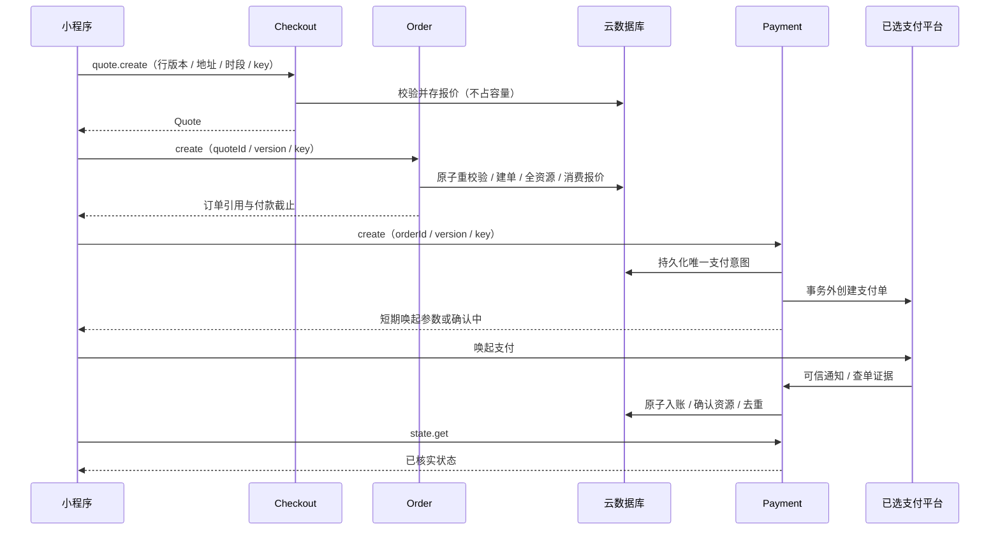

> 技术参考。当前部署/验收状态不在此维护；历史实现描述不能视为已接入。

## quote → order → payment 时序

1. quote.create 提交袋选中行 / 版本、履约、联系人、本人地址、slotId、报价 key。服务端读取真实袋 / 目录 / 发布配置 / 地址 / 时段；D03 验规格 / 数量 / 留言 / 整数分，D05 验范围 / 日期 / 提前量 / 名额，D02 捕获事实并存 ACTIVE 报价，不占资源。
2. 用户确认 Quote 后 order.create 提交 quoteId/expectedQuoteVersion/下单 key。云端复核归属 / 时效 / 未消费、现行事实 / 商品 / 地址版本 / 发布配置 / 范围 / 时段 / 库存；同一真实事务写订单头 / 行 / 日志 / reservations、更新全资源、消费报价、记录幂等。失败不留半单或局部占用。
3. 一报价最多一个 consumedOrderId。同键返回原结果；不同键也不能再次消费；同本人已有 consumedOrderId 可受限返回原单引用。事实变化 QUOTE_CHANGED 须重新确认，不能自动涨价。
4. 返回 PENDING_PAYMENT 与统一付款截止。payment.create 读取本人订单状态和金额，先持久化唯一未决意图 / 商户号，再事务外调选定适配器；无真实接入配置明确失败，不生成模拟唤起参数。

5. 前端唤起支付后无论成功 / 取消 / 失败，只查询 payment.state.get；不写付款轴。可信通知 / 查单核对商户 / AppID / 意图 / 币种 / 全额分金额，按事件与交易号去重入账。未知展示确认中，重复请求沿用原意图。
6. 可信付款才 PAID、资源 CONFIRMED。取消 / 过期先查单 / 关单，未知不释放；取消后迟到实付记账并计划全额退款，保持取消。退款持久化审批意图后事务外发起，重试同退款号，失败仍占预算。

2026-10-05 P02 已在离线注入事务服务验证唯一意图、独立商户号、受控预算与跨 key 复用；claimDispatch 的一次发送占权 / token 是内部要求，不是公开 action。仅返回不可调用计划、payInvocation=null；发送后未知 / 响应丢失只要求查单，尚未执行外部调用、签发 READY 参数或实现 state.get handler / 关闭后重付。现有 PaymentSession 仍是目标协议，不将内部发送数据直接投影；真实传输格式继续待 E03/P01。见 [P02](../../archive/stages/phase-7.md#p02-payment-intents)。

2026-10-05 P03 注入来源边界后的业务核验、通知 / 交易双去重、原子入账 / 资源确认及异常资金隔离离线通过；没有真实 callback 传输格式、原始字节验签 / 解密、平台转发认证或 HTTP 应答。处理结果不投影成 PaymentSession，也不开放客户端 SYSTEM action。未来应答必须晚于资金处理或可信恢复证据持久提交；无云时不能拿内部 sourceAccepted 冒充成功应答。下一项 P04 查单 / 关单与迟到款协调，见 [P03](../../archive/stages/phase-7.md#p03-payment-notifications)。

P04 本地恢复请求先提交再输出内部查询 / 关闭要求，实际网络执行器尚未实现。经注入验证的结果按原请求绑定：查询 SUCCESS 共用资金去重；关闭空 ACK / 未知只要求查询，可信 CLOSED 才写摘要并允许 O05 重新取消。迟到款补偿意图与告警需求持久保存，退款 / 告警传输待接入；不新增用户 SYSTEM action 或真实网络协议字段。见 [P04](../../archive/stages/phase-7.md#p04-payment-recovery)。

