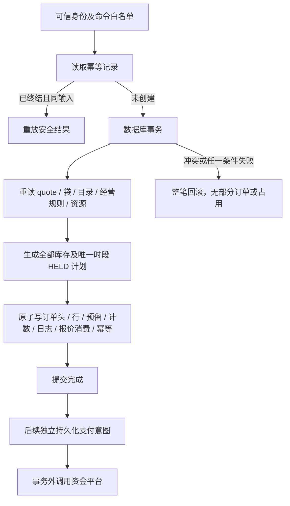

> 技术参考。当前部署/验收状态不在此维护；历史实现描述不能视为已接入。

## quote → order 的原子边界

事务前解析身份、规范命令、定位确定性 IDs / 引用并预检。真实创建事务里重新读取所有会决定结果的可变记录与版本，校验报价本人同店 / 未消费 / 未过期、袋选中行 / 留言、商品 / SKU、门店 / 发布配置 / 地址、预约与配送规则、资源余额。事务前查询不能取代事务内检查。

planResourceHolds(order, requests, resources, context)：

- order 只用 _id/storeId/paymentDeadlineAt；context.environment/now；requests 每项 resourceKind/resourceId/quantity/expectedVersion；resources 每项 {resourceKind,resource}。STOCK 读 totalUnits，SLOT 读 capacityTotal。
- 所有请求已按 D03 整单聚合、每资源一项；至少一个 STOCK、恰好一个 SLOT，读取资源与请求集合精确对应。同店、OPEN、当前版本、有效截止与安全整数计数必须满足。
- 返回冻结 resourceChanges（resourceKind/resourceId/expectedVersion/nextVersion/三种计数）及完整 reservations 创建记录；预留 schemaVersion=1/version=0、status=HELD、expiresAt=paymentDeadlineAt、resolvedAt/resolutionLogId=null。
- 检查 held+confirmed+consumed<=total，quantity<=可用量，held 增加与 version+1 无溢出。任意资源不足整单抛错，不修改输入，不生成可返回的部分成功。
- 不核对 appointmentSnapshot.slotId、serviceDate、fulfillment、时间 / 配送范围、真实单位、SKU 归属或 paymentDeadline 是否过预约边界；这些须 quote/order 服务按 D02/D05 前置验证，再构造唯一时段请求。

数据库写入必须以 resourceChanges.expectedVersion 检查当前版本并同时修改计数，不能把 plan 输出当锁。两个基于库存 1 / version 0 的纯计划都可以产生 held=1；实际事务只应允许一个提交，另一个重读后缺货。旧版模型测试只能证明计算 / 冲突检测，不能证明云事务语义。

初次 order 写入：orders 头、唯一 order_items、reservations、所有资源计数、order_logs 首事件、checkout_quotes 消费、idempotency_records 同一原子边界。任何写失败应全回滚。若所选 SDK 无法满足，先调整受控事务预算 / 数据结构，不能采用无补偿保证的分步扣库存。是否同事务删除选中袋行在 B03 定义；删除要条件匹配原 lineVersion，不能抹去用户后来修改。
